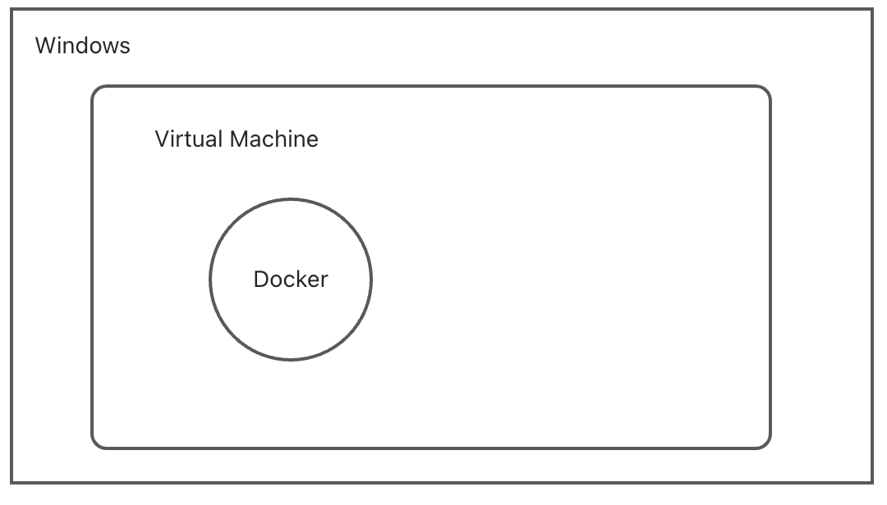
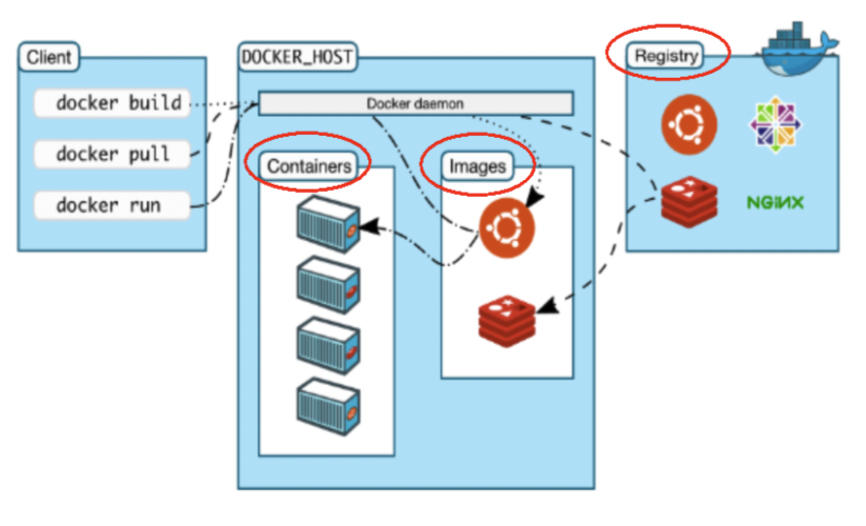
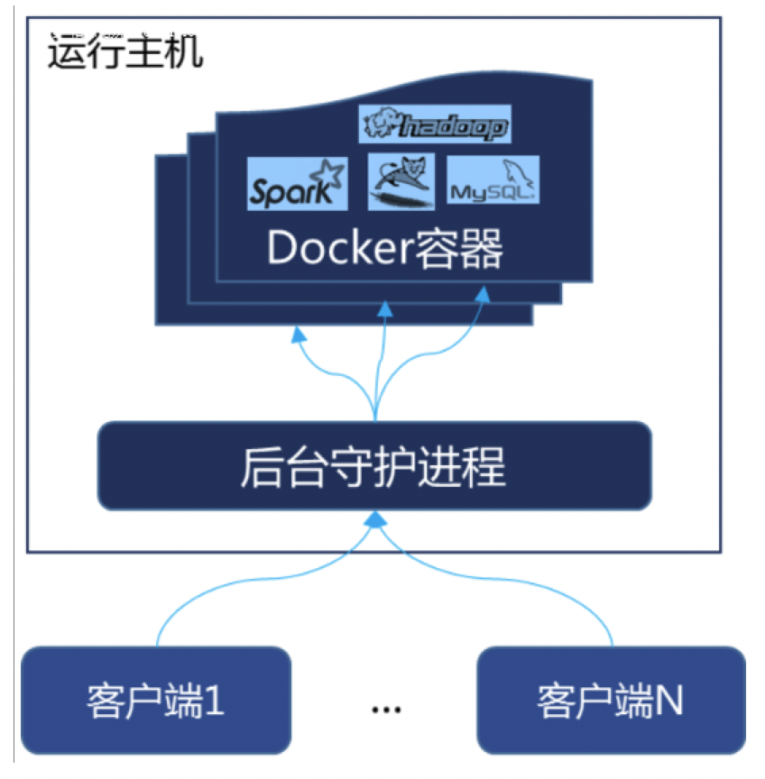
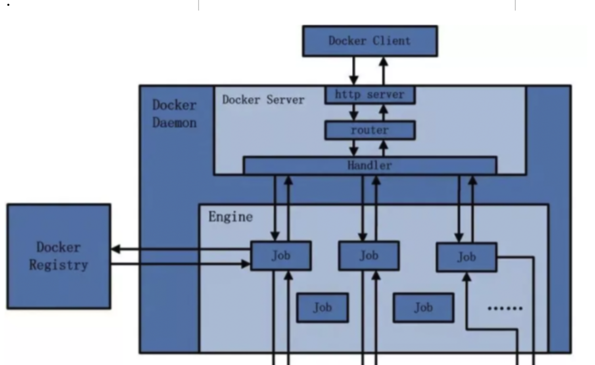
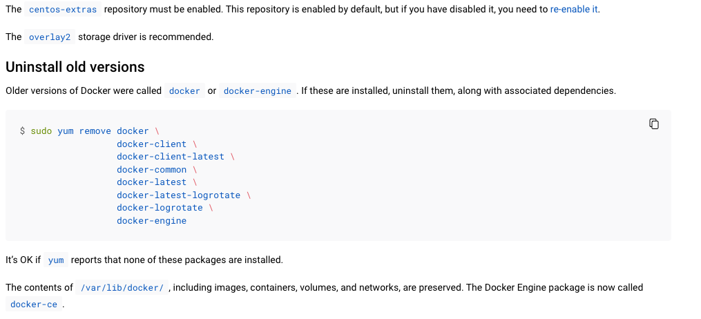
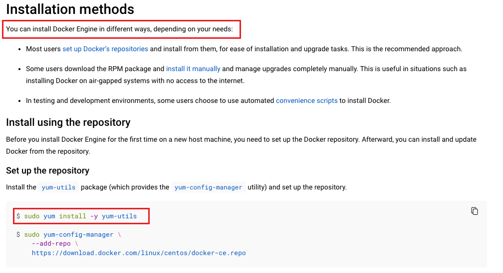
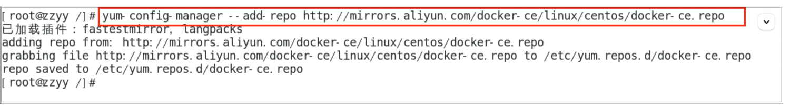
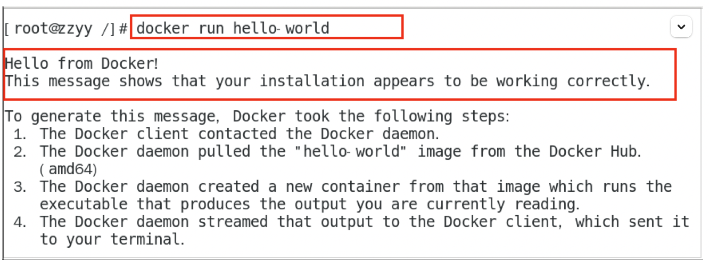
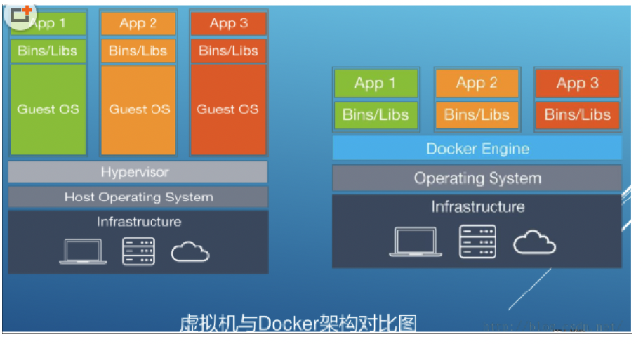

## 二、Docker安装
### 2.1 前提说明
#### 2.1.1 CentOS Docker 安装
Docker并非是一个通用的容器工具，它依赖于已存在并运行的Linux内核环境。
Docker实质上是在已经运行的Linux下制造了一个隔离的文件环境，因此它执行的效率几乎等同于所部署的Linux主机。
因此，Docker必须部署在Linux内核的系统上。如果其他系统想部署Docker就必须安装一个虚拟Linux环境。

在Windows上部署Docker的方法都是先安装一个虚拟机，并在安装Linux系统的虚拟机中运行Docker。
#### 2.1.2 前提条件
目前，CentOS仅发行版本中的内核支持Docker。Docker运行在CentOS 7（64-bit）上，要求系统为64位，Linux系统内核版本为3.8以上，这里选用Centos7.x
#### 2.1.3 查看自己的内核
uname 命令用于打印当前系统相关信息（内核版本号，硬件架构，主机名称和操作系统类型等）。
```
/ > cat /etc/redhat-release
CentOS Linux release 7.9.2009(Core)

/ > uname -r
5.14.0-162.6.1.el9_1.x86_64
```

### 2.2 Docker 的基本组成
#### 2.2.1 镜像（image）
Docker 镜像（Image）就是一个 只读 的模板。镜像可以用来创建 Docker 容器， 一个镜像可以创建很多容器 。
它也相当于是一个root文件系统。比如官方镜像 centos:7 就包含了完整的一套 centos:7 最小系统的 root 文件系统。
相当于容器的“源代码”， docker镜像文件类似于Java的类模板，而docker容器实例类似于java中new出来的实例对象。
#### 2.2.2 容器（container）
- 从面向对象角度
Docker 利用容器（Container）独立运行的一个或一组应用，应用程序或服务运行在容器里面，容器就类似于一个虚拟化的运行环境， 容器是用镜像创建的运行实例 。就像是Java中的类和实例对象一样，镜像是静态的定义，容器是镜像运行时的实体。容器为镜像提供了一个标准的和隔离的运行环境 ，它可以被启动、开始、停止、删除。每个容器都是相互隔离的、保证安全的平台
- 从镜像容器角度
`可以把容器看做是一个简易版的 Linux 环境`  （包括root用户权限、进程空间、用户空间和网络空间等）和运行在其中的应用程序。

#### 2.2.3 仓库（repository）
`仓库（Respository）`是集中存放镜像文件的场所。
类似于：
Maven仓库，存放各种jar包的地方；
github仓库，存放各种git项目的地方；
Docker公司提供的官方registry被称为Docker Hub，存放各种镜像模板的地方。
仓库分为公开仓库（Public）和私有仓库（Private）两种形式。
最大的公开仓库是 Docker Hub(https://hub.docker.com/) ，
存放了数量庞大的镜像供用户下载。国内的公开仓库包括阿里云 、网易云等
#### 2.2.4 小结
- 需要正确的理解仓库/镜像/容器这几个概念:
Docker 本身是一个容器运行载体或称之为管理引擎。我们把应用程序和配置依赖打包好形成一个可交付的运行环境，这个打包好的运行环境就是image镜像文件。只有通过这个镜像文件才能生成Docker容器实例(类似Java中new出来一个对象)。
image文件可以看作是容器的模板。Docker 根据 image 文件生成容器的实例。同一个 image 文件，可以生成多个同时运行的容器实例。
- 镜像文件
image 文件生成的容器实例，本身也是一个文件，称为镜像文件。
- 容器实例
一个容器运行一种服务，当我们需要的时候，就可以通过docker客户端创建一个对应的运行实例，也就是我们的容器 。
- 仓库
就是放一堆镜像的地方，我们可以把镜像发布到仓库中，需要的时候再从仓库中拉下来就可以了。

### 2.3 Docker平台架构图解（入门版）

#### 2.3.1 Docker工作原理
Docker是一个Client-Server结构的系统，Docker守护进程运行在主机上， 然后通过Socket连接从客户端访问，守护进程从客户端接受命令并管理运行在主机上的容器 。 容器，是一个运行时环境，就是我们前面说到的集装箱。可以对比mysql演示对比讲解。

#### 2.3.2 整体架构及底层通信原理简述
Docker是一个C/S模式的架构，后端是一个松耦合架构，众多模块各司其职。
#### 2.3.3 Docker运行的基本流程为
1. 用户是使用Docker Client 与Docker Daemon 建立通信，并发送请求给后者。
2. Docker Daemon 作为Docker架构中的主体部分，首先提供Docker Server 的功能时期可以接受 Docker Client的请求。
3. Docker Engine 执行Docker内部的一些列工作，每一项工作都是以一个Job的形式的存在。
4. Job的运行过程中，当需要容器镜像时，则从Docker Register中下载镜像，并通过镜像管理驱动Graph driver 将下载镜像以Graph的形式存储。
5. 当需要为Docker创建网络环境时，通过网络驱动Network driver创建并配置Docker容器网络环境。
6. 当需要限制Docker容器运行资源或执行用户指令等操作时，则通过Exec driver来完成。
7. Libcontainer是一项独立的容器管理包，Network driver以及Exec driver都是通过Libcontainer来实现具体容器进行的操作。


### 2.4 安装步骤
#### 2.4.1 CentOS 7 安装 Docker
1. 确定你是CentOS 7 或以上版本
```
# 查看CentOS版本命令
cat /etc/redhat-release
```

2. 卸载旧版本
https://docs.docker.com/engine/install/centos/
```
sudo yum remove docker \
                  docker-client \
                  docker-client-latest \
                  docker-common \
                  docker-latest \
                  docker-latest-logrotate \
                  docker-logrotate \
                  docker-engine
```

1. yum安装gcc相关命令
```
# yum安装gcc相关命令
yum -y install gcc
yum -y install gcc-c++
```

1. 安装需要的软件包

```
sudo yum install -y yum-utils
sudo yum-config-manager \
    --add-repo \
    https://download.docker.com/linux/centos/docker-ce.repo
```
使用存储库安装
```
在新主机上首次安装Docker Engine之前，您需要设置Docker存储库。之后，您可以从存储库安装和更新Docker
设置存储库
安装 yum-utils 包（提供yum-config-manager 实用程序）并设置稳定的存储库
# 官网要求
yum install -y yum-utils
```
1. 设置stable镜像仓库

```
# 推荐使用 使用阿里的 docker 镜像仓库，国外的镜像仓库是比较慢的
yum-config-manager --add-repo http://mirrors.aliyun.com/docker-ce/linux/centos/docker-ce.repo
```

6. 更新yum软件包索引
```
# 更新yum软件包索引
yum makecache fast
```
7. 安装Docker CE引擎
```
# 命令
yum -y install docker-ce docker-ce-cli containerd.io
```
8. 启动Docker
```
# 启动命令
systemctl start docker
```
9. 测试

```
docker version 

docker run hello-world
```

输出这段提示以后hello world就会停止运行，容器自动终止。
10. 卸载
```
# 卸载命令
systemctl stop docker 
yum remove docker-ce docker-ce-cli containerd.io
rm -rf /var/lib/docker
rm -rf /var/lib/containerd
```
#### 2.5.3 底层原理
为什么Docker会比VM虚拟机快：
```
1. docker有着比虚拟机更少的抽象层 
   由于docker不需要Hypervisor(虚拟机)实现硬件资源虚拟化,运行在docker容器上的程序直接使用的都是实际物理机的硬件资源。因此在CPU、内存利用率上docker将会在效率上有明显优势。 
2. docker利用的是宿主机的内核,而不需要加载操作系统OS内核 
   当新建一个容器时,docker不需要和虚拟机一样重新加载一个操作系统内核。进而避免引寻、加载操作系统内核返回等比较费时费资源的过程,当新建一个虚拟机时,虚拟机软件需要加载OS,返回新建过程是分钟级别的。而docker由于直接利用宿主机的操作系统,则省略了返回过程,因此新建一个docker容器只需要几秒钟。
```

