# 三、Docker常用命令
## 3.1 帮助启动类命令
```shell
# 启动命令
systemctl start docker
# 停止命令
systemctl stop docker
# 重启命令
systemctl restart docker
# 查看docker状态
systemctl status docker
# 开机启动
systemctl enable docker
# 查看 docker 概要信息
docker info
# 查看docker 总体帮助文档
docker --help
# 查看docker命令帮助文档：
docker 具体命令 --help
```

## 3.2 镜像命令
### 3.2.1 列出本地主机上的镜像
```shell
# 列出本地主机上的镜像
docker images
```

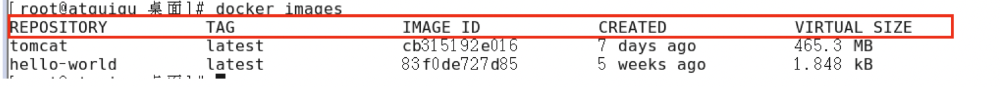

各个选项说明：
- REPOSITORY：表示镜像的仓库源
- TAG：镜像的标签版本号
- IMAGE ID：镜像ID
- CREATED：镜像创建时间
- SIZE：镜像大小

同一仓库源可以有多个 TAG版本，代表这个仓库源的不同个版本，我们使用 REPOSITORY:TAG 来定义不同的镜像。<br />如果你不指定一个镜像的版本标签，例如你只使用 ubuntu，docker 将默认使用 ubuntu:latest 镜像

### 3.2.2 OPTIONS 说明
`-a`：列出本地所有镜像（含历史映像层）<br />`-q`：只显示镜像ID

### 3.2.3 docker search 某个镜像名字
```shell
# 网站
https://hub.docker.com
# 命令
docker search [OPTIONS]镜像名字
# OPTIONS说明
# --limit ：只列出N个镜像，默认25个
docker search  --limit 5 redis
```
案例：
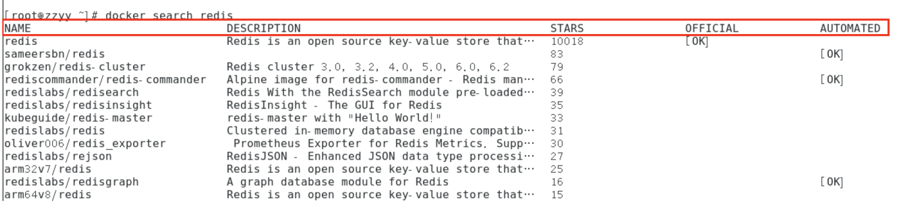

### 3.2.4 docker pull 某个镜像名字

```shell
# 下载镜像
 docker pull 镜像名字[:TAG]
 
 docker pull  镜像名字 
 
 # 没有TAG就是最新版本 等价于
 docker pull 镜像名字：latest
 docker pull ubuntu 
```
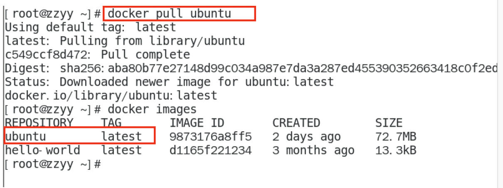

### 3.2.5 docker system df 查看镜像/容器/数据卷所占用的空间

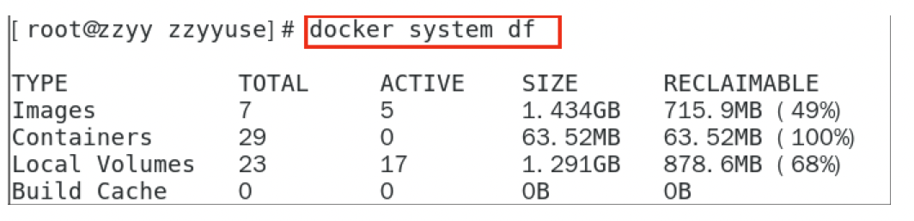

### 3.2.6 docker rmi 删除镜像
```shell
# 删除单个
docker rmi -f 镜像ID

# 删除多个
docker rmi -f 镜像名1:TAG 镜像名2:TAG

# 删除全部
docker rmi -f $(docker images -qa)
```

### 3.2.7 谈谈docker虚悬镜像是什么？

```shell
仓库名称，标签都是<none>的镜像，俗称虚悬镜像dangling image
长什么样子
后续Dockerfile章节在介绍
```

## 3.3 容器命令

有镜像才能创建容器，这是根本前提（下载一个CentOS或者Ubuntu镜像演示）

1. 说明

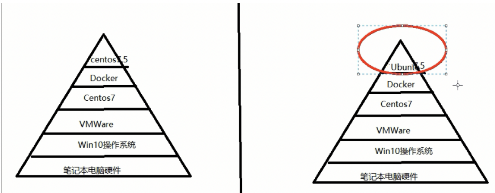

1. docker pull centos
2. docker pull ubuntu
3. 本次演示用ubuntu演示

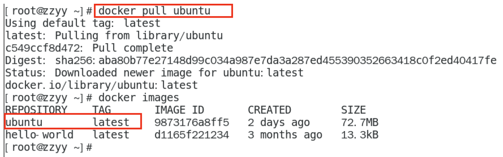
### 3.3.1 新建+启动容器

```shell
docker run [OPTIONS] IMAGE [COMMAND] [ARG...]
```

<br />**OPTIONS说明**<br />
OPTIONS说明（常用）：有些是一个减号，有些是两个减号<br />--name="容器新名字" 为容器指定一个名称； -d: 后台运行容器并返回容器ID，也即启动守护式容器(后台运行)；<br />-i：以交互模式运行容器，通常与 -t 同时使用； -t：为容器重新分配一个伪输入终端，通常与 -i 同时使用； 也即 启动交互式容器(前台有伪终端，等待交互) ；<br />-P: 随机 端口映射，大写P -p: 指定 端口映射，小写p<br />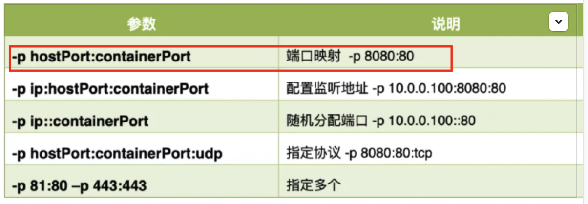

启动交互式容器（前台命令行）<br />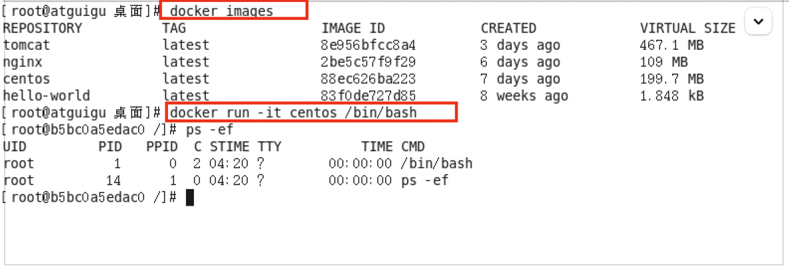<br />使用镜像centos:latest以 交互模式 启动一个容器,在容器内执行/bin/bash命令。

```shell
docker run -it centos /bin/bash
```

参数说明：

- -i：交互式操作
- -t：终端
- centos：centos镜像
- /bin/bash：放在镜像名后的是命令，这里我们希望有个交互式 Shell，因此用的是 /bin/bash。 要退出终端，直接输入 `exit:`

### 3.3.2 列出当前所有正在运行的容器

```shell
docker ps [OPTIONS]
# OPTIONS说明
-a : 列出当前所有 正在运行 的容器 + 历史上运行过 的 
-l :显示最近创建的容器。 
-n：显示最近n个创建的容器。 
-q :静默模式，只显示容器编号。 
```

### 3.3.3 退出容器

```shell
# 1、run进去容器，exit退出，容器停止
exit 
# 2、run进去容器，ctrl+p+q退出，容器不停止
ctrl+p+q
```

### 3.3.4 启动已停止运行的容器

```shell
# 启动已停止运行的容器
docker start 容器ID或者容器名
# 重启容器
docker restart 容器ID或者容器名
# 停止容器
docker stop 容器ID或者容器名
# 强制停止容器
docker kill 容器ID或容器名
# 删除已停止的容器
docker rm 容器ID
# 一次性删除多个容器实例
docker rm -rf $(docker ps -a -q)

docker ps -a -q | xargs docker rm
```

### 3.3.5 重要
### 启动守护式容器（后台服务器）：

```shell
有镜像才能创建容器，这是根本前提（下载一个Redis6.0.8镜像演示）

在大部分的场景下，我们希望docker的服务是在后台运行的，我们可以通过 -d 指定容器的后台运行模式。

docker run -d 容器名
# 使用镜像centos:latest以后台模式启动一个容器 
docker run -d centos 

问题：然后docker ps -a 进行查看,  会发现容器已经退出 
很重要的要说明的一点:  Docker容器后台运行,就必须有一个前台进程. 
容器运行的命令如果不是那些 一直挂起的命令 （比如运行top，tail），就是会自动退出的。 

这个是docker的机制问题,比如你的web容器,我们以nginx为例，正常情况下, 
我们配置启动服务只需要启动响应的service即可。例如service nginx start 
但是,这样做,nginx为后台进程模式运行,就导致docker前台没有运行的应用, 
这样的容器后台启动后,会立即自杀因为他觉得他没事可做了. 
所以，最佳的解决方案是, 将你要运行的程序以前台进程的形式运行， 
常见就是命令行模式，表示我还有交互操作，别中断，O(∩_∩)O哈哈~ 
```

```shell
# 前台交互式启动
docker run -it redis:6.0.8
# 后台交互式启动
docker run -d redis:6.0.8
```

```shell
docker logs 容器ID
```

```shell
docker top 容器ID
```

```shell
docker inspect 容器ID
```

```shell
docker exec -it 容器ID bashShell
```

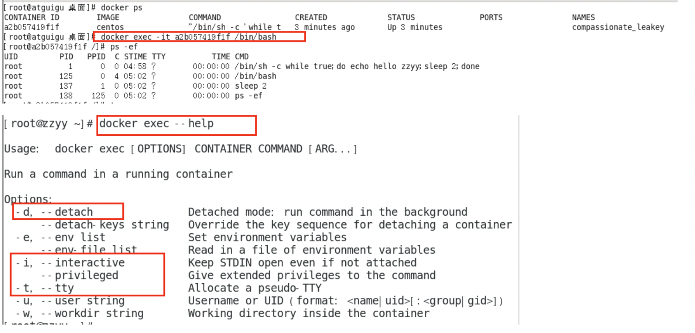<br />重新进入docker attach 容器ID<br />案例演示，用centos或者unbuntu都可以 上述两个区别：

1. attach 直接进入容器启动命令的终端，不会启动新的进程用exit退出，会导致容器的停止。

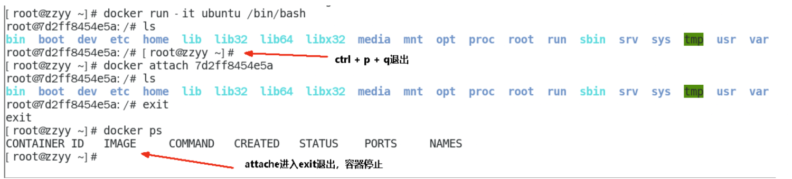

1. exec 是在容器中打开新的终端，并且可以启动新的进程用exit退出，不会导致容器的停止。

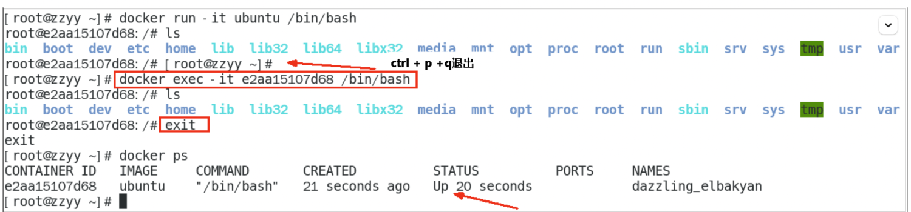<br />**推荐大家使用docker exec 命令，因为退出容器终端，不会导致容器的停止。**

```shell
docker exec -it 容器ID /bin/bash

docker exec -it 容器ID redis-cli

一般用-d后台启动的程序，在用exec进入对应容器实例
```

**从容器内拷贝文件到主机上**

> 容器 -> 主机
> docker cp 容器ID:容器内路径 目的主机路径
> 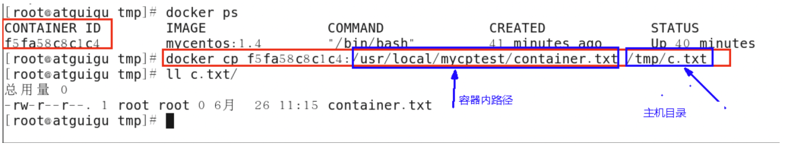
> 公式： docker cp 容器 ID: 容器内路径 目的主机路径

**导入和导出容器**

> Export 导出容器的内容留作为一个tar归档文件[对应import命令]
> import 从tar 包中的内容创建一个新的文件系统在导入为镜像[对应export]
> 【案例】：
> docker export 容器ID > 文件.tar
> 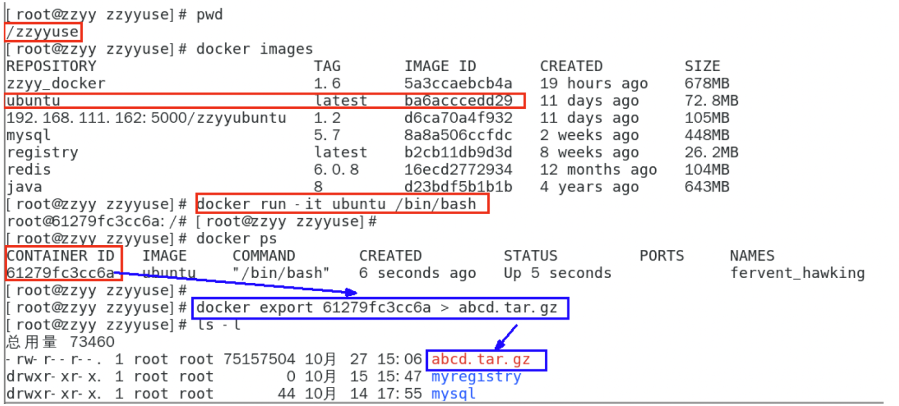
> cat 文件名.tar | docker import -镜像用户/镜像名:镜像版本号
> 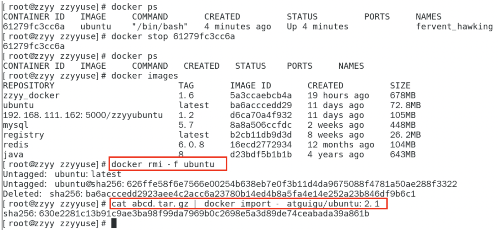

## 3.4 总结

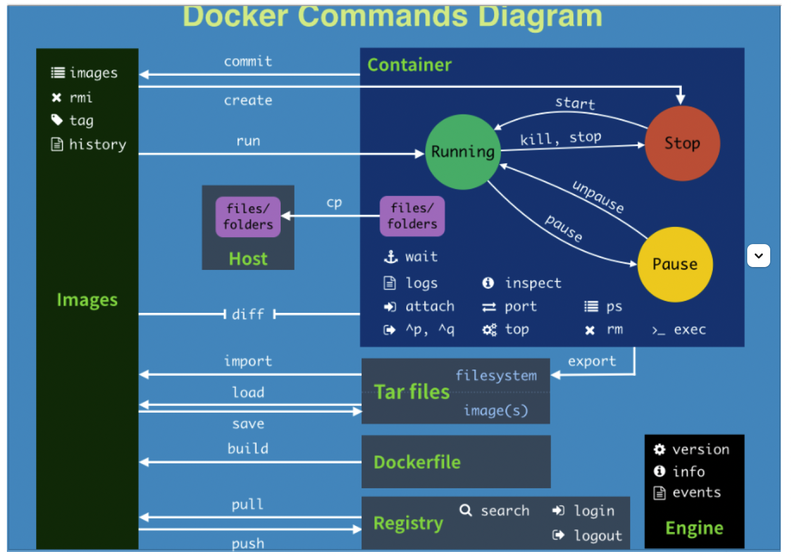

```dockerfile
attach    Attach to a running container                 # 当前 shell 下 attach 连接指定运行镜像 
build     Build an image from a Dockerfile              # 通过 Dockerfile 定制镜像 
commit    Create a new image from a container changes   # 提交当前容器为新的镜像 
cp        Copy files/folders from the containers filesystem to the host path   #从容器中拷贝指定文件或者目录到宿主机中 
create    Create a new container                        # 创建一个新的容器，同 run，但不启动容器 
diff      Inspect changes on a container's filesystem   # 查看 docker 容器变化 
events    Get real time events from the server          # 从 docker 服务获取容器实时事件 
exec      Run a command in an existing container        # 在已存在的容器上运行命令 
export    Stream the contents of a container as a tar archive   # 导出容器的内容流作为一个 tar 归档文件[对应 import ] 
history   Show the history of an image                  # 展示一个镜像形成历史 
images    List images                                   # 列出系统当前镜像 
import    Create a new filesystem image from the contents of a tarball # 从tar包中的内容创建一个新的文件系统映像[对应export] 
info      Display system-wide information               # 显示系统相关信息 
inspect   Return low-level information on a container   # 查看容器详细信息 
kill      Kill a running container                      # kill 指定 docker 容器 
load      Load an image from a tar archive              # 从一个 tar 包中加载一个镜像[对应 save] 
login     Register or Login to the docker registry server    # 注册或者登陆一个 docker 源服务器 
logout    Log out from a Docker registry server          # 从当前 Docker registry 退出 
logs      Fetch the logs of a container                 # 输出当前容器日志信息 
port      Lookup the public-facing port which is NAT-ed to PRIVATE_PORT    # 查看映射端口对应的容器内部源端口 
pause     Pause all processes within a container        # 暂停容器 
ps        List containers                               # 列出容器列表 
pull      Pull an image or a repository from the docker registry server   # 从docker镜像源服务器拉取指定镜像或者库镜像 
push      Push an image or a repository to the docker registry server    # 推送指定镜像或者库镜像至docker源服务器 
restart   Restart a running container                   # 重启运行的容器 
rm        Remove one or more containers                 # 移除一个或者多个容器 
rmi       Remove one or more images       # 移除一个或多个镜像[无容器使用该镜像才可删除，否则需删除相关容器才可继续或 -f 强制删除] 
run       Run a command in a new container              # 创建一个新的容器并运行一个命令 
save      Save an image to a tar archive                # 保存一个镜像为一个 tar 包[对应 load] 
search    Search for an image on the Docker Hub         # 在 docker hub 中搜索镜像 
start     Start a stopped containers                    # 启动容器 
stop      Stop a running containers                     # 停止容器 
tag       Tag an image into a repository                # 给源中镜像打标签 
top       Lookup the running processes of a container   # 查看容器中运行的进程信息 
unpause   Unpause a paused container                    # 取消暂停容器 
version   Show the docker version information           # 查看 docker 版本号 
wait      Block until a container stops, then print its exit code   # 截取容器停止时的退出状态值 
```

