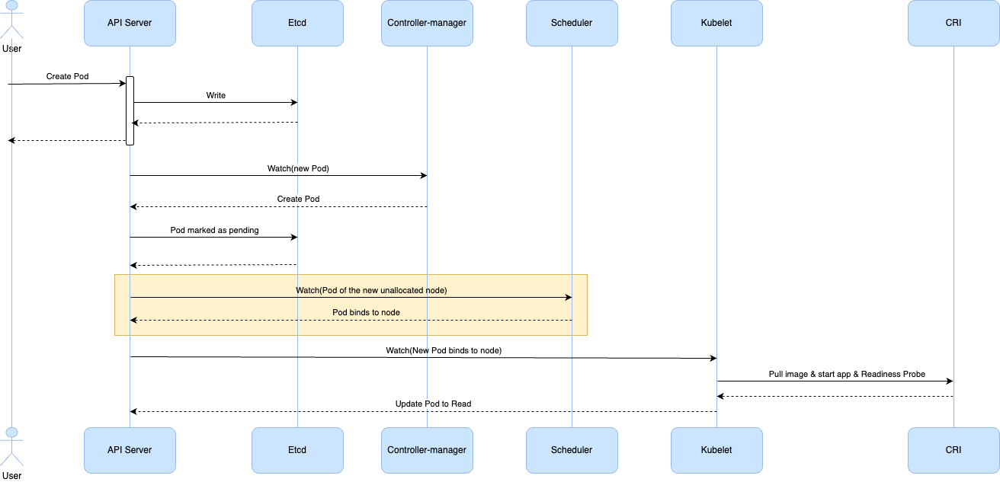
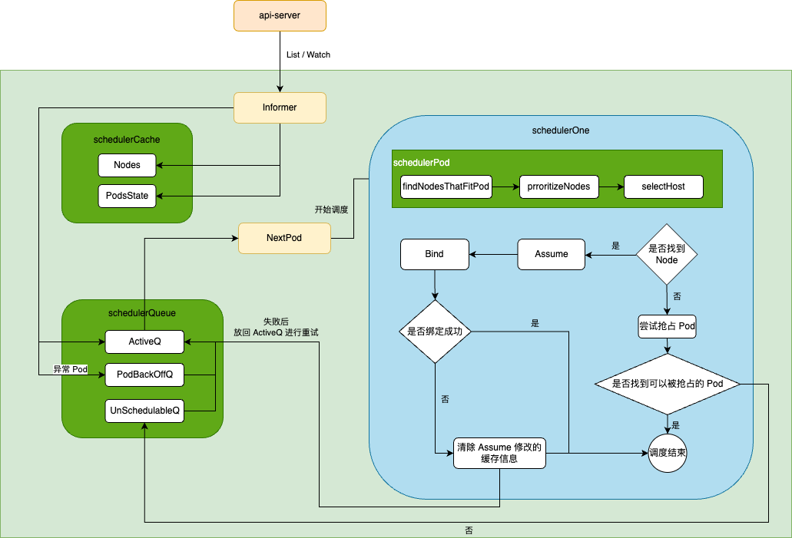
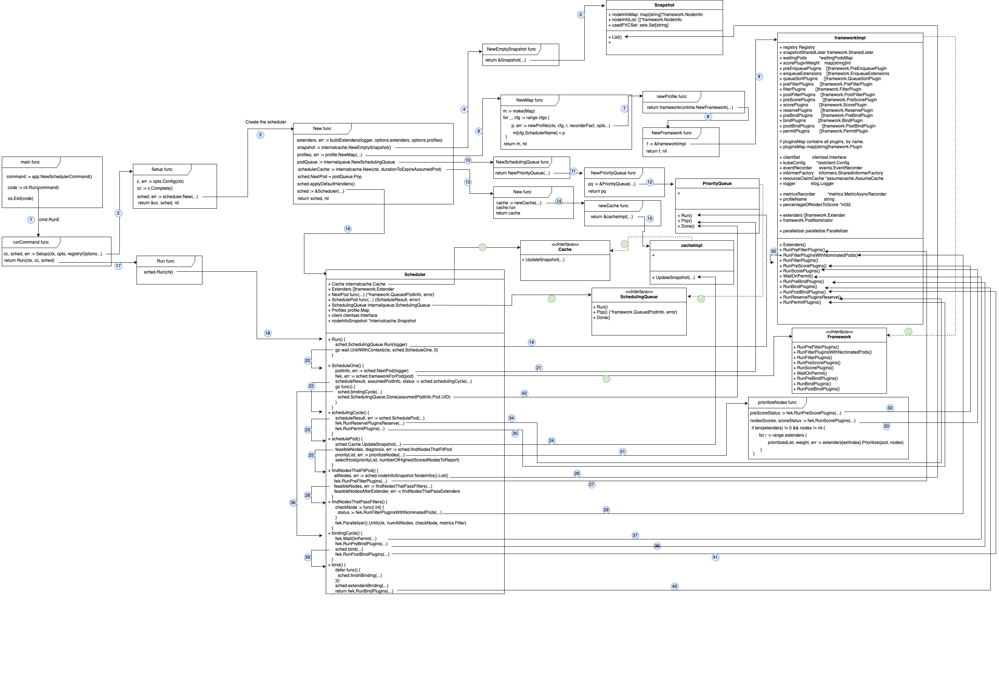
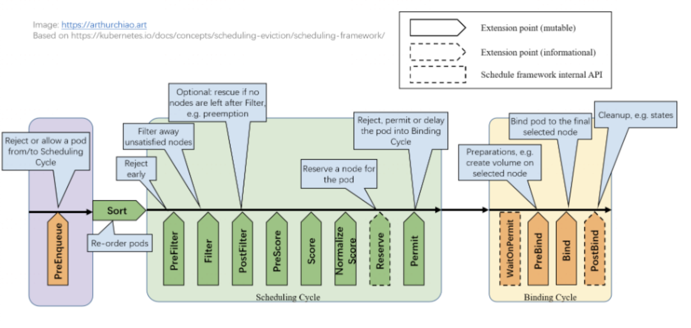
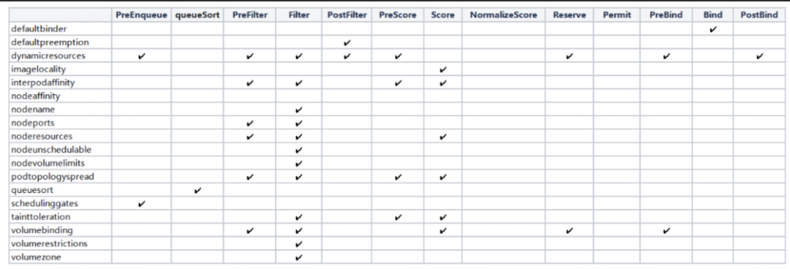
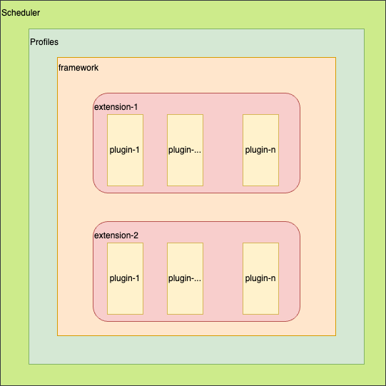

# 深入了解 kube-scheduler
## kube-scheduler 用途
kube-scheduler 主要用途是负责将 Pod 调度到 Node 上。

Pod 创建流程：
> 说明：所有的组件只与 APIServer 做交互，APIServer 再把信息更新的 Etcd 中。

1. 用户向 Kubernetes APIServer 发送创建（create/apply）指令。
2. APIServer 接收到配置文件，进行校验，将配置数据存储到 Etcd 中。
3. Contriller-manager 监听 APIServer 的变化，检测到有新的 Pod 对象时，控制器创建 Pod 并且将其状态设为 Pending 。
4. Scheduler 也通过监听 APIServer 的变化，发现有新的、尚未分配节点（Node）的 Pod。根据预选策略和优选策略，选择一个最适合的 Node 来运行新的 Pod 。
5. Pod 被调度到对应的 Node 后，该 Node 上的 kubelet 组件则开始根据 Pod 配置文件，拉镜像、启动 app、就绪探针探测。
6. Kubelet 向 APIServer 上报状态为 Reday，APIServer 写入到 Etcd 中。

## Scheduler Pod 调度流程
Scheduler 的作用是负责将 Pod 调度到 Node 上。
Kubernetes 是如何设计这个组件，保证它稳定高效的运行？
1. 需要能够实时监听到有新的 Pod 待调度。
2. 同一时间如果有大量待调度的 Pod，如何保证不能漏掉？先处理哪个 Pod？调度过程中，如果是失败，如何处理？所以需要加个队列并且有重试机制等。
3. 调度过程中依赖 Node 、 Pod 的实时信息，根据 Node 、 Pod 信息，决策 Pod 调度到哪个 Node 上合适，每次调度都要调用 APIServer 是否低效？得在本地缓存一份数据，加个缓存。
4. 调度选择过程中，考虑因素有很多，很难周全，所以可扩展性一定要设计好。
5. Pod 绑定过程中可能依赖 pvc 绑定等，耗时比较长，所以绑定要是异步的，但是匹配哪个 Node 合适的策略算法，则需要同步执行。所以要有两个周期，调度周期和绑定周期。调度周期串行，绑定周期并行。

以下是调度框架


## 源码调用链路
> 原图是用 draw.io 画的，可打开后二次编辑。



```sh
# 42 个序号对应的源码位置依次为：
1 找到启动主函数
https://github.com/shychee/kubernetes/blob/v1.31.0-learning/cmd/kube-scheduler/scheduler.go#L32
https://github.com/shychee/kubernetes/blob/v1.31.0-learning/cmd/kube-scheduler/app/server.go#L81
https://github.com/shychee/kubernetes/blob/v1.31.0-learning/cmd/kube-scheduler/scheduler.go#L34
https://github.com/shychee/kubernetes/blob/v1.31.0-learning/cmd/kube-scheduler/app/server.go#L133

2 Setup 初始化
https://github.com/shychee/kubernetes/blob/v1.31.0-learning/cmd/kube-scheduler/app/server.go#L153
https://github.com/shychee/kubernetes/blob/v1.31.0-learning/cmd/kube-scheduler/app/server.go#L384

3、16 初始化 scheduler 实例
https://github.com/shychee/kubernetes/blob/v1.31.0-learning/cmd/kube-scheduler/app/server.go#L413
https://github.com/shychee/kubernetes/blob/v1.31.0-learning/pkg/scheduler/scheduler.go#L371
https://github.com/shychee/kubernetes/blob/v1.31.0-learning/pkg/scheduler/scheduler.go#L65

4、5 初始化 snapshot 实例
https://github.com/shychee/kubernetes/blob/v1.31.0-learning/pkg/scheduler/scheduler.go#L300
https://github.com/kubernetes/kubernetes/blob/v1.31.0/pkg/scheduler/backend/cache/snapshot.go#L49
https://github.com/kubernetes/kubernetes/blob/v1.31.0/pkg/scheduler/backend/cache/snapshot.go#L30
```
具体代码太多了，不展示在这。

## Scheduler Framework
上面调度链路图，可以清晰的看出  Framework 调度算法的扩展点。

具体每个扩展点包含哪些 plugin， 每个 plugin 可作用于那些扩展点，如下图：


## 如何扩展插件
如果我们要实现自己的插件，必须向调度框架注册插件并完成配置，另外还必须实现扩展点接口。

1. 向调度框架注册插件 & 扩展点实现接口如下：
out-of-tree 实现扩展示例
main.go
```go
package main

import (
    "os"

    "k8s.io/component-base/cli"
    _ "k8s.io/component-base/metrics/prometheus/clientgo"  // 指标收集
    _ "k8s.io/component-base/metrics/prometheus/version" // 版本收集
    "k8s.io/kubernetes/cmd/kube-scheduler/app"

    "xxx/pkg/scheduler/framework/plugins/example"

    // 注册 scheduler-plugins 插件
    _ "sigs.k8s.io/scheduler-plugins/pkg/apis/config/scheme"
)

func main() {
    // 将自定义插件注册到调度框架中。稍后, 它们可以由各种工作负载的调度文件(profile)组成。
    command := app.NewSchedulerCommand(
        app.WithPlugin(example.Name, example.New),
    )
    
    code := cli.Run(command)
    os.Exit(code)
}
```
```go
package example

import (
    "context"

    v1 "k8s.io/api/core/v1"
    "k8s.io/apimachinery/pkg/runtime"
    "k8s.io/klog/v2"
    "k8s.io/kubernetes/pkg/scheduler/framework"
)

const Name = "example.com/example"

var _ framework.FilterPlugin = &ExamplePlugin{}

type ExamplePlugin struct {}

// NewExamplePlugin 是插件的构造函数，返回一个实现了 framework.Plugin 接口的结构体实例。
func NewExamplePlugin(_ runtime.Object, _ framework.Handle) (framework.Plugin, error) {
    return &ExamplePlugin{}, nil
}

func (e *ExamplePlugin) Filter(ctx context.Context, state *framework.CycleState, pod *v1.Pod, nodeInfo *framework.NodeInfo) *framework.Status {
    cpu := nodeInfo.Allocatable.MillCpu
    memory := nodeInfo.Allocatable.Memory
    klog.InfoS("Filter", "pod", pod.Name, "current nodeInfo", nodeInfo.Node().Name, "cpu", cpu, "memory", memory)
    return framework.NewStatus(framework.Success, "")
}

func (e *ExamplePlugin) Name() string {
    return Name
}
```

2. 进行配置，enable 插件
编写 kube-scheduler 启动命令配置文件 example-cm.yaml
> 一个 ksc 里面可以描述多个 profile，会启动多个独立 scheduler 。
> pod 想用那个 scheduler，就填对应的 schedulerName 。如果没指定，就是 default-scheduler。
> 由于这个配置是给 kube-scheduler 的而不是 kube-apiserver，所以 k api-resources 或 k get KubeSchedulerConfiguration 都是找不到这个资源的。

```yaml
apiVersion: v1
kind: ConfigMap
metadata:
  name: example-scheduler-config
  namespace: kube-system
data:
  scheduler-config.yaml: |
    apiVersion: kubescheduler.config.k8s.io/v1
    kind: KubeSchedulerConfiguration
    leaderElection:
      leaderElect: false
    clientConnection:
      acceptContentTypes: ""
      burst: 100
      contentType: application/vnd.kubernetes.protobuf
      qps: 100
    profiles:
    - schedulerName: example-scheduler
      plugins:
        filter:
          enabled:
          - name: "example" 
```


3. 使用自定义 scheduler
Pod yaml 文件中指定 `schedulerName: example-scheduler` 即可使用自定义 Scheduler 了。