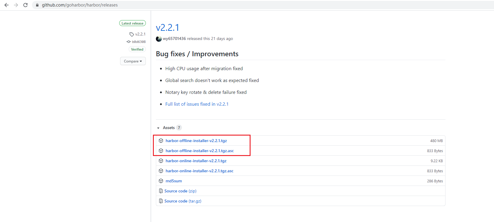

## Get Start
### Download Package
https://github.com/goharbor/harbor/releases
```
wget https://github.com/goharbor/harbor/releases/download/v2.2.1/harbor-offline-installer-v2.2.1.tgz
gpg -v -d harbor-offline-installer-v2.2.1.tgz.asc #校验
```

### Deploy
1. 解压
2. 配置
   - 可配置项目：域名、登录密码、访问方式为 http 还是 https、数据存储目录等
   ```
    [0 root@vps apps]# tar -xf /opt/harbor-offline-installer-v2.2.1.tgz
    [0 root@vps apps]# cd harbor/
    [0 root@vps harbor]# cp harbor.yml.tmpl harbor.yml
   ```
   - 生成与配置 https
   ```
   # 方法1，手动生成
   ## 生成CA证书
   openssl req -newkey rsa:4096 -nodes -sha256 -keyout ca.key -x509 -subj "/CN=harbor.domain.io" -days 365 -out ca.crt
   # 生成harbor主机的证书申请
   openssl req -newkey rsa:4096 -nodes -sha256 -subj "/CN=harbor.domain.io" -keyout harbor.domain.io.key -out harbor.domain.io.csr
   ## 给harbor主机颁发证书
   openssl x509 -req -in harbor.domain.io.csr -CA ca.crt -CAkey ca.key -CAcreateserial -out harbor.domain.io.crt

   # 方法2，使用官方的证书生成方式 https://goharbor.io/docs/2.2.0/install-config/configure-https/
   docker run -v /:/hostfs goharbor/prepare:v2.1.0 gencert -p /apps/harbor/certs
   ```
   - 添加证书
   ```
   cat harbor.yml
   hostname: harbor.domain.io

   # http related config
   http:
     # port for http, default is 80. If https enabled, this port will redirect to https port
     port: 80

   # https related config
   https:
     # https port for harbor, default is 443
     port: 443
     # The path of cert and key files for nginx
     certificate: /data/secret/certs/harbor.domain.io.crt
     private_key: /data/secret/certs/harbor.domain.io.key
   ```
3. 测试启动
   ```
   # ./install.sh  #初始化加载即启动
   # docker-compose down  #关闭服务
   # ./prepare  #修改配置文件后需要重新同步更新配置文件
   ```
4. 配置 harbor 自启动/systemd 管理
   ```
   # 方法1： 简单设置为开机启动
   echo '/apps/harbor/usr/bin/docker-compose restart' >> /etc/rc.local
   chmod +x /etc/rc.local

   # 方法2：使用systemd管理
   cat /lib/systemd/system/harbor.service
   [Unit]
   Description=Harbor
   After=docker.service systemd-networkd.service systemd-resolved.service
   Requires=docker.service
   Documentation=http://github.com/vmware/harbor
   [Service]
   Type=simple
   Restart=on-failure
   RestartSec=5
   ExecStart=/usr/bin/docker-compose -f /apps/harbor/docker-compose.yml up
   ExecStop=/usr/bin/docker-compose -f /apps/harbor/docker-compose.yml down
   [Install]
   WantedBy=multi-user.target

   [root@harbor ~]#systemctl daemon-reload
   [root@harbor ~]#systemctl enable --now harbor
   ```
5. 客户端使用
   1. docker客户端如果配置中添加了insecure-registary配置，就不需要在docker 客户端配置上对应证书
   2. 如果不配置就需要在/etc/docker/certs.d/目录中添加对应证书才能正常登录
https://www.cnblogs.com/firewalld/p/14684565.html

## 配图
下载 harbor2.2.1 离线安装包

