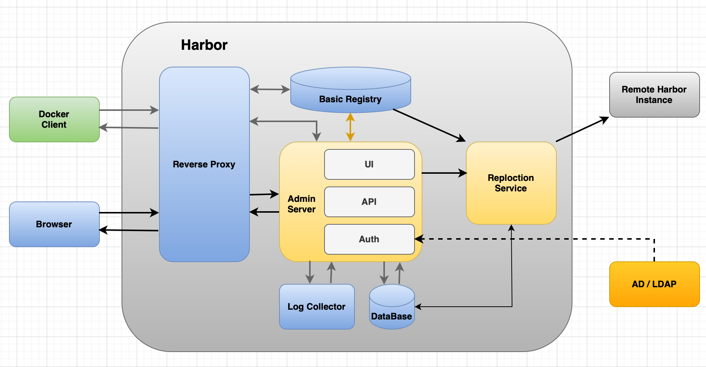

## Harbor简介
Harbor是一个开源的企业级Registry服务器，用于存储和分发Docker镜像。Harbor为用户提供了一系列的管理工具，帮助用户管理和复用镜像，包括用户界面，RESTful API和命令行界面。作为一个企业级私有Registry服务器，Harbor提供了更好的性能和安全性。Harbor支持安装在多个Registry节点的镜像资源复制，镜像全部保存在私有 Registry 中，确保数据和知识产权在公司内部网络中管控，另外，Harbor也提供了高级的安全特性，诸如用户管理，访问控制和活动审计等。

## Harbor的特性
- 企业级Registry服务器
- 基于角色的访问控制
- 多租户
- 安全扫描
- 镜像复制

## Harbor的架构

### Harbor的主要组件
- Proxy：负责接收用户的请求，对请求进行身份验证，然后将请求转发给UI Service或者Registry Service。
- UI Service：负责处理用户的请求，包括用户的登录，镜像的搜索，镜像的复制等。
- Registry Service：负责处理镜像的上传，下载，删除等。
- Database：负责存储Harbor的元数据，包括用户信息，镜像信息，镜像的复制信息等。
- API: Harbor暴露的API服务
- Redis：负责存储用户的会话信息，包括用户的登录信息，用户的权限信息等。
- Storage：负责存储镜像文件。
- Log Collector：负责收集Harbor的日志信息，包括Proxy，UI Service，Registry Service的日志信息。
- Job Service：负责执行Harbor的定时任务，包括镜像的复制，镜像的删除等。
- Admin Service: 对应启动组件harbor-adminserver。是系统的配置管理中心附带检查存储用量，ui和jobserver启动时候需要加载adminserver的配置
- DB: 对应启动组件harbor-db，负责存储project、 user、 role、replication、image_scan、access等的metadata数据
