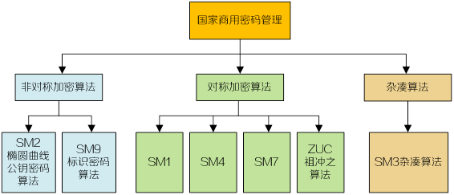
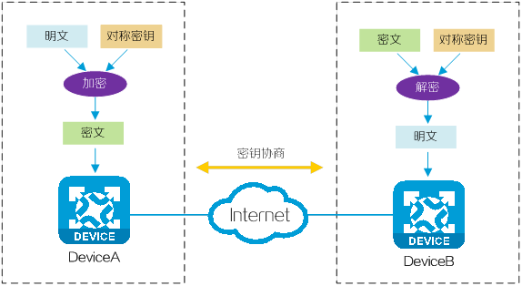
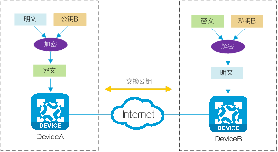
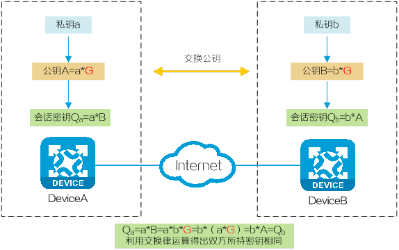
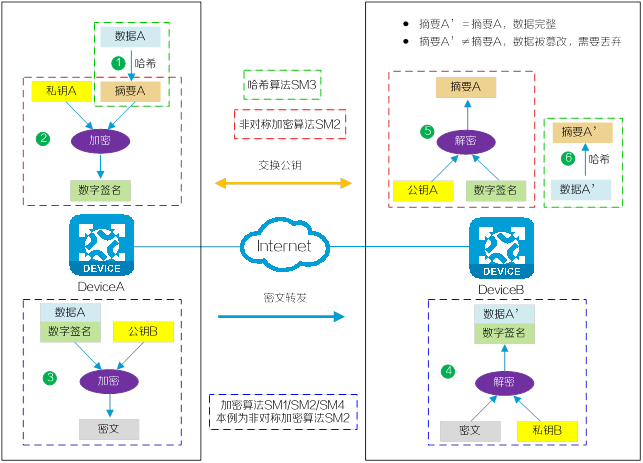
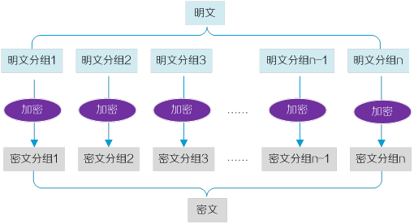
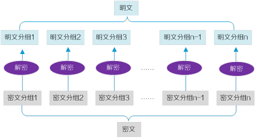
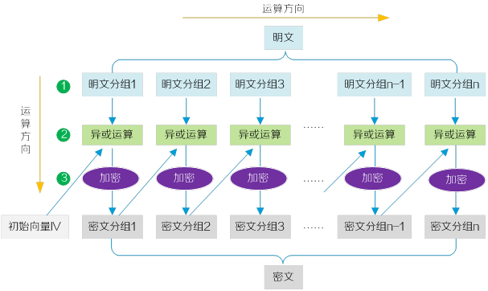
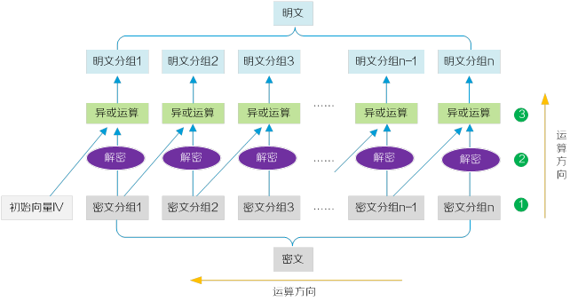

## 什么是国密算法

国密算法是指由中国国家密码管理局发布的密码算法标准，旨在保障国家信息安全。目前，国家密码管理局已发布了一系列国产商用密码标准算法，包括SM1（SCB2）、SM2、SM3、SM4、SM7、SM9以及祖冲之密码算法（ZUC)等。通过在金融、电子政务及安防等领域广泛应用国密算法，在对敏感数据进行机密性、完整性和可用性保护的同时，减少对外部密码产品的依赖，提升国家信息安全水平。

### 为什么需要国密算法？
#### 国密算法的产生背景

在网络信息传输和存储过程中，数据的保密性和安全性是一项重要的需求。传统的国际标准加密算法虽然安全可靠，但由于无法保证源代码的安全性，因此存在着源代码被外部恶意攻击者渗透或篡改的风险。为了构建安全的行业网络环境并增强国家行业信息系统的“安全可控”能力，中国积极开展了针对信息安全需求的研究和探索。自2007年开始，中国制定了国密算法标准，并于2010年正式发布。

经过多年的发展、改进和完善，国密算法已成为中国自主研发的密码算法标准，并在各行业得到广泛应用。它的诞生不仅显著提升了中国在密码技术领域的核心竞争力，还为国家信息安全建设作出了重要贡献。

### 国密算法的特点

国密算法具备如下特点：

- 安全性高：国密算法采用了严密的密码学原理和复杂的运算方式，具有较高的安全性。它在加密、数字签名和哈希等功能上都能提供可靠的保护，抵抗了各种传统和现代密码攻击手段。
- 高效性与灵活性：国密算法在保证安全性的同时，注重算法的效率。它的加密速度和运行效率相对较高，同时也能适应不同的密码长度和密钥长度，以满足不同场景的需求。
- 标准化广泛：国密算法已被国家标准化机构认可和采用。它符合国际密码学标准的基本要求，具备与国际算法相媲美的能力。同时，国密算法也在国内推广和应用广泛，成为中国信息安全领域的基础核心算法之一。
- 自主创新：国密算法是中国自主研发的密码算法，所以对于算法的实现和推广都具有独立的掌控能力。这意味着中国可以更好地保护自己的国家信息安全，减少对外依赖，提高自主抵抗能力。
- 面向多领域应用：国密算法不仅局限于某个特定领域的应用，它适用于金融业、电子商务、通信、物联网、区块链等不同领域的信息安全保护。它的广泛应用范围使得国密算法可以满足不同行业的安全需求。

### 国密算法如何工作？
国密算法包括SM1（SCB2）、SM2、SM3、SM4、SM7、SM9以及祖冲之密码算法（ZUC)等。其中，SM1、SM4、SM7、祖冲之密码（ZUC）属于对称算法；SM2、SM9属于非对称算法；SM3属于杂凑算法。

下文将主要介绍国密算法中的常用算法SM1、SM2、SM3和SM4的实现和应用。

#### SM1算法的实现和应用
SM1算法是国密算法中的一种对称加密算法，其特点是加解密使用相同密钥。利用SM1对称加密算法加解密数据的过程。

SM1算法未公开，仅以IP核（Intellectual Property Core，一种预先做好的集成电路功能模块）的形式存在于芯片中。SM1算法主要用于小数据量的加密保护，因此被广泛用于研制智能IC卡、智能密码钥匙、门禁卡、加密卡等安全产品。

#### SM2算法的实现和应用
SM2算法是基于ECC（Elliptic Curve Cryptography）椭圆曲线的非对称加密算法，包括了SM2-1椭圆曲线数字签名算法、SM2-2椭圆曲线密钥交换协议和SM2-3椭圆曲线公钥加密算法，分别用于实现数字签名、密钥协商和数据加密等功能。

SM2算法在许多领域都有广泛的应用。在电子商务领域，SM2算法被用于保护用户个人信息的安全传输，确保用户在网上交易过程中的隐私和财产的安全。在互联网金融领域，SM2算法被用于数字支付、电子银行等场景，实现用户身份认证和交易的安全性。此外，SM2算法还适用于物联网领域，保护物联网设备之间的通信安全，确保数据的可靠传输。

##### 数据加密
在非对称加密算法中，可对外公布的密钥称为“公钥”，只有持有者所知的密钥称为“私钥”。发送者使用接收者的公钥来加密消息，接收者用自己的私钥解密和读取该消息。

利用SM2非对称加密算法加解密数据的过程。

##### 密钥协商
由于椭圆曲线的计算复杂性高，破解难度大，因此SM2算法在密钥协商技术领域也起着关键作用。利用SM2算法进行密钥协商的过程。

(1) 会话双方生成自己的私钥（随机数）。

(2) 会话双方由私钥、ECC椭圆曲线参数G各自计算出公钥。

(3) 会话双方将自己的公钥传递给对方，传递过程公开。由于椭圆曲线的计算复杂性高，破解难度大，因此攻击者难以通过公钥和椭圆曲线参数G反推出私钥。

(4) 双方将自己的私钥与对方的公钥进行运算，最终得到相同的会话密钥，该会话密钥可作为共享密钥用于对称加密（例如SM4算法）通信。

##### 数字签名
数字签名是一种用于验证信息完整性、真实性和来源的技术手段。它通常用于确保数据在传输或存储过程中没有被篡改，并且可以追溯到特定的发送方。发送方使用自己的私钥对消息进行加密，生成数字签名。接收方使用发送方的公钥对签名进行解密和验证，以验证消息的完整性和真实性。

在数字签名应用中，SM2算法通常与SM3摘要算法一起使用。

#### SM3算法的实现和应用
SM3杂凑（Hashing）算法是国密算法中的一种摘要算法。SM3算法通过哈希函数将任意长度的消息压缩成固定长度的摘要。摘要具有唯一性，即不同信息生成的摘要不同，且无法由摘要恢复出原始信息，更无法伪造信息获得相同摘要，因此SM3算法被广泛用于实现数字签名、数据完整性检测及消息验证等功能。

基于SM3算法的特点，在信息安全领域，SM3算法被用于保护密码学协议、数字证书和电子签名等数据的完整性。在区块链领域，SM3算法被用于加密货币的区块生成和链上交易的校验，确保区块链的安全性。此外，SM3算法还可以应用于密码学随机数的生成和伪随机序列的校验等领域，增加了数据的安全性和可靠性。

利用SM2算法和SM3算法对用户数据进行数字签名认证及完整性校验的过程。

(1) 用户A发送的数据A经过SM3哈希算法运算生成摘要A。

(2) 摘要A经过用户A的私钥加密生成数字签名。

(3) 用户A的明文数据和数字签名经加密算法（SM1/SM2/SM4）加密成密文后发送给用户B。加密算法以非对称加密算法SM2为例，即加解密使用不同密钥。

(4) 密文到达用户B处，经加密算法（SM1/SM2/SM4）解密后，还原成明文数据和数字签名。

(5) 用户B使用用户A的公钥解密数据包中的数字签名：
  - 解密成功，数据来源合法，得到摘要A；
  - 解密失败，数据来源非用户A，丢弃本次数据。

(6) 收到的数据包中的明文数据经过SM3哈希运算生成摘要A’。对比摘要A和摘要A’：
  - 摘要A’＝摘要A，数据完整；
  - 摘要A’≠摘要A，数据被篡改，丢弃本次数据。

#### SM4算法的实现和应用
与SM1算法分类相同，SM4算法同样为分组对称加密算法，但SM4算法实现公开。

分组加密算法是将明文数据按固定长度进行分组，用同一密钥逐组加密，密文解密时同样使用相同密钥逐组解密。SM4算法实现简单，因此加解密速度较快，消耗资源少，主要用于大数据量的加密和解密，例如静态储存或数据信号传输通道中数据的加解密。

在网络安全领域，SM4算法被用于保护网络传输和存储的敏感数据，如银行卡信息、密码等。在物联网领域，SM4算法被用于物联网设备之间的通信和数据加密，确保物联网数据的隐私安全。此外，SM4算法还可以应用于区块链领域，保护加密货币的交易安全等领域，为相关系统和数据的安全提供了保障。

##### 加解密模式
SM4算法支持ECB、CBC、CFB等多种分组模式，下文将介绍ECB和CBC两种基础模式。

- ECB模式

SM4算法基于ECB模式对数据加解密的过程。

(1) 发送端将明文按固定长度分组，对每个明文分组分别使用相同的密钥进行加密生成密文分组。完整的密文由所有密文分组按序排列组合而成。

(2) 接收端将密文按固定长度分组，对每个密文分组分别使用相同的密钥进行解密生成明文分组。所有明文分组按序排列组合而成完整的明文数据。

ECB模式实现简单，各段数据间互不影响，有利于并行运算，但相同的明文块会被加密成相同的密文块，不能提供严格的数据保密性。

- CBC模式

SM4算法基于CBC模式对明文加密的过程。

(1) 将明文按固定长度分组。

(2) 明文分组1与初始向量IV进行异或运算，异或运算的结果经密钥加密后得到密文分组1。

(3) 剩余的明文分组依次与前一个密文分组进行异或运算后再加密，得到对应的密文分组。

(4) 完整的密文由所有密文分组按序排列组合而成。

##### SM4算法基于CBC模式对密文解密的过程。

(1) 将密文按固定长度分组后，对密文分组进行倒序处理。

(2) 对密文分组n先使用密钥进行解密，密文分组n解密后的数据与密文分组n-1进行逻辑逆运算，得到明文分组n。

(3) 同理，剩余的密文分组解密后再与前一个密文分组进行逻辑逆运算，得到对应的明文分组。

(4) 最后，密文分组1用密钥解密后的数据是与初始向量进行逻辑逆运算，然后得到明文分组1。

(5) 完整的明文由所有明文分组按序排列组合而成。

CBC模式安全性高于ECB，但明文块不能并行计算，且误差会传递下去。

### 国密算法与国际标准算法的对比
国密算法和国际标准算法都是现代密码学中常用的加密算法，但在技术和优劣方面存在一些区别。常见国密算法与国际标准算法各参数性能的对比如下：

| 对比项   | DES算法                                      | AES算法                                      | SM1算法   | SM4算法                                 | RSA算法              | SM2算法                              | SHA1算法                          | SHA256算法                        | SM3算法                           |
| :------- | :------------------------------------------- | :------------------------------------------- | :-------- | :-------------------------------------- | :------------------- | :----------------------------------- | :-------------------------------- | :-------------------------------- | :-------------------------------- |
| 计算结构 | 难，基于标准的算数和逻辑运算，不含非线性变换 | 极难，基于字节代换、行代换等，不含非线性变换 | 未公开    | 极难，基于基本轮函数+迭代，含非线性变换 | 难，基于可逆幂模运算 | 极难，基于椭圆曲线上点群离散对数难题 | 函数结构类似，但SM3算法设计更复杂 | 函数结构类似，但SM3算法设计更复杂 | 函数结构类似，但SM3算法设计更复杂 |
| 分组长度 | 64位                                         | 128位                                        | 128位     | 128位                                   | 亚指数级             | 完全指数级                           | 128位                             | 256位                             | 256 位                            |
| 密钥长度 | 64位（3DES为128位）                          | 128/192/256位                                | 128位     | 128位                                   | 较长                 | 较短                                 | 较快                              | 略低于SHA1                        | 略低于SHA1                        |
| 计算轮次 | 16轮（3DES为48轮）                           | 20/12/14轮                                   | 未公开    | 32轮                                    | 慢                   | 较RAS算法快百倍以上                  |
| 安全性   | 较低（3DES较高）                             | 较高                                         | 与AES相当 | 较高                                    | 一般                 | 较高                                 |

