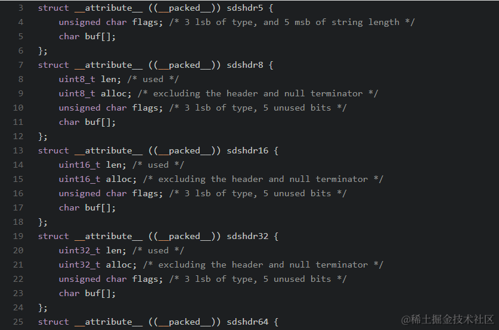

### 前言
Redis为开发者提供了丰富的数据类型，而String类型使用的比较广泛一种，使用也比较简便。

你看用下面命令就可以设置和获取Redis字符串值：
```bash
redis 127.0.0.1:6379> SET lynch code
OK
redis 127.0.0.1:6379> GET lynch
"code"
```
Redis 是用 C 语言写的，但是对于Redis的字符串，却不是 C 语言中的字符串（即以空字符’\0’结尾的字符数组），它是自己构建了一种名为 简单动态字符串（simple dynamic string）简称SDS的抽象类型，并将 SDS 作为 Redis的默认字符串表示。


### Redis 字符串
`SDS`名为简单动态字符串，它是内部如何设计的，既然是C语言写的为什么不用C语言的字符串呢？

带着这些问题我们继续往下看！

#### 二进制安全性
> 🙋‍♂️ 什么是二进制安全性？

二进制安全是指一种数据处理或传输的方式，其中对待数据的处理不会受到数据中包含的二进制数据的影响。在计算机科学和编程中，这个术语通常与字符串的处理有关。

> 🚩 C语言字符串和Redis SDS的二进制安全性问题对比

C 语言中字符串是以遇到的第一个空字符 \0 来识别是否到末尾，因此其只能保存文本数据，不能保存图片，音频，视频和压缩文件等二进制数据，否则可能出现字符串不完整的问题，所以其是二进制不安全。

Redis SDS（简单动态字符串）允许不受限制地存储和操作任意长度的二进制数据，保证了二进制安全。

#### C语言字符串的不足
上面我们通过C语言字符串和Redis SDS二进制安全性问题的现象对比，我们知道了C语言字符串只能保存文本数据，不能保存图片，音频，视频和压缩文件等二进制数据。

与Redis的SDS比起来有以下不足：

- 获取字符串长度的时间复杂度为 n

- API是不安全的可能造成缓冲区溢出

- 只能保存文本数据

#### SDS结构
现在开始进入正题，挖一挖Redis String的底层实现！

我们复制了其中一种SDS类型【sdshdr8】，它在Redis源码中的结构代码如下：
```C
struct __attribute__ ((__packed__)) sdshdr8 {
    uint8_t len;
    uint8_t alloc;
    unsigned char flags;
    char buf[];
};
```

字段说明：

- len : 记录buf数组中已使用的字节数量

- alloc : 分配的buf数组长度，不包括头和空字符结尾

- flags : 标志位，标记当前字节数组是 sdshdr8/16/32/64 中的哪一种，占 1 个字节。

- buf[] : 字符数组，用于存放实际字符串


定义的这些字段有以下一些好处：

- 用单独的变量 len 和 free，可以方便地获取字符串长度和剩余空间；

- 内容存储在动态数组 buf 中，SDS 对上层暴露的指针指向 buf，而不是指向结构体 SDS。因此，上层可以像读取 C 字符串一样读取 SDS 的内容，兼容 C 语言处理字符串的各种函数，同时也能通过 buf 地址的偏移，方便地获取其他变量；

- 读写字符串不依赖于 \0，保证二进制安全。

对应在文章开头中我们设置的 key="lynch"、value="code"，存储情况如下图所示：


从图中可以看出SDS 也遵循 C 字符串以空字符“\0”结尾的惯例，而保存空字符的大小不计算在 SDS 的 len 属性中。

不过你也注意到了此时表示SDS类型的flags字段的值是 1，也就是 sdshdr8。

### SDS类型
在SDS结构一节中我们使用的是sdshdr8，而Redis 3.2 版本之后，SDS 由一种数据结构变成了 5 种数据结构。

> ✏️这5 种类型分别是 sdshdr5、sdshdr8、sdshdr16、sdshdr32 和 sdshdr64

五种类型的区别在于数组的 len 长度和分配空间长度 alloc。

- sdshdr5：存储大小为 32 byte = 2^ 5 【被弃用】

- sdshdr8：存储大小为 256 byte = 2^ 8

- sdshdr16：存储大小为 64KB = 2 ^16

- sdshdr32：存储大小为 4GB = 2^ 32

- sdshdr64：存储大小为 2^ 64




上面5 种数据结构存储不同长度的内容，而在使用中Redis 会根据 SDS 存储的内容长度来选择不同的结构。

### 底层编码选择
字符串是 Redis最基本的数据类型，Redis 中字符串对象的编码可以是下面三种类型：


- int 编码：存储8个字节的长整型（long，2^63-1）字符串，长度小于等于20

- embstr 编码：长度小于44字节的字符串

- raw 编码：长度大于44字节的字符串

这里举个栗子：
```bash
127.0.0.1:6379> set num 111111111
OK
127.0.0.1:6379> type num
string
127.0.0.1:6379> object encoding num
"int"
127.0.0.1:6379> set address aaaaaaaaaaaaaaaaaaaaaaaaaaaaaaaaaaaaaaaaaaa
OK
127.0.0.1:6379> type address
string
127.0.0.1:6379> object encoding address
"embstr"
127.0.0.1:6379> set address aaaaaaaaaaaaaaaaaaaaaaaaaaaaaaaaaaaaaaaaaaaa
OK
127.0.0.1:6379> type address
string
127.0.0.1:6379> object encoding address
"raw"
127.0.0.1:6379>
```

从图中我们可以可以发现，当输入纯数字字符串的时候，采用的是 int 编码，而字符串小于等于 44 则为 embstr，大于 44 则为 raw 编码

注：编码转换在Redis写入数据时完成，且转换过程不可逆，只能从小内存编码向大内存编码转换，不能反向转换。

> 🚩 embstr和raw之间有什么区别？

> embstr：只分配一次内存空间，SDS结构体和RedisObject分配在同一块连续的内存空间
> raw：需要分配两次内存空间，SDS结构体和依赖RedisObject不在连续


### SDS相对C字符串的好处
SDS 是Redis中用于存储二进制数据的一种结构, 具有动态扩容的特点。

使用它主要有以下好处：

- 读取字符串长度快：获取 SDS 字符串的长度只需要读取 len 属性，时间复杂度为 O(1)

- 杜绝缓冲区溢出：SDS 数据类型，在进行字符修改的时候，会首先根据记录的 len 属性检查内存空间是否满足需求

- 二进制安全：SDS 的API 都是以处理二进制的方式来处理 buf 里面的元素，并且 SDS 不是以空字符串来判断是否结束

- 减少内存重新分配次数：对于修改字符串SDS实现了空间预分配和惰性空间释放两种策略

这些好处也就解释了为什么Redis要使用SDS来实现字符串了。


### 文末提问
1：SDS实际能存储多大字符串？
SDS 结构中 alloc 字段 表示允许容纳的最大字符长度，而类型为sdshdr32的存储大小为 4GB，但是现实并不是这样的。

Redis的文档和源代码中写死它的字符串最大长度为512M，超过这个长度将报错
```C
static int checkStringLength(client *c, long long size) {
    if (size > 512*1024*1024) {
        addReplyError(c,"string exceeds maximum allowed size (512MB)");
        return C_ERR;
    }
    return C_OK;
}
```
那为什么在Redis中会设置这个限制呢？我觉得可能还有如下考虑

- 程序中一般不会有那么大的数据量存入缓存

- 大的数据量对网络和性能有一定影响

2：SDS如何空间预分配和惰性空间释放？
Redis的SDS，由于len属性和alloc属性的存在，对于修改字符串SDS实现了空间预分配和惰性空间释放两种策略：

- 空间预分配：对字符串进行空间扩展的时候，扩展的内存比实际需要的多，这样就不需要每次增大字符串都需要分配空间，减少了内存重分配的次数

- 惰性空间释放：对字符串进行缩短操作时，程序空余出来的空间并不会直接释放，而是会被保留，等待下次再次使用

3：attribute ((packed))是什么？
在Redis SDS定义的五种结构体类型中有一个 attribute ((packed)) 关键字声明

attribute ((packed)) 的作用就是告诉编译器取消结构在编译过程中的优化对齐,按照实际占用字节数进行对齐。

Redis SDS默认情况下是按sdshdr8（8字节来分配），而经过__attribute__ ((packed)) 定义结构体，目的就是让编译器按照实际占用来分配内存空间。
