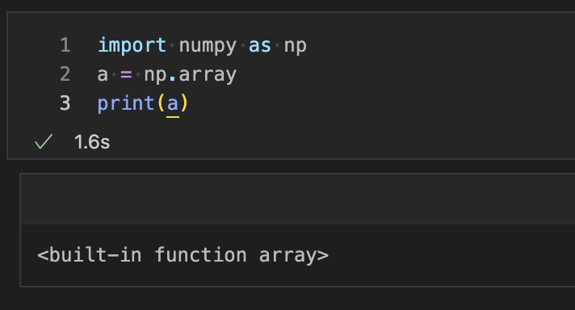
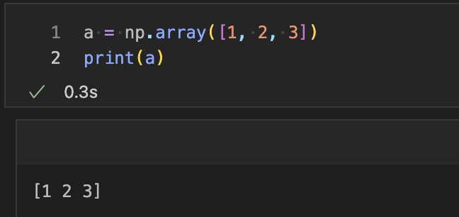
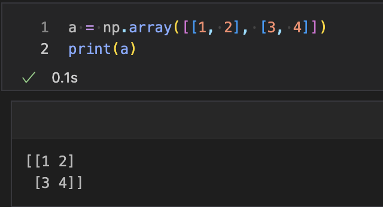
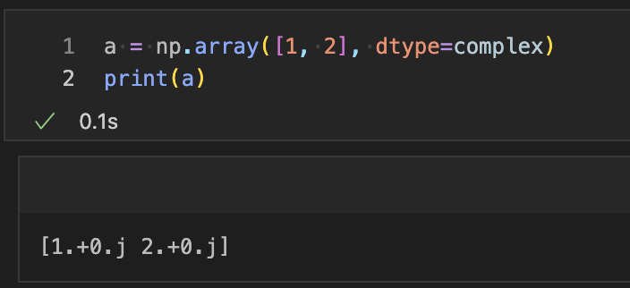
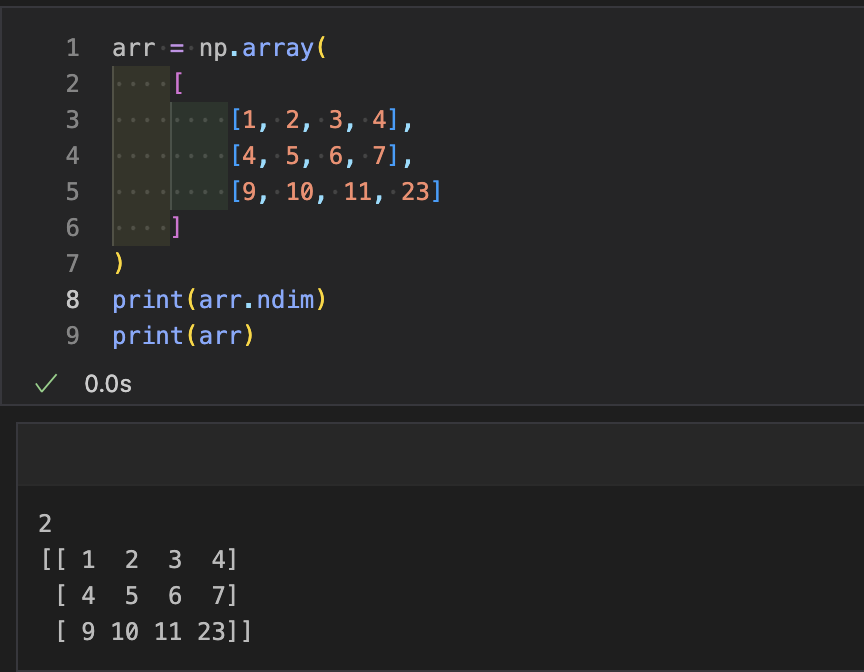
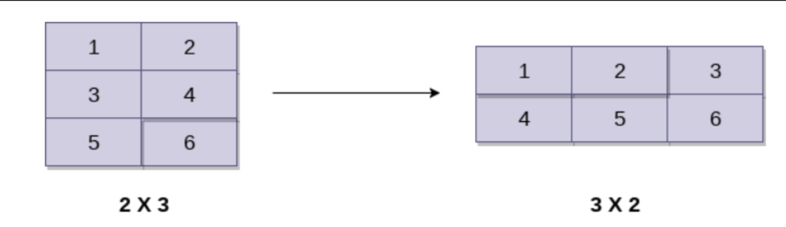
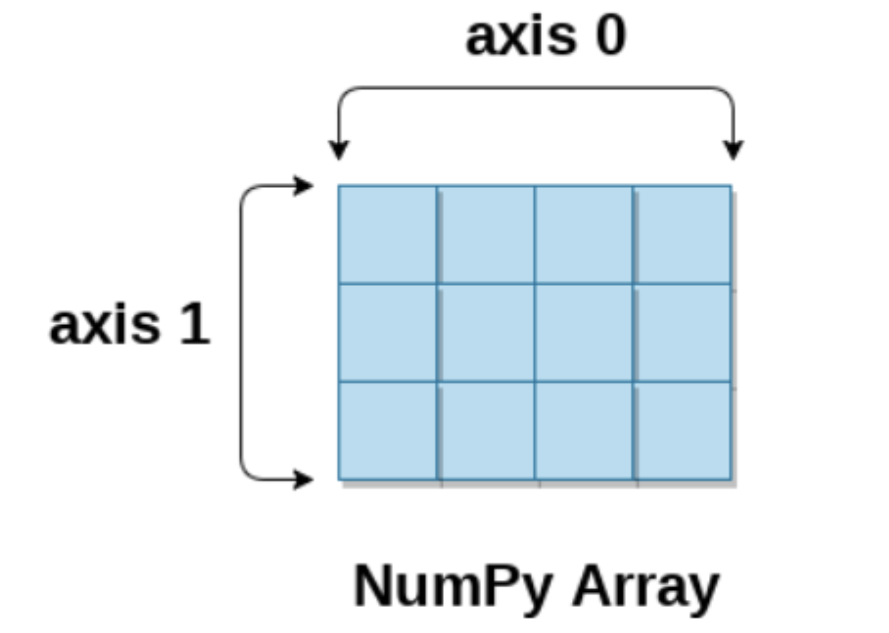

## Ndarray
Ndarray是NumPy中定义的n维数组对象，它存储了相似类型的元素集合。换句话说，我们可以将ndarray定义为数据类型（dtype）对象的集合。

可以使用基于0的索引来访问ndarray对象。数组对象的每个元素在内存中具有相同的大小。

### 创建ndarray对象
可以使用numpy模块的array例程来创建ndarray对象。为此，我们需要导入numpy。
```python
import numpy as np
a = np.array
```
参考以下图像


我们还可以将一个集合对象传递到array例程中，以创建等效的n维数组。语法如下。
```python
import numpy as np
np.array(object, dtype=None, copy=True, order=None, subok=False, ndmin=0)
```

参数说明：
- object: 要转换为ndarray的任何集合对象, 它表示集合对象。可以是列表、元组、字典、集合等。
- dtpe: 通过将此选项更改为指定的类型, 我们可以更改数组元素的数据类型。默认为None。
- copy: 可选参数，默认为Ture, 它将创建数组的副本。如果将其设置为False, 则它将不复制数组。
- order: 可选参数，默认为None, 此选项可以分配3个可能的值。它可以是C（列顺序）、R（行顺序）或A（任意）。
- subok: 可选参数，默认为False, 返回的数组默认将是基类数组。我们可以更改为通过设置此选项为true 使子类通过。
- ndim: 可选参数，默认为0, 它表示结果数组的最小维数。


要使用列表创建数组，请使用以下语法。
```python
import numpy as np
a = np.array([1, 2, 3])
print(a)
```


要创建多维数组对象，请使用以下语法。
```python
import numpy as np
a = np.array([[1, 2], [3, 4]])
print(a)
```


要更改数组元素的数据类型，请在集合后面提到数据类型的名称。
```python
import numpy as np
a = np.array([1, 2], dtype=complex)
print(a)
```


### 查找数组的维度
可以使用ndim函数查找数组的维度。
```python
import numpy as np
arr = np.array([[1, 2, 3, 4], [4, 5, 6, 7], [9, 10, 11, 23]])
print(arr.ndim)
```


### 查找每个数组元素的大小
使用itemsize函数可以获取每个数组项的大小。它返回每个数组元素占用的字节数。
```python
# 查找数组中每个项的大小
import numpy as np
a = np.array([[1,2,3]])
print("每个项包含",a.itemsize,"字节")

# 输出：
每个项包含 8 字节。
```
### 查找每个数组项的数据类型
要检查每个数组项的数据类型，可以使用dtype函数。考虑以下示例以检查数组项的数据类型。
示例
```python
# 查找每个数组项的数据类型
import numpy as np
a = np.array([[1,2,3]])
print("每个项的类型为",a.dtype)

# 输出：
每个项的类型为 int64。
```

### 查找数组的形状和大小
要获取数组的形状和大小，可以使用与numpy数组相关联的size和shape函数。
示例
```python
import numpy as np
a = np.array([[1,2,3,4,5,6,7]])
print("数组大小:", a.size)
print("形状:", a.shape)

# 输出：
数组大小: 7
形状: (1, 7)
```

### 重塑数组对象
通过数组的形状，我们指的是多维数组的行数和列数。然而，numpy模块为我们提供了通过更改多维数组的行数和列数来重塑数组的方法。

与ndarray对象关联的reshape()函数用于重塑数组。它接受两个参数，表示数组的新形状的行和列。

让我们重塑以下图像中给定的数组。

示例
```python
import numpy as np
a = np.array([[1,2],[3,4],[5,6]])
print("打印原始数组..")
print(a)
a = a.reshape(2,3)
print("打印重塑后的数组..")
print(a)
```
输出
```python
打印原始数组..
[[1 2]
 [3 4]
 [5 6]]
打印重塑后的数组..
[[1 2 3]
 [4 5 6]]
```
### 数组切片
在NumPy数组中，切片是从数组中提取一定范围的元素的方法。数组中的切片与Python列表中的切片方式相同。

考虑以下示例来打印数组的特定元素。

示例
```python
import numpy as np
a = np.array([[1,2],[3,4],[5,6]])
print(a[0,1])
print(a[2,0])
```
输出
```python
2
5
```
上面的程序打印了数组的0索引处的第2个元素，以及数组的2索引处的第0个元素。

### 等分
linspace()函数返回给定区间上均匀间隔的值。以下示例返回在给定区间5-15上均匀分隔的10个值。

示例
```python
import numpy as np
a = np.linspace(5, 15, 10)  # 在给定区间5-15上打印10个均匀分隔的值
print(a)
```
输出:
```
[ 5.          6.11111111  7.22222222  8.33333333  9.44444444 10.55555556 11.66666667 12.77777778 13.88888889 15.        ]
```

### 查找数组元素的最大值、最小值和总和
NumPy提供了max()、min()和sum()函数，用于分别查找数组元素的最大值、最小值和总和。

示例
```python
import numpy as np
a = np.array([1, 2, 3, 10, 15, 4])
print("数组:", a)
print("最大元素:", a.max())
print("最小元素:", a.min())
print("元素总和:", a.sum())
```
输出:
```python
数组: [ 1  2  3 10 15  4]
最大元素: 15
最小元素: 1
元素总和: 35
```

### NumPy数组轴
NumPy多维数组由轴表示，其中axis-0表示列，axis-1表示行。我们可以指定轴来执行行级或列级计算，例如对行或列元素进行加法。

要计算每列的最大元素、每行的最小元素以及所有行元素的总和，请考虑以下示例。

示例
```python
import numpy as np
a = np.array([[1, 2, 30], [10, 15, 4]])
print("数组:", a)
print("列的最大元素:", a.max(axis=0))
print("行的最小元素:", a.min(axis=1))
print("所有行的总和:", a.sum(axis=1))
```
输出:
```python
数组: [[ 1  2 30]
 [10 15  4]]
列的最大元素: [10 15 30]
行的最小元素: [ 1  4]
所有行的总和: [33 29]
```

### 查找平方根和标准差
与numpy数组关联的sqrt()和std()函数分别用于查找数组元素的平方根和标准差。
标准差表示数组的每个元素与numpy数组的均值之间的差异程度。

示例
```python
import numpy as np
a = np.array([[1, 2, 30], [10, 15, 4]])
print(np.sqrt(a))
print(np.std(a))
```
输出:
```python
[[1.         1.41421356 5.47722558]
 [3.16227766 3.87298335 2.        ]]
10.044346115546242
```

### 数组上的算术运算
numpy模块允许我们直接在多维数组上执行算术运算。在下面的示例中，对两个多维数组a和b执行算术运算。

示例
```python
import numpy as np
a = np.array([[1, 2, 30], [10, 15, 4]])
b = np.array([[1, 2, 3], [12, 19, 29]])
print("数组a和b的和\n", a + b)
print("数组a和b的乘积\n", a * b)
print("数组a和b的除法\n", a / b)
```

### 数组连接
numpy为我们提供了垂直堆叠和水平堆叠，允许我们在垂直或水平方向上连接两个多维数组。

示例
```python
import numpy as np
a = np.array([[1, 2, 30], [10, 15, 4]])
b = np.array([[1, 2, 3], [12, 19, 29]])
print("垂直连接的数组\n", np.vstack((a, b)))
print("水平连接的数组\n", np.hstack((a, b)))
```
输出:
```python
垂直连接的数组
 [[ 1  2 30]
 [10 15  4]
 [ 1  2  3]
 [12 19 29]]
水平连接的数组
 [[ 1  2 30  1  2  3]

 [10 15  4 12 19 29]]
```
