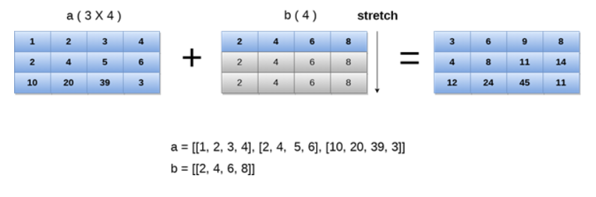

## NumPy 广播
在数学运算中，我们可能需要考虑不同形状的数组。NumPy 可以执行涉及不同形状数组的操作。
例如，如果我们考虑矩阵乘法操作，如果两个矩阵的形状相同，那么这个操作将很容易执行。但是，我们可能也需要在形状不相似的情况下进行操作。

考虑以下示例来相乘两个数组。
示例
```python
import numpy as np

a = np.array([1, 2, 3, 4, 5, 6, 7])
b = np.array([2, 4, 6, 8, 10, 12, 14])
c = a * b
print(c)
```

输出：
```python
[ 2  8 18 32 50 72 98]
```

然而，在上面的示例中，如果我们考虑不同形状的数组，将会得到如下的错误。
示例
```python
import numpy as np
a = np.array([1, 2, 3, 4, 5, 6, 7])
b = np.array([2, 4, 6, 8, 10, 12, 14, 19])
c = a * b
print(c)
```
输出：
```
ValueError: operands could not be broadcast together with shapes (7,) (8,)
```

在上面的示例中，我们可以看到两个数组的形状不相似，因此它们不能相乘。NumPy 可以通过使用广播(broadcasting)的概念来执行这种操作。
在广播中，较小的数组被广播到较大的数组，以使它们的形状相互兼容。

### 广播规则
如果满足以下情况，就可以进行广播。

- 较小维度的数组可以在其形状中附加 '1'。

- 每个输出维度的大小是维度中的输入大小的最大值。

- 如果输入在特定维度上的大小与输出大小匹配，或者其值恰好为 1，则可以在计算中使用它。

- 如果输入大小为 1，则在维度上使用第一个数据条目进行计算。

只有满足以下规则，才能将广播应用于数组。

- 所有输入数组具有相同的形状。

- 数组具有相同数量的维度，每个维度的长度要么是一个公共长度，要么是 1。

- 维度较少的数组可以在其形状中附加 '1'。

让我们看一个广播的示例。
示例
```python
import numpy as np

a = np.array([[1, 2, 3, 4], [2, 4, 5, 6], [10, 20, 39, 3]])
b = np.array([2, 4, 6, 8])

print("\nprinting array a..")
print(a)

print("\nprinting array b..")
print(b)

print("\nAdding arrays a and b ..")
c = a + b
print(c)
```
输出：
```python
printing array a..
[[ 1  2  3  4]
 [ 2  4  5  6]
 [10 20 39  3]]

printing array b..
[2 4 6 8]

Adding arrays a and b ..
[[ 3  6  9 12]
 [ 4  8 11 14]
 [12 24 45 11]]
```

