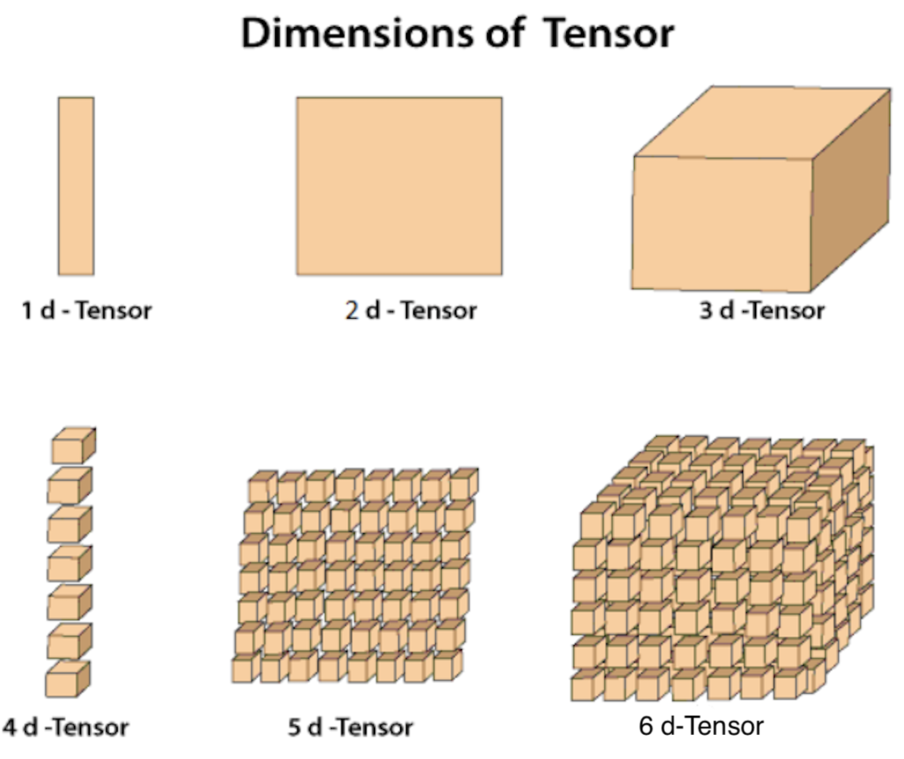
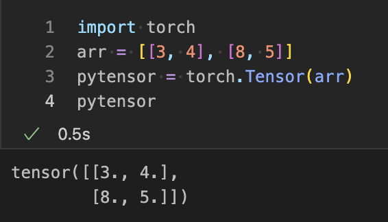
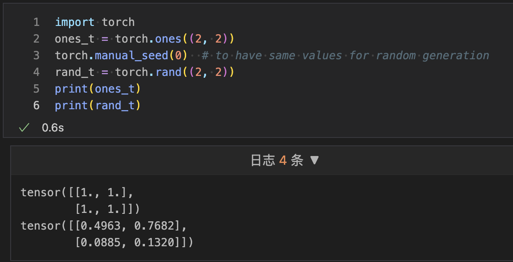
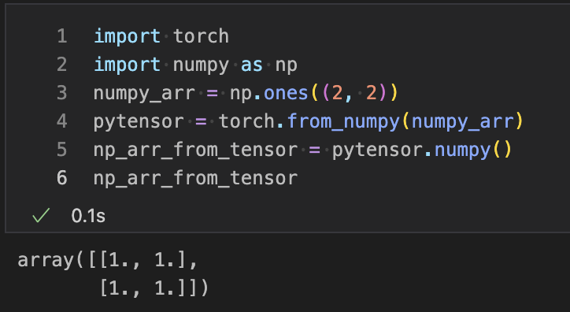

## 张量介绍

张量是PyTorch的关键组件。我们可以说PyTorch完全基于张量。在数学中，数字的矩形数组称为矩阵。在NumPy库中，这些矩阵称为ndarray。在PyTorch中，它被称为张量。张量是一个n维数据容器。例如，在PyTorch中，1维张量是一个向量，2维张量是一个矩阵，3维张量是一个立方体，4维张量是一个四维立方体。

Torch提供了带有强大GPU加速的张量计算。了解张量数据结构对于使用PyTorch非常重要。在神经网络实现之前，它将作为基本先决条件。

在深度学习中，张量是关键部分，我们可以看到很多关于张量的讨论。甚至在谷歌的主要机器学习库中，即TensorFlow的名称中都包含了这个术语。

在本教程中，我们将讨论张量是什么以及如何在Python中使用NumPy执行操作和操作它们。

“在一般情况下，一个数字数组按照规则网格排列，具有可变数量的轴，被称为张量。”

下面是以一种非常高效的方式描述张量维度的图表。


现在让我们稍微了解一下张量的符号表示法。

张量符号表示法类似于矩阵符号表示法。大写字母表示张量，带下标整数的小写字母表示张量中的标量值。
在物理学和工程领域，作为一种工具，张量和张量代数被广泛使用。我们可以说，它是机器学习中一组关于操作和训练深度学习模型的技术。

### 如何创建张量？
有三种方式可以创建张量。每种方式都有不同的创建方式和使用方法。张量可以通过以下方式创建：

- 从数组创建张量

- 创建全为一和随机数的张量

- 从NumPy数组创建张量

让我们看看张量是如何创建的。

#### 从数组创建张量
在这种情况下，您首先必须定义数组，然后将该数组作为参数传递给torch的张量方法。

例如
```python
import torch
arr = [[3, 4], [8, 5]]
pytensor = torch.Tensor(arr)
print(pytensor)
```
输出:
```python
tensor ([[3., 4.],[8., 5.]])
```


#### 创建带有随机数和全为一的张量
要创建带有随机数的张量，我们必须使用rand()方法，并且要创建全为一的张量，您必须使用torch的ones()方法。为了生成随机数，torch的另一种方法将与rand一起使用，即manual_seed，参数为0。

例如
```python
import torch
ones_t = torch.ones((2, 2))
torch.manual_seed(0)  # to have same values for random generation
rand_t = torch.rand((2, 2))
print(ones_t)
print(rand_t)
```
输出:
```python
tensor([[1., 1.],[1., 1.]])
tensor([[0.4962, 0.7682],[0.0885, 0.1320]])
```


#### 从NumPy数组创建张量
要从NumPy数组创建张量，我们必须创建一个NumPy数组。一旦您的NumPy数组创建完成，我们必须将其作为参数传递给from_numpy()。该方法将NumPy数组转换为张量。

例如
```python
import torch
import numpy as np
numpy_arr = np.ones((2, 2))
pytensor = torch.from_numpy(numpy_arr)
np1_arr_from_tensor = pytensor.numpy()
print(np1_arr_from_tensor)
```
输出:
```python
[[1. 1.][1. 1.]]
```

