## 一维张量

正如我们知道的，PyTorch在方便地定义神经网络方面受到了深度学习世界的欢迎。神经网络基本上是基于传感器结构的，而PyTorch也是围绕传感器构建的。这通常会在性能上获得显著提升。张量模糊地是矩阵的概括。

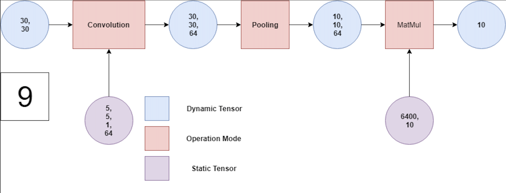

1D-张量类似于1D-矩阵。在一维张量中，只有一行和一列，这被称为向量。还有零维张量，也称为标量。

现在我们将讨论在张量上执行的操作。

我们也可以使用Google Colab编写Tensor的代码。访问Google Colab非常简单。对于Google Colab，无需设置。它完全在云上运行。
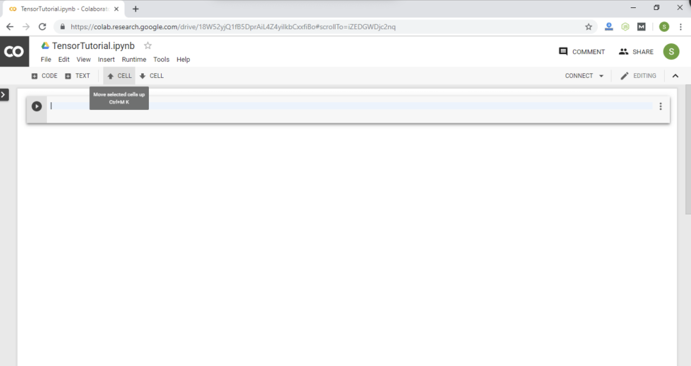

Google Colab类似于Jupyter Notebook。当使用Google Colab时，许多软件包会为我们预先安装。不幸的是，torch不是其中之一，因此我们首先必须使用!pip3 install torch命令安装torch。

现在，我们将对一维Tensor执行操作。

### 创建一维Tensor
要创建一维Tensor，我们使用torch库的tensor属性。要创建张量，我们使用torch.tensor()方法。

创建一维张量的语法如下：
```python
n= torch.tensor([Tensor elements])
```

这里，n是张量类型的变量，张量元素可以是任何整数或浮点数，后面跟着(,)。

示例
```python
import torch
n = torch.tensor([1, 2, 3, 4])
print(n)
```
输出：
```python
tensor([1, 2, 3, 4])
```
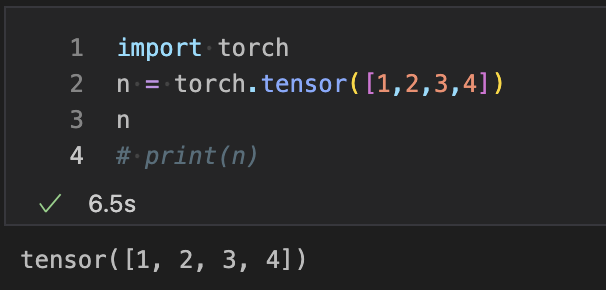


### 检查Tensor中元素的数据类型
我们可以检查Tensor中包含的元素的数据类型。我们使用Tensor的dtype()来找到数据类型。

示例
```python
import torch
n = torch.tensor([1.0, 2.0, 3.0])
print(n.dtype)
```
输出：
```python
torch.float32
```
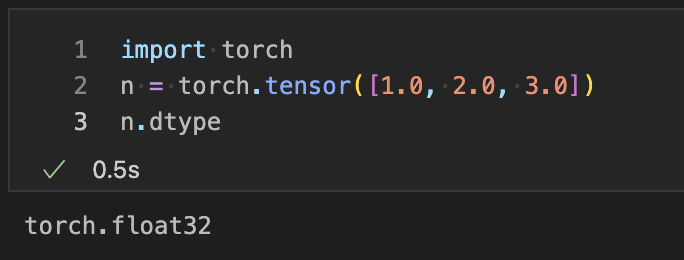

### 访问Tensor的元素
我们可以使用元素的索引来访问Tensor的元素。如果我们想打印Tensor的所有元素，那么我们可以打印张量变量。与一维矩阵索引类似，Tensor索引也从0开始。

示例
```python
import torch
n=torch.tensor([1.0, 2.0, 3.0])
print(n[2])
```
输出：
```python
tensor(3.)
```
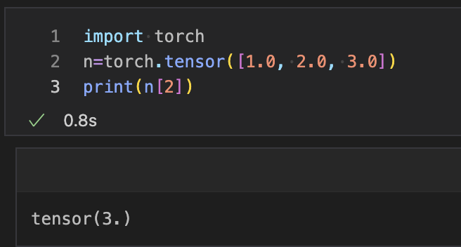

### 访问指定范围的Tensor元素
通过传递元素的起始索引或结束索引，访问指定范围的元素非常简单。它将跳过起始索引元素并打印到结束索引的元素。

示例
```python
import torch
n=torch.tensor([1.0, 2.0, 3.0])
print(n[0:2])
```
输出：
```python
tensor (2.0,3.0)
```
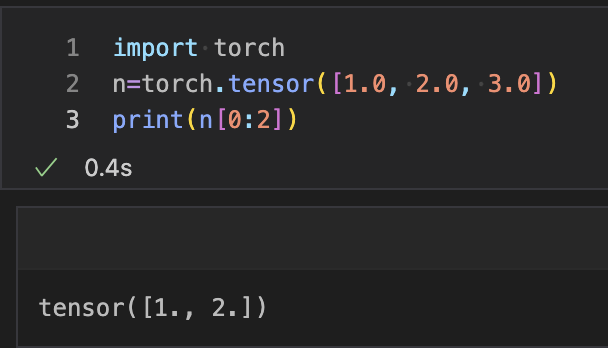

我们有另一个示例，通过跳过我们初始化的起始索引来打印所有元素。

示例
```python
import torch
n = torch.tensor([1.0, 2.0, 3.0])
print(n[0:])
```
输出：
```python
tensor (2.0,3.0)
```
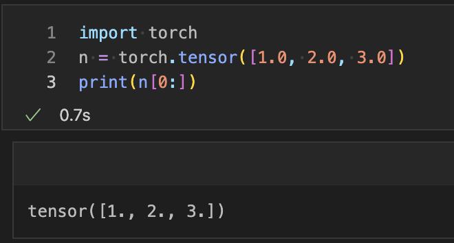

### 使用整数元素创建浮点Tensor
我们可以使用整数元素创建浮点Tensor。在这种情况下，使用torch的FloatTensor属性。

示例
```python
import torch
n = torch.FloatTensor([1,2,3,4,5,6,7])
print(n)
```
输出：
```python
tensor([1., 2., 3., 4., 5., 6., 7.])
```
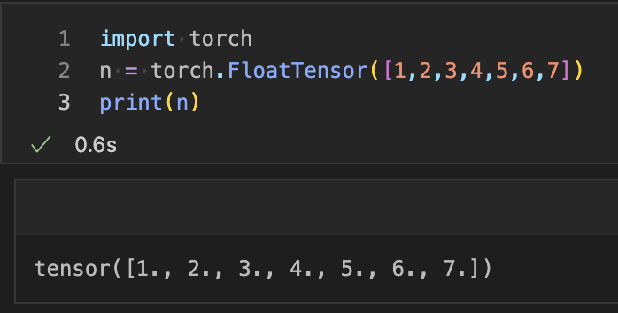

### 查找Tensor的大小
与一维矩阵一样，我们也可以找到Tensor的大小。我们使用Tensor的size()方法来获取大小。

示例
```python
import torch
n = torch.FloatTensor([1,2,3,4,5,6,7])
print(n.size())
```
输出：
```python
torch.Size([7])
```
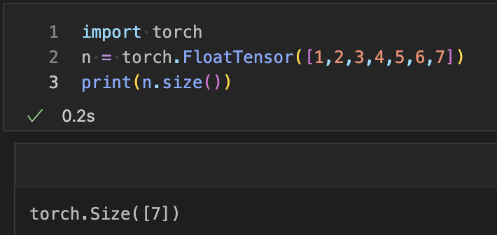

### 更改Tensor的视图
Tensor具有的属性是我们可以更改Tensor的视图。更改视图意味着如果一个张量是一维的（一行一列），我们想将其视图更改为六行一列。可以使用Tensor的view()来进行更改。这类似于数组的reshape()。

示例
```python
import torch
n=torch.FloatTensor([1,2,3,4,5,6])
print(n)
n.view(6,1)
```
输出：
```python
tensor ([1., 2., 3., 4., 5., 6.])
tensor([[1.],
        [2.],
        [3.],
        [4.],
        [5.],
        [6.]])
```
注意：我们也可以使用其他维度，如（3, 2），但它应与我们原始的张量元素兼容。
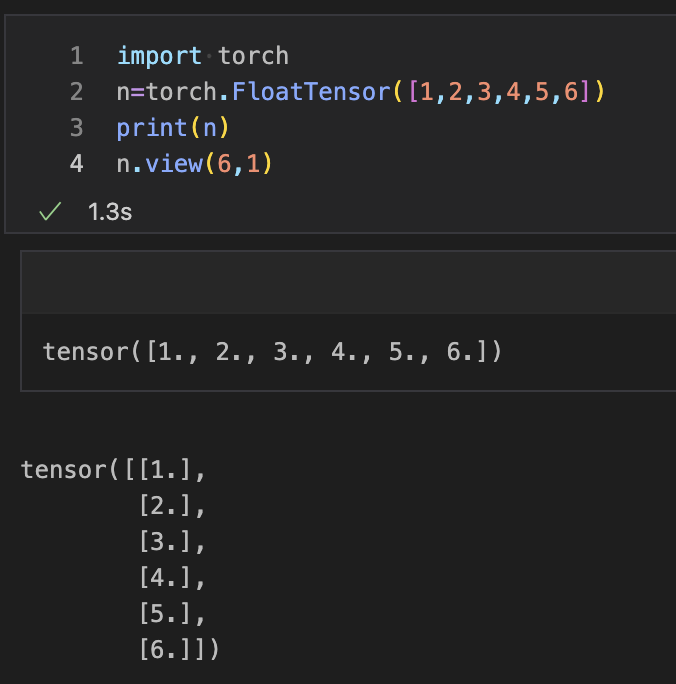

### 使用numpy数组创建Tensor
我们还可以使用numpy数组创建Tensor。我们必须使用torch的from_numpy()将numpy数组转换为Tensor的方法。为此，我们首先必须初始化numpy，然后创建numpy数组。

示例
```python
import torch
import numpy as np
a=np.array([1,2,3,4,5,6])
tensorcon=torch.from_numpy(a)
print(tensorcon)
print(tensorcon.type())
```
输出：
```python
tensor([1, 2, 3, 4, 5, 6])
torch.LongTensor
```
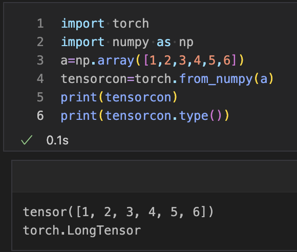
