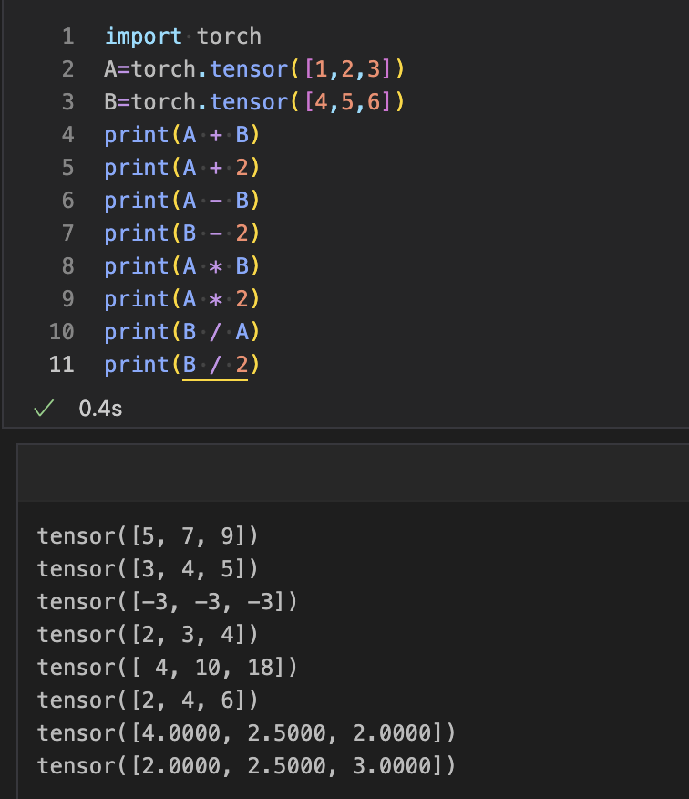
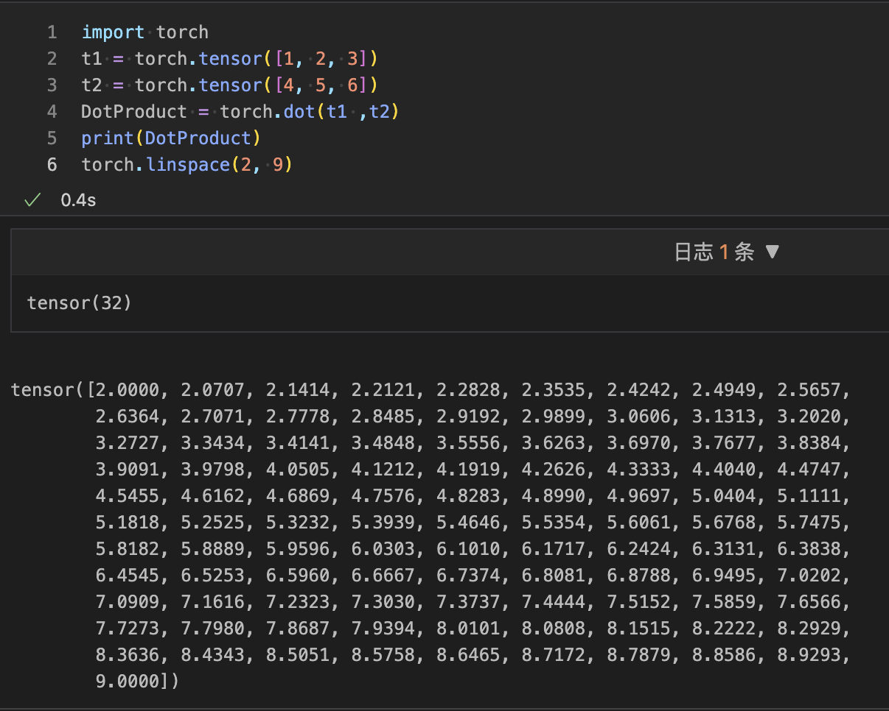
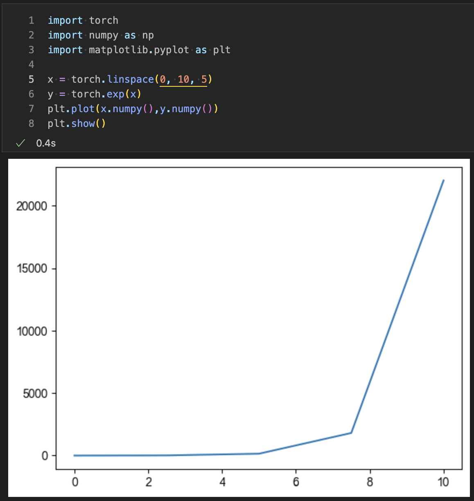
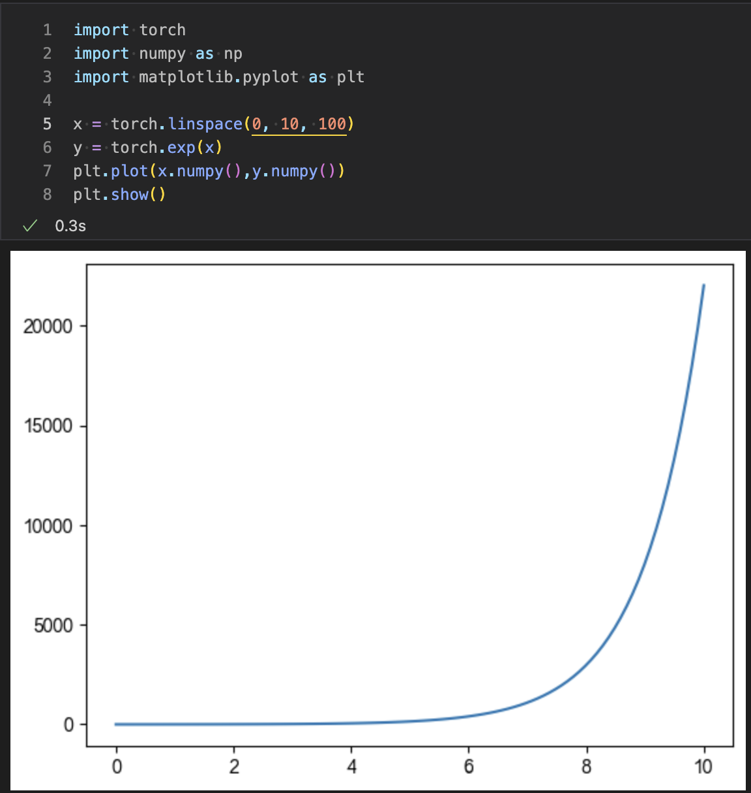
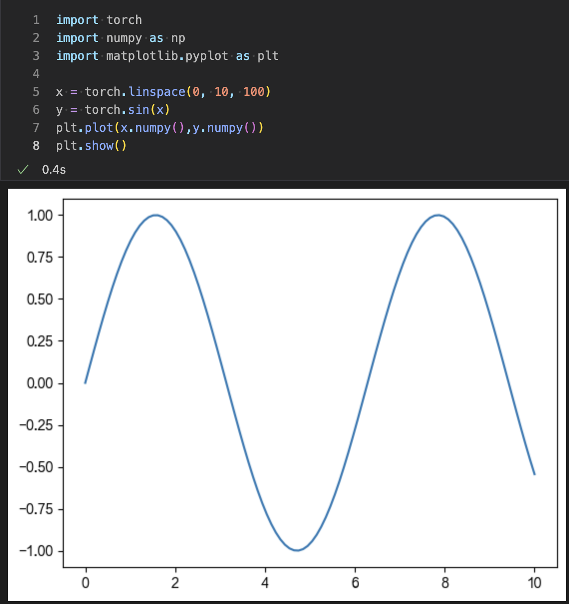

## 向量操作

我们知道张量有不同类型的维度，例如零维、一维和多维。向量是一维张量，为了操纵它们，有许多可用的操作。向量操作有不同的类型，如数学运算、点积和linspace。向量在深度学习中起着关键作用。

在深度学习神经网络中，我们使用向量或一维张量生成随机点。以下是对向量执行的操作。

### 数学运算
我们可以将张量与另一个张量相加、相减、相乘和相除。以下是对向量执行的所有数学运算的表格，其中包含预期的输出。

| 序号  | 操作  |  张量 A   |  张量 B   | 数字  | 语法  |     输出     |
| :---: | :---: | :-------: | :-------: | :---: | :---: | :----------: |
|   1   |   +   | [1, 2, 3] | [4, 5, 6] |   2   |  A+B  |  [5, 7, 9]   |
|   2   |   +   | [1, 2, 3] | [4, 5, 6] |   2   |  A+2  |  [3, 4, 5]   |
|   3   |   -   | [1, 2, 3] | [4, 5, 6] |   2   |  A-B  | [-3, -3, -3] |
|   4   |   -   | [1, 2, 3] | [4, 5, 6] |   2   |  B-2  |  [2, 3, 4]   |
|   5   |   *   | [1, 2, 3] | [4, 5, 6] |   2   |  A*B  |  [4, 10,18]  |
|   6   |   *   | [1, 2, 3] | [4, 5, 6] |   2   |  A*2  |  [2, 4, 6]   |
|   7   |   /   | [1, 2, 3] | [4, 5, 6] |   2   |  B/A  |  [4, 2, 2]   |
|   8   |   /   | [1, 2, 3] | [4, 5, 6] |   2   |  B/2  |  [2, 2, 3]   |

```python
import torch
A=torch.tensor([1,2,3])
B=torch.tensor([4,5,6])
print(A + B)
print(A + 2)
print(A - B)
print(B - 2)
print(A * B)
print(A * 2)
print(B / A)
print(B / 2)
```
输出:
```python
tensor([5, 7, 9])
tensor([3, 4, 5])
tensor([-3, -3, -3])
tensor([2, 3, 4])
tensor([ 4, 10, 18])
tensor([2, 4, 6])
tensor([4.0000, 2.5000, 2.0000])
tensor([2.0000, 2.5000, 3.0000])
```


### 点积和linspace
我们还可以执行两个张量的点积。我们使用torch的dot()方法来计算，该方法提供准确或预期的结果。还有另一种向量操作，即linspace。对于linspace，我们使用linspace()方法。此方法包含两个参数，第一个是起始数字，第二个是结束数字。

此方法的输出是，它从起始数字到结束数字打印一百个等间距的数字。

注意：我们可以明确指定步长，而不是通过在参数列表的末尾传递一个额外的参数来使用默认值。

示例
```python
import torch
t1 = torch.tensor([1, 2, 3])
t2 = torch.tensor([4, 5, 6])
DotProduct = torch.dot(t1 ,t2)
print(DotProduct)
torch.linspace(2, 9)
```
输出:
```python
tensor(32)
tensor([2.0000, 2.0707, 2.1414, 2.2121, 2.2828, 2.3535, 2.4242, 2.4949, 2.5657,
        2.6364, 2.7071, 2.7778, 2.8485, 2.9192, 2.9899, 3.0606, 3.1313, 3.2020,
        3.2727, 3.3434, 3.4141, 3.4848, 3.5556, 3.6263, 3.6970, 3.7677, 3.8384,
        3.9091, 3.9798, 4.0505, 4.1212, 4.1919, 4.2626, 4.3333, 4.4040, 4.4747,
        4.5455, 4.6162, 4.6869, 4.7576, 4.8283, 4.8990, 4.9697, 5.0404, 5.1111,
        5.1818, 5.2525, 5.3232, 5.3939, 5.4646, 5.5354, 5.6061, 5.6768, 5.7475,
        5.8182, 5.8889, 5.9596, 6.0303, 6.1010, 6.1717, 6.2424, 6.3131, 6.3838,
        6.4545, 6.5253, 6.5960, 6.6667, 6.7374, 6.8081, 6.8788, 6.9495, 7.0202,
        7.0909, 7.1616, 7.2323, 7.3030, 7.3737, 7.4444, 7.5152, 7.5859, 7.6566,
        7.7273, 7.7980, 7.8687, 7.9394, 8.0101, 8.0808, 8.1515, 8.2222, 8.2929,
        8.3636, 8.4343, 8.5051, 8.5758, 8.6465, 8.7172, 8.7879, 8.8586, 8.9293,
        9.0000])
```


### 在二维坐标系上绘制函数
当在二维坐标系上绘制函数时，linspace函数可以派上用场。对于x轴，我们在间隔2.5中从0到10创建一个土地空间，而Y将是每个x值的函数。例如，我们可以找到每个x值的指数。

现在，我们正在使用数据分析的可视化库Map plot lib绘制x和y数据。

示例
```python
import torch
import numpy as np
import matplotlib.pyplot as plt

x = torch.linspace(0, 10, 100)
y = torch.exp(x)
plt.plot(x.numpy(),y.numpy())
plt.show()
```
输出:


注意：为了获得更平滑的指数，我们必须增加linspace中的数据。如果是100而不是5，那么输出将更加平滑。


注意：我们可以绘制x的sin值，而不是指数值。这样它将创建一个被称为曲线的正弦曲线。
示例
```python
import torch
import numpy as np
import matplotlib.pyplot as plt

x = torch.linspace(0, 10, 100)
y = torch.sin(x)
plt.plot(x.numpy(),y.numpy())
plt.show()
```
输出:

