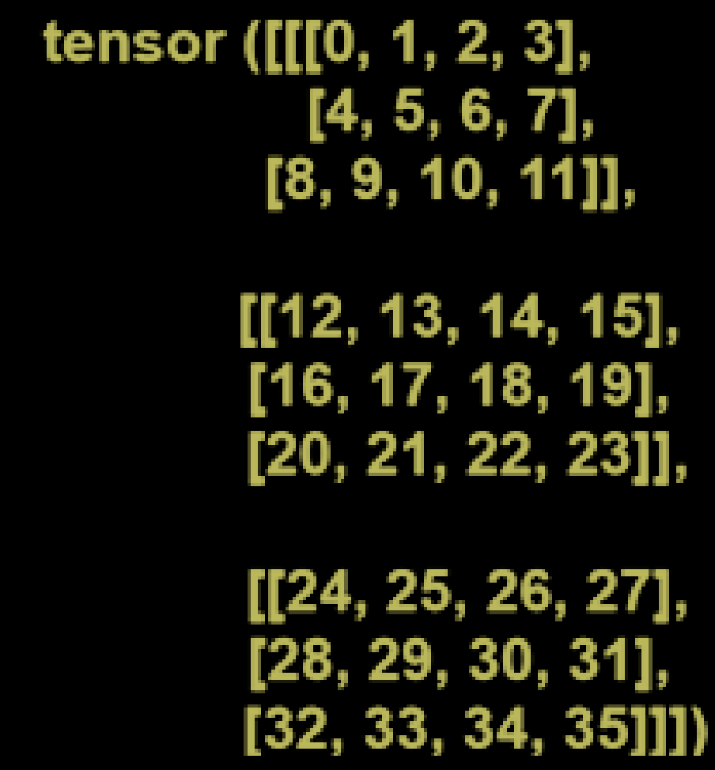

## 二维张量

二维张量类似于二维矩阵。一个二维矩阵有n行和n列。同样，二维张量也有n行和n列。

一个二维张量的表示如下：



灰度标量图像是像素的二维矩阵。每个像素的强度用数值表示，范围从0到255，其中强度值为0表示没有强度，完全黑色，而255表示最大强度，完全白色。我们可以存储这个二维值的网格。


### 创建二维张量

要创建一个二维张量，首先必须使用torch的arrange()方法创建一个一维张量。这个方法包含两个整数类型的参数。一旦创建了一维张量，下一步就是将其视图更改为二维形式，并将这个视图存储在二维类型的变量中。

让我们看一个创建二维张量的示例：
```python
import torch

x = torch.arange(0, 9)
x
y = x.view(3, 3)
y
```
```python
tensor([0, 1, 2, 3, 4, 5, 6, 7, 8])
tensor([[0, 1, 2],
        [3, 4, 5],
        [6, 7, 8]])
```


注意：要检查张量的维度，我们必须使用张量的dim()方法。


### 访问二维张量元素
让我们看一个二维张量的示例，以了解如何使用索引从二维张量中访问特定元素。

示例
```python
import torch

x = torch.arange(0, 9)
x
y = x.view(3, 3)
y
y[0, 2]
```
输出:
```python
tensor([0, 1, 2, 3, 4, 5, 6, 7, 8])
tensor([[0, 1, 2],
        [3, 4, 5],
        [6, 7, 8]])
tensor(2)
```


### 张量乘法
乘法的方式与矩阵乘法相同。张量乘法是将相应的行与相应的列相乘。张量乘法在深度学习模型中起着重要作用。张量可以是一维的、二维的、三维的等等。张量的乘法只能在兼容的大小下进行。

让我们看一个张量乘法的示例：
```python
import torch

mat_a = torch.tensor([1, 3, 5, 7, 9, 2, 4, 6, 8])
mat_a = mat_a.view(3, 3)
mat_b = torch.tensor([1, 3, 5, 7, 9, 2, 4, 6, 8])
mat_b = mat_b.view(3, 3)
mat_a
mat_b
torch.matmul(mat_a, mat_b)  # 我们也可以使用mat_a @ mat_b
```

输出:
```python
tensor([[1, 3, 5],
        [7, 9, 2],
        [4, 6, 8]])
tensor([[1, 3, 5],
        [7, 9, 2],
        [4, 6, 8]])
tensor([[ 42,  60,  51],
        [ 78, 114,  69],
        [ 78, 114,  96]])
```

#### 这是咋乘出来的？
> [ [ 1*1+3*7+5*4=42，1*3+3*9+5*6=60，1*5+3*2+5*8=51]，
> [ 7*1+9*7+2*4=78，7*3+9*9+2*6=114，7*5+9*2+2*8=69]，
> [ 4*1+6*7+8*4=78，4*3+6*9+8*6=114，4*5+6*2+8*8=96] ]

### 三维张量
三维张量是使用view()方法创建的。一个三维张量具有以下结构：


### 从三维张量中访问元素
从三维张量中访问元素非常容易。这将使用索引完成。

示例
```python
import torch

x = torch.arange(18)
y = x.view(3, 2, 3)
y
y[1, 1, 1]
```
输出:
```python
tensor([[[ 0,  1,  2],
         [ 3,  4,  5]],
        [[ 6,  7,  8],
         [ 9, 10, 11]],
        [[12, 13, 14],
         [15, 16, 17]]])
tensor(10)
```


### 三维张量的切片
分割切片与我们如何切片一维张量非常相似。切片张量意味着将张量的元素切片成一个新的张量，或者我们可以说切片是通过将张量划分为一个新的张量来创建的过程。

示例
假设我们有一个包含0到17的元素的三维张量，我们想从6到11切片张量。
```python
import torch

x = torch.arange(18)
y = x.view(3, 2, 3)
y
y[1, 0:2, 0:3]  # 也可以写成y[1, :, :]
```
输出:
```python
tensor([[[ 0,  1,  2],
         [ 3,  4,  5]],
        [[ 6,  7,  8],
         [ 9, 10, 11]],
        [[12, 13, 14],
         [15, 16, 17]]])
tensor([[ 6,  7,  8],
[ 9, 10, 11]])
```


#### 为啥是这样的？
> 因为y[1, 0:2, 0:3]的意思是从y[1]中取出0到2的元素，然后再从这些元素中取出0到3的元素，所以就是y[1, 0:2, 0:3] = y[1, :, :] = [ [6, 7, 8], [9, 10, 11] ]
