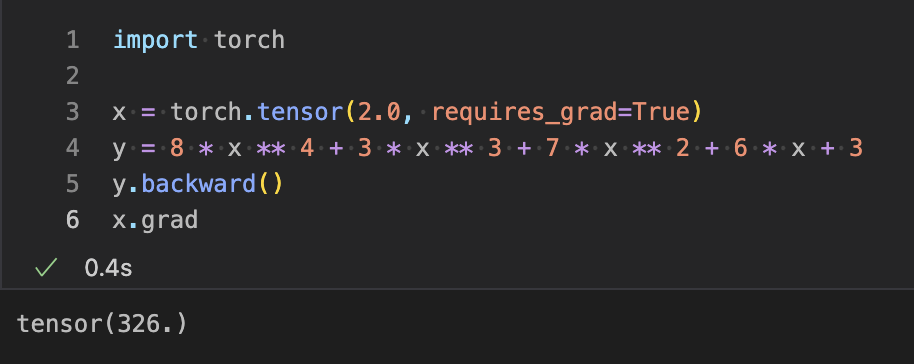

## PyTorch中的梯度
在这一部分，我们将讨论导数以及如何在PyTorch中应用它们。让我们开始吧。

梯度用于找到函数的导数。在数学术语中，导数意味着对函数进行部分微分并找到值。

下面是如何计算函数的导数的示意图。


我们在图中上面所做的工作，将在PyTorch中使用梯度完成相同的工作。要找到函数的导数，有以下步骤。

我们首先要初始化要计算导数的函数`（y= 3x3 + 5x2 + 7x+1）`。

下一步是设置函数中使用的变量的值。变量x的值设置如下。
```python
X = torch.tensor(2.0, requires_grad=True)
```
我们通常需要梯度来找到函数的导数。
接下来是通过简单地使用backward()方法计算函数的导数。

最后一步是使用grad访问或打印导数的值。

让我们看一个找到导数的例子：
```python
import torch

x = torch.tensor(2.0, requires_grad=True)  # requires_grad=True表示我们需要梯度
y = 8 * x ** 4 + 3 * x ** 3 + 7 * x ** 2 + 6 * x + 3
y.backward()  # backward() 是计算梯度的方法 
x.grad  # grad 是访问梯度的方法
```
输出：
```python
tensor(326.)
```


另一个例子
```python
import torch

x = torch.tensor(2.0, requires_grad=True)
z = torch.tensor(4.0, requires_grad=True)
y = x ** 2 + z ** 3
y.backward()
x.grad
z.grad
```
输出：
```python
tensor(4.)
tensor(48.)
```

