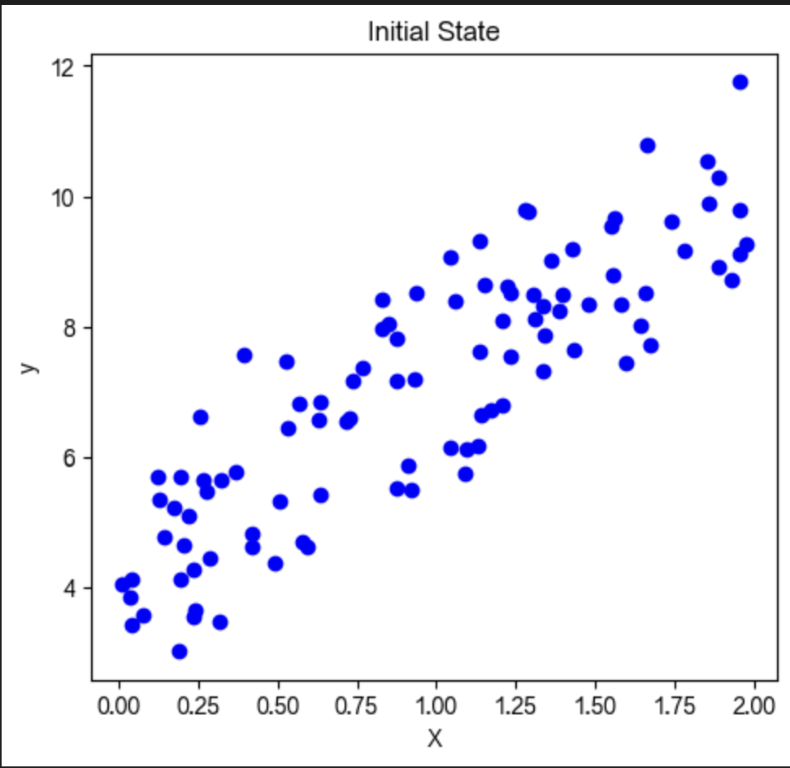
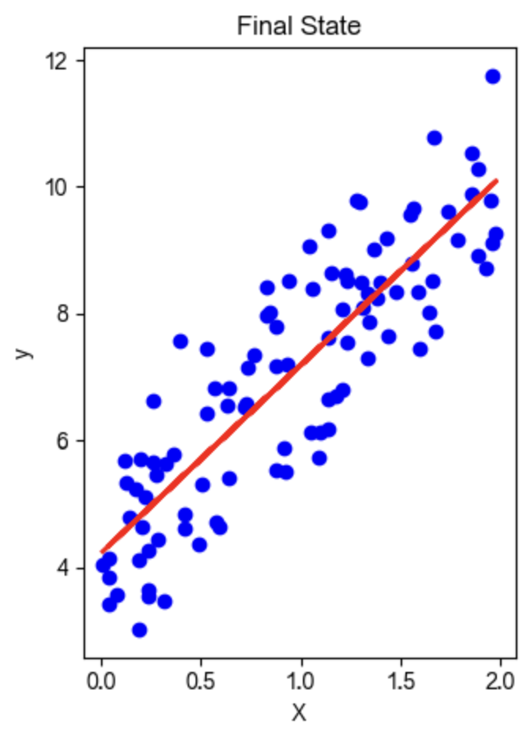
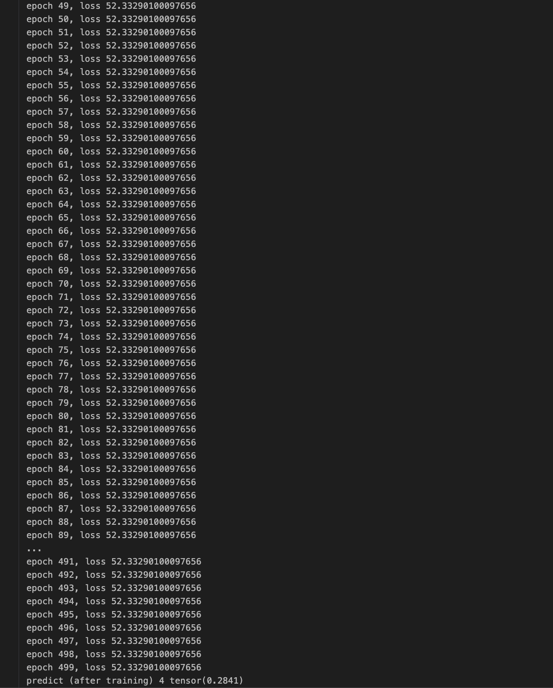

## 线性回归
线性回归是一种通过最小化距离来找出因变量和自变量之间线性关系的方法。

线性回归是一种监督式机器学习方法。这种方法用于有序离散类别的分类。在本节中，我们将了解如何构建一个模型，以便用户可以预测因变量和自变量之间的关系。

简单来说，我们可以将因变量和自变量之间的关系称为线性。假设Y是因变量，X是自变量，那么这两个变量的线性回归关系Y=AX+b

- A是斜率。

- b是y截距。

初始状态

最终状态



要创建或学习基本线性模型，有三个基本概念是必须理解的。

### 1. 模型类
编写所有功能并在需要时编写所有函数是非常典型的，但这不是我们的目标。

使用数字优化库编写代码总是更好，而不是编写所有代码和函数，但如果我们在预写库的基础上构建它，也可以增加商业价值，以完成事情。为此，我们使用PyTorch的nn包的实现。为此，我们首先需要创建一个单层。

使用线性层
每个线性模块都从输入计算输出，并持有其内部张量的权重和偏差。

还有几个其他标准模块。我们将使用模型类格式，它有两个主要方法，如下：

- Init: 用于定义线性模块。

- Forward: 通过前向方法做出预测，基于此我们将训练我们的线性回归模型

### 2. 优化器
优化器是PyTorch中的一个重要概念。它用于优化我们的权重，以使我们的模型适应数据集。有几种优化算法，如梯度下降和反向传播，这些算法优化我们的权重值并使我们的模型最佳。

torch.optim包实现了各种优化算法。要使用torch.optim，您需要构造一个优化器对象，该对象将根据计算出的梯度更新参数，并保持当前状态。对象创建如下：
```python
Optimizer = optim.SGD(model.parameters(), lr=0.01, momentum=0.9)
Optimizer = optim.Adam([var1, var2], lr=0.0001)
```
所有优化器都实现了一个step()方法，该方法更新参数。使用它有两种方法

#### 1) Optimizer.step()
这是一个非常简单的方法，许多优化器都支持它。使用backward()方法计算梯度后，我们可以调用optimizer.step()函数。

示例:
```python
for input, target in dataset:
    optimizer.zero_grad()
    output = model(input)
    loss = loss_fn(output, target)
    loss.backward()
    optimizer.step()
```

#### 2) Optimizer.step(closure)
有些优化算法，如LBFGS和共轭梯度需要多次重新评估函数，因此我们必须通过闭包传递它，这允许它们重新计算模型。

示例:
```python
for input, target in dataset:
    def closure():
        optimizer.zero_grad()
        output = model(input)
        loss = loss_fn(output, target)
        loss.backward()
        return loss
    optimizer.step(closure)
```

### 标准
标准是我们的损失函数，用于查找损失。这个函数来自torch nn模块。

示例:
```python
criterion = torch.nn.MSELoss(size_average = False)
```

需要的函数和对象

- 导入torch
- 从torch.autagrad导入Variable

我们需要定义一些数据并以以下方式将它们分配给变量
```python
xdata = Variable(torch.Tensor([[1.0], [2.0], [3.0]]))
ydata = Variable(torch.Tensor([[2.0], [4.0], [6.0]]))
```

以下是为我们提供训练完整回归模型预测的代码。这只是为了理解我们如何实现代码以及我们用于训练回归模型的函数。
```python
import torch
from torch.autograd import Variable

xdata = Variable(torch.Tensor([[1.0], [2.0], [3.0]]))
ydata = Variable(torch.Tensor([[2.0], [4.0], [6.0]]))

class LRM(torch.nn.Module):
    def __init__(self):
        super(LRM, self).__init__()
        self.linear = torch.nn.Linear(1, 1)
    def forward(self, x):
        ypred = self.linear(x)
        return ypred

ourmodel = LRM()
criterion = torch.nn.MSELoss(size_average = False)
optimizer = torch.optim.SGD(ourmodel.parameters(), lr = 0.01)
for epoch in range(500):
    predy = our_model(xdata)
    loss = criterion(predy, ydata)
    optimizer.zero_grad()
    loss.backward()
    optimizer.step()
    print('epoch {}, loss {}'.format(epoch, loss.item()))
newvar = Variable(torch.Tensor([[4.0]]))
predy = ourmodel(newvar)
print("predict (after training)", 4, our_model(newvar).data[0][0])
```
输出:
```python
epoch0,loss1.7771836519241333
epoch1,loss1.0423388481140137
epoch2,loss0.7115973830223083
epoch3,loss0.5608030557632446
.
.
.
.
epoch499,loss0.0003389564517419785
predict (after training) 4 tensor(7.9788)
```
(每次运行结果可能不同)


以下是用于训练完整回归模型的概念：

1.做出预测
2.线性类
3.自定义模块
4.创建数据集
5.损失函数
6.梯度下降
7.均方误差
8.训练

理解如何训练回归模型，上述所有点都是必要的。
