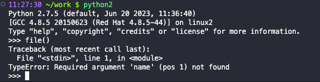
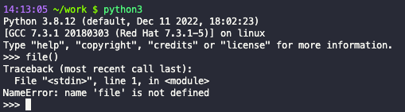

## 沙箱逃逸概述
沙箱逃逸就是在在一个严格限制的python环境中，通过绕过限制和过滤达到执行更高权限，甚至getshell的过程。

既然是想getshell，或者说是执行命令就需要一个可执行命令的包。可直接执行命令的模块有
```python
os
pty
subprocess
platform
commands
```

有些时候，比如CTF，我们并不需要去执行命令，而是去读取目录下的flag文件即可，也就是说需要文件读取的模块来执行，常用的文件读取模块：
```python
file
open
codecs
fileinput
```
不过其中file只在python2中执行
python2

python3



