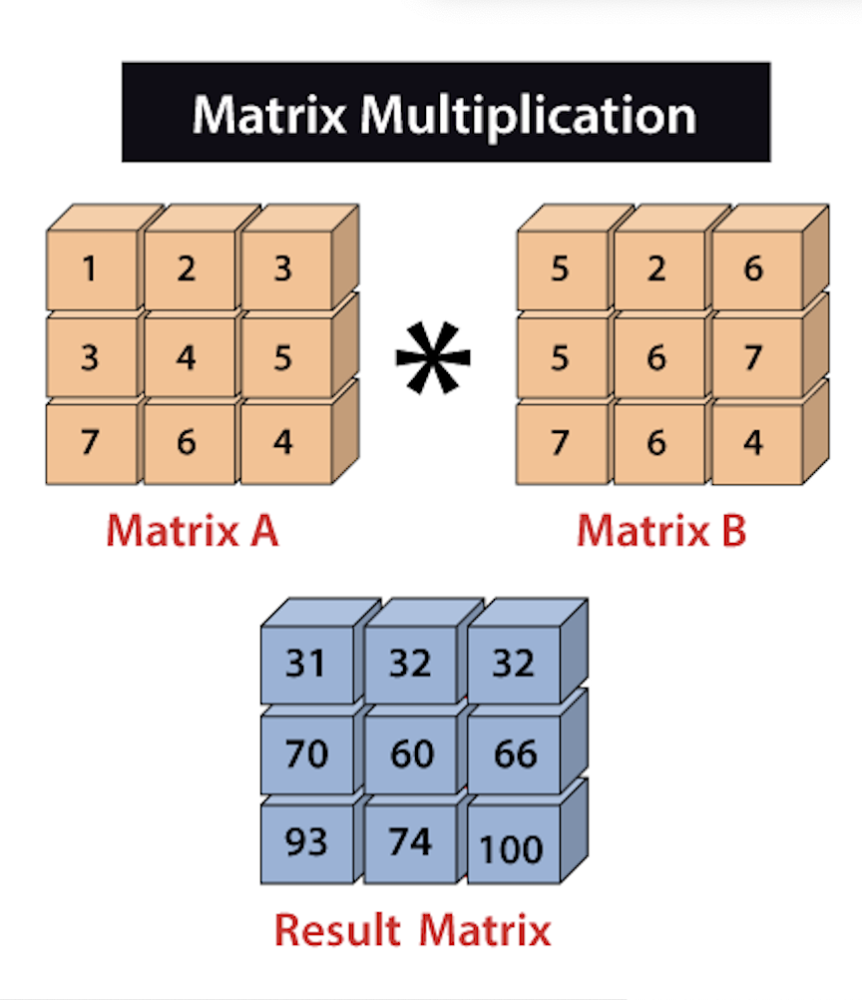

## NumPy中的矩阵乘法(Matrix Multiplication)

矩阵的乘法是一种操作，通过将两个矩阵作为输入，将第一个矩阵的行与第二个矩阵的列相乘，生成一个单独的矩阵。需要注意的是，第一个矩阵的行数应等于第二个矩阵的列数。



在Python中，使用NumPy进行矩阵乘法的过程被称为向量化。向量化的主要目标是消除或减少我们明确使用的for循环。通过从程序中减少“for”循环可以加快计算速度。内置的NumPy包用于数组处理和操作。
有三种方法可以执行numpy矩阵乘法。

- 第一种是使用multiply()函数，该函数执行矩阵的逐元素乘法。

- 第二种是使用matmul()函数，该函数执行两个数组的矩阵乘积。

- 最后一种是使用dot()函数，该函数执行两个数组的点积。

### 示例 1：逐元素矩阵乘法
```python
import numpy as np  

array1=np.array([[1,2,3],[4,5,6],[7,8,9]],ndmin=3)  
array2=np.array([[9,8,7],[6,5,4],[3,2,1]],ndmin=3)  
result=np.multiply(array1,array2)  
result
```

在上面的代码中

- 我们导入了别名为np的numpy。

- 我们使用numpy.array()函数创建了array1和array2，维数为3。

- 我们创建了一个名为result的变量，并将np.multiply()函数的返回值赋给它。

- 我们在np.multiply()中传递了array1和array2两个数组。

- 最后，我们尝试打印result的值。

在输出中，显示了一个三维矩阵，其元素是array1和array2元素的逐元素乘积的结果。
输出：
```python
array([[[ 9, 16, 21],
            [24, 25, 24],
            [21, 16,  9]]])
```

### 示例 2：矩阵乘积
```python
import numpy as np  

array1=np.array([[1,2,3],[4,5,6],[7,8,9]],ndmin=3)  
array2=np.array([[9,8,7],[6,5,4],[3,2,1]],ndmin=3)  
result=np.matmul(array1,array2)  
result
```
输出：
```python
array([[[ 30,  24,  18],
            [ 84,  69,  54],
            [138, 114,  90]]])
```
在上面的代码中

- 我们导入了别名为np的numpy。

- 我们使用numpy.array()函数创建了array1和array2，维数为3。

- 我们创建了一个名为result的变量，并将np.matmul()函数的返回值赋给它。

- 我们在np.matmul()中传递了array1和array2两个数组。

- 最后，我们尝试打印result的值。

在输出中，显示了一个三维矩阵，其元素是array1和array2元素的乘积结果。

### 示例 3：点积
numpy.dot具有以下规格：

- 当a和b都是1-D（一维）数组时-> 两个向量的内积（不包含复共轭）

- 当a和b都是2-D（二维）数组时 -> 矩阵乘法

- 当a或b为0-D（也称为标量）时 -> 使用numpy.multiply(a, b)或a * b进行乘法。

- 当a是N-D数组，b是1-D数组时 -> 在a和b的最后一个轴上进行求和乘积。

- 当a是N-D数组，b是M-D数组，并且M>=2时 -> 在a的最后一个轴和b的倒数第二个轴上进行求和乘积：同时，dot(a, b)[i,j,k,m] = sum(a[i,j,:] * b[k,:,m])

```python
import numpy as np  

array1=np.array([[1,2,3],[4,5,6],[7,8,9]],ndmin=3)  
array2=np.array([[9,8,7],[6,5,4],[3,2,1]],ndmin=3)  
result=np.dot(array1,array2)  
result
```
在上面的代码中

- 我们导入了别名为np的numpy。

- 我们使用numpy.array()函数创建了array1和array2，维数为3。

- 我们创建了一个名为result的变量，并将np.dot()函数的返回值赋给它。

- 我们在np.dot()中传递了array1和array2两个数组。

- 最后，我们尝试打印result的值。

在输出中，显示了一个三维矩阵，其元素是array1和array2元素的点积结果。
输出：
```python
array([[[[ 30,  24,  18]],
            [[ 84,  69,  54]],
            [[138, 114,  90]]]])
```