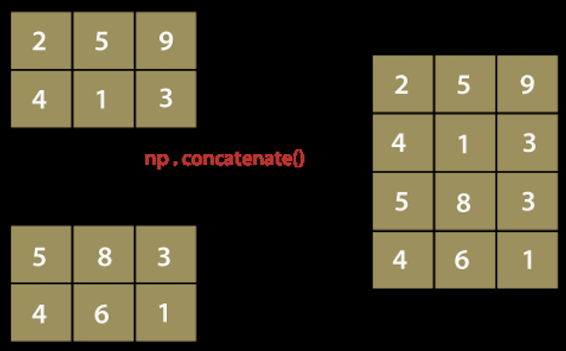

## 使用numpy.concatenate()在Python中连接数组

numpy.concatenate() 函数是NumPy包中的函数。该函数主要用于将NumPy数组组合在一起。此函数基本上用于在指定的轴上连接两个或多个具有相同形状的数组。有以下几点需要注意：
NumPy的concatenate()不像传统的数据库连接那样，它更像是将NumPy数组堆叠在一起。

此函数可以在垂直和水平方向上操作。这意味着我们可以将数组水平或垂直连接在一起。



concatenate() 函数通常写作 np.concatenate()，但我们也可以写成 numpy.concatenate()。这取决于导入numpy包的方式，即使用 import numpy as np 还是 import numpy。

### 语法
> numpy.concatenate((a1, a2, ...), axis)

#### 参数

1) (a1, a2, ...)

此参数定义数组序列。这里的 a1、a2、a3 ... 是具有相同形状的数组，除了与轴相对应的维度。

2) axis：int（可选）

此参数定义沿着哪个轴连接数组。默认情况下，其值为 0。

#### 返回结果
它将返回包含两个数组元素的 ndarray。


示例 1：numpy.concatenate()
```python
import numpy as np 

x = np.array([[1, 2], [3, 4]]) 
y = np.array([[12, 30]]) 
z = np.concatenate((x, y)) 
z 
```
上述代码中

我们使用别名np导入numpy。

我们使用np.array()函数创建一个数组'x'。

然后，我们使用相同的np.array()函数创建另一个数组'y'。

我们声明变量'z'并将其赋值为np.concatenate()函数的返回值。

我们在函数中传递数组'x'和'y'。

最后，我们尝试打印'z'的值。

在输出中，根据axis=0，显示了数组'x'和'y'的值。

输出：
```python
array([[ 1,  2],
       [ 3,  4],
       [12, 30]])
```

示例 2：numpy.concatenate() 使用 axis=0
```python
import numpy as np 

x = np.array([[1, 2], [3, 4]]) 
y = np.array([[12, 30]]) 
z = np.concatenate((x, y), axis=0) 
z 
```
输出：
```python
array([[ 1,  2],
       [ 3,  4],
       [12, 30]])
```

示例 3：numpy.concatenate() 使用 axis=1
```python
import numpy as np 

x = np.array([[1, 2], [3, 4]]) 
y = np.array([[12, 30]]) 
z = np.concatenate((x, y.T), axis=1) 
z 
```
输出：
```python
array([[ 1,  2, 12],
       [ 3,  4, 30]])
```
在上面的示例中，'.T' 用于将行变为列，列变为行。

示例 4：numpy.concatenate() 使用 axis=None
```python
import numpy as np 

x = np.array([[1, 2], [3, 4]]) 
y = np.array([[12, 30]]) 
z = np.concatenate((x, y), axis=None) 
z 
```
输出：
```python
array([ 1,  2,  3,  4, 12, 30])
```
在上面的示例中，我们使用了np.concatenate()函数。该函数不会保留 MaskedArray 输入的屏蔽。以下是可以保留 MaskedArray 输入的屏蔽的连接数组的方法。

示例 5：np.ma.concatenate()
```python
import numpy as np 

x = np.ma.arange(3) 
y = np.arange(3, 6) 
x[1] = np.ma.masked 
x 
y 
z1 = np.concatenate([x, y]) 
z2 = np.ma.concatenate([x, y]) 
z1 
z2 
```
上述代码中

我们使用别名np导入numpy。

我们使用np.ma.arange()函数创建一个数组'x'。

然后，我们使用相同的np.ma.arange()函数创建另一个数组'y'。

我们声明变量'z1'并将其赋值为np.concatenate()函数的返回值。

我们声明变量'z2'并将其赋值为np.ma.concatenate()函数的返回值。

最后，我们尝试打印'z1'和'z2'的值。

在输出中，数组'z1'和'z2'的值保留了 MaskedArray 输入的屏蔽。

输出：
```python
masked_array(data=[0, --, 2],
              mask=[False,  True, False],
              fill_value=999999)
array([3, 4, 5])
masked_array(data=[0, 1, 2, 3, 4, 5],
              mask=False,
              fill_value=999999)
masked_array(data=[0, --, 2, 3, 4, 5],
              mask=[False,  True, False, False, False, False],
              fill_value=999999)
```