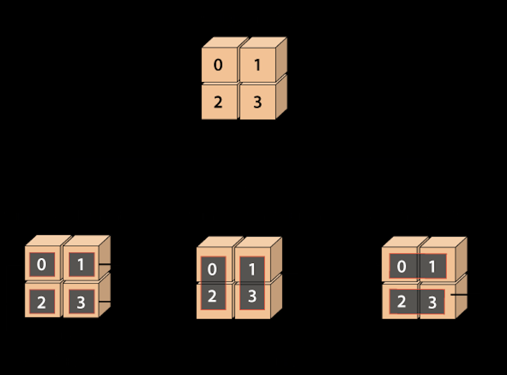

## numpy.sum()在Python中的使用

numpy.sum()函数是Python的NumPy包中的一个函数。该函数用于计算给定数组的所有元素的总和、每行的总和以及每列的总和。

本质上，该函数将数组的元素相加，将ndarray中的元素相加。还可以将数组的行和列元素相加。输出将以数组对象的形式呈现。


#### 语法
numpy.sum()函数的语法如下：
> numpy.sum(arr, axis=None, dtype=None, out=None, keepdims=<no value>, initial=<no value>)

#### 参数
1) arr: array_like
这是一个ndarray。这是我们想要求和其元素的源数组。该参数是必需的，在numpy.sum()函数中发挥着重要作用。

2) axis: int或None或int元组(可选)
此参数定义要执行求和的轴。默认轴是None，将对数组的所有元素求和。当轴为负时，它从最后一个轴计数到第一个轴。在版本1.7.0中，当轴是整数元组时，对元组中指定的所有轴执行求和，而不是像以前那样只在单个轴或所有轴上执行求和。

3) dtype: dtype(可选)
此参数定义累加器和求和后的返回数组的类型。默认情况下，使用arr的dtype，除非arr的整数dtype精度低于默认平台整数。在这种情况下，当arr是有符号的时，使用平台整数，当arr是无符号的时，使用与平台整数相同精度的无符号整数。

4) out: ndarray(可选)
此参数定义替代输出数组，结果将被放置在其中。此结果数组必须与预期输出具有相同的形状。必要时，将强制转换输出值的类型。

5) keepdims: bool(可选)
此参数定义一个布尔值。当此参数设置为True时，被减少的轴将保留在结果中，作为尺寸为一的维度。通过此选项，结果将正确广播到输入数组。当传递默认值时，不会将keepdims传递给ndarray的子类的sum方法，但是在非默认值情况下会传递。如果子类方法不实现keepdims，那么可能会引发任何异常。

6) initial: 标量
此参数定义求和的起始值。

#### 返回值
该函数返回一个与arr具有相同形状的数组，指定的轴已被移除。当arr是0维数组时，或者当轴为None时，返回标量。当指定了数组输出时，返回对out的引用。

示例 1：numpy.array()
```python
import numpy as np 

a = np.array([0.4, 0.5]) 
b = np.sum(a) 
b
```
输出：
```python
0.9
```
在上面的代码中
我们使用别名`np`导入了numpy。

我们使用np.array()函数创建了一个数组`a`。

我们声明了变量`b`，并将其赋值为np.sum()函数的返回值。

我们在函数中传递了数组'a'。

最后，我们尝试打印变量'b'的值。

在输出中，显示了数组所有元素的总和。

示例 2：
```python
import numpy as np 

a = np.array([0.4, 0.5, 0.9, 6.1]) 
x = np.sum(a, dtype=np.int32) 
x
```
输出：
```python
6
```
在上面的代码中
我们使用别名`np`导入了numpy。

我们使用np.array()函数创建了一个数组`a`。

我们声明了变量`x`，并将其赋值为np.sum()函数的返回值。

我们在函数中传递了数组`a`和int32的数据类型。

最后，我们尝试打印变量`x`的值。

在输出中，只显示了整数值的总和，不包括浮点值。

示例 3：
```python
import numpy as np 

a = np.array([[1, 4], [3, 5]]) 
b = np.sum(a) 
b
```
输出：
```python
13
```

示例 4：
```python
import numpy as np 

a = np.array([[1, 4], [3, 5]]) 
b = np.sum(a, axis=0) 
b
```
在上面的代码中
我们使用别名`np`导入了numpy。

我们使用np.array()函数创建了一个数组`a`。

我们声明了变量`b`，并将其赋值为np.sum()函数的返回值。

我们在函数中传递了数组`a`和axis=0。

最后，我们尝试打印变量`b`的值。

在输出中，按列元素进行了相加，并显示了对应的和。

输出：
```python
array([4, 9])
```

示例 5：
```python
import numpy as np 

a = np.array([[1, 4], [3, 5]]) 
b = np.sum(a, axis=1) 
b
```
输出：
```python
array([5, 8])
```

示例 6：
```python
import numpy as np 

b = np.sum([15], initial=8) 
b
```
输出：
```python
23
```
在上面的代码中
我们使用别名`np`导入了numpy。

我们声明了变量`b`，并将其赋值为np.sum()函数的返回值。

我们在函数中传递了元素的数量和初始值。

最后，我们尝试打印变量`b`的值。

在输出中，首先将初始值添加到序列中的最后一个元素，然后对所有元素进行求和。