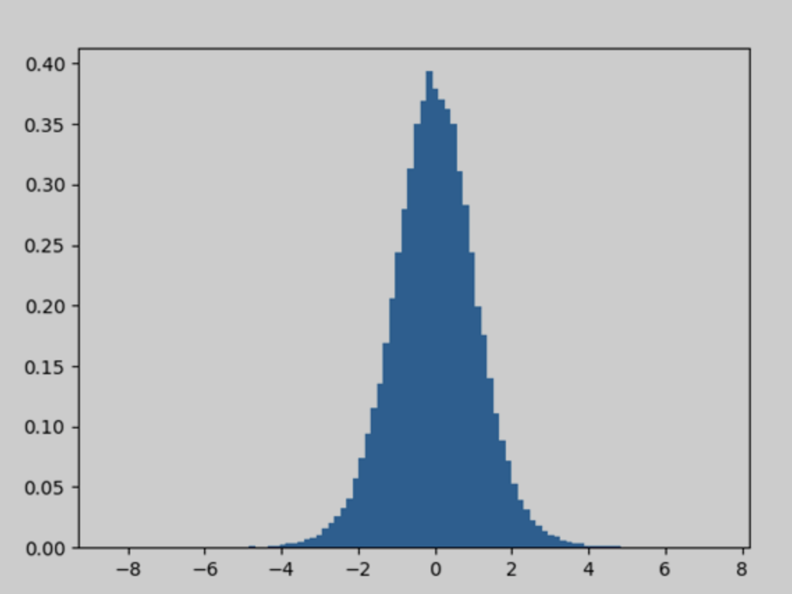

## numpy.random()在Python中的使用

random 是 NumPy 库中的一个模块。这个模块包含用于生成随机数的函数。这个模块包含一些简单的随机数据生成方法，一些排列和分布函数，以及随机生成器函数。
在 random 模块中的所有函数如下：

#### 简单随机数据
以下是一些简单随机数据的函数：
1) p.random.rand(d0, d1, ..., dn)

这个 random 模块的函数用于在给定的形状中生成随机数或值。

示例:
```python
import numpy as np 

a = np.random.rand(5, 2) 
a
```
输出:
```python
array([[0.74710182, 0.13306399],
       [0.01463718, 0.47618842],
       [0.98980426, 0.48390004],
       [0.58661785, 0.62895758],
       [0.38432729, 0.90384119]])
```

2) np.random.randn(d0, d1, ..., dn)

这个 random 模块的函数从“标准正态”分布中返回一个样本。

示例:
```python
import numpy as np 

a = np.random.randn(2, 2) 
a 
b = np.random.randn()
b
```
输出:
```python
array([[ 1.43327469, -0.02019121],
       [ 1.54626422,  1.05831067]])
-0.3080190768904835
```

3) np.random.randint(low[, high, size, dtype])
这个 random 模块的函数用于生成从包括 (low) 到不包括 (high) 的随机整数。

示例:
```python
import numpy as np 

a = np.random.randint(3, size=10) 
a
```
输出:
```python
array([1, 1, 1, 2, 0, 0, 0, 0, 0, 0])
```

4) np.random.random_integers(low[, high, size])
这个 random 模块的函数用于在 low 和 high 之间生成 np.int 类型的随机整数。

示例:
```python
import numpy as np 

a = np.random.random_integers(3) 
a 
b = type(np.random.random_integers(3)) 
b 
c = np.random.random_integers(5, size=(3, 2)) 
c
```
输出:
```python
2
<class 'numpy.int32'>
array([[1, 1],
       [2, 5],
       [1, 3]])
```

5) np.random.random_sample([size])
这个 random 模块的函数用于在半开区间 [0.0, 1.0) 中生成随机浮点数。

示例:
```python
import numpy as np 

a = np.random.random_sample() 
a 
b = type(np.random.random_sample()) 
b 
c = np.random.random_sample((5,)) 
c
```
输出:
```python
0.09250360565571492
<class 'float'>
array([0.34665418, 0.47027209, 0.75944969, 0.37991244, 0.14159746])
```

6) np.random.random([size])

这个 random 模块的函数用于在半开区间 [0.0, 1.0) 中生成随机浮点数。
示例:
```python
import numpy as np 

a = np.random.random() 
a 
b = type(np.random.random()) 
b 
c = np.random.random((5,)) 
c
```
输出:
```python
0.008786953974334155
<class 'float'>
array([0.05530122, 0.59133394, 0.17258794, 0.6912388 , 0.33412534])
```

7) np.random.ranf([size])
这个随机模块的函数用于生成半开区间 [0.0, 1.0) 内的随机浮点数。
示例:
```python
import numpy as np  

a = np.random.ranf()  
a  
b = type(np.random.ranf())  
b   
c = np.random.ranf((5,))  
c  
```
输出:
```python
0.2907792098474542
<type 'float'>
array([0.34084881, 0.07268237, 0.38161256, 0.46494681, 0.88071377])
```

8) np.random.sample([size])
这个随机模块的函数用于生成半开区间 [0.0, 1.0) 内的随机浮点数。

示例:
```python
import numpy as np  

a = np.random.sample()  
a  
b = type(np.random.sample())  
b  
c = np.random.sample((5,))  
c  
```
输出:
```python
0.012298209913766511
<type 'float'>
array([0.71878544, 0.11486169, 0.38189074, 0.14303308, 0.07217287])
```

9) np.random.choice(a[, size, replace, p])
这个随机模块的函数用于从给定的一维数组中生成随机样本。
示例:
```python
import numpy as np  

a = np.random.choice(5,3)  
a  
b = np.random.choice(5,3, p=[0.2, 0.1, 0.4, 0.2, 0.1])  
b  
```
输出:
```python
array([0, 3, 4])
array([2, 2, 2], dtype=int64)
```

10)  np.random.bytes(length)
这个随机模块的函数用于生成随机字节。

示例:
```python
import numpy as np  

a = np.random.bytes(7)  
a  
```
输出:
```python
'nQ\x08\x83\xf9\xde\x8a'
```

#### 排列
下面是排列的相关函数：
1) np.random.shuffle()
这个函数用于通过对序列内容进行洗牌来原地修改序列。

示例:
```python
import numpy as np  

a = np.arange(12)  
a  
np.random.shuffle(a)  
a  
```
输出: 
```python
array([ 0,  1,  2,  3,  4,  5,  6,  7,  8,  9, 10, 11])
array([10,  3,  2,  4,  5,  8,  0,  9,  1, 11,  7,  6])
```
2) np.random.permutation()
这个函数用于随机排列一个序列，或返回一个随机排列的范围。

示例:
```python
import numpy as np  

a = np.random.permutation(12)  
a 
```
输出:
```python
array([ 8,  7,  3, 11,  6,  0,  9, 10,  2,  5,  4,  1])
```

#### 分布
以下是一些排列函数的说明：
1) beta(a, b[, size])
这个函数用于从 Beta 分布中抽取样本。
示例:
```python
def setup(self):  
    self.dist = dist.beta  
    self.cargs = []  
    self.ckwd = dict(alpha=2, beta=3)  
    self.np_rand_fxn = numpy.random.beta  
    self.np_args = [2, 3]  
    self.np_kwds = dict()
```
2) binomial(n, p[, size])
这个函数用于从二项分布中抽取样本。

示例:
```python
import numpy as np  

n, p = 10, .6  
s1= np.random.binomial(n, p, 10)  
s1 
```
输出:
```python
array([6, 7, 7, 9, 3, 7, 8, 6, 6, 4])
```
3) chisquare(df[, size])
这个函数用于从卡方分布中抽取样本。

示例:
```python
import numpy as np  

np.random.chisquare(2,4)  
sum(np.random.binomial(9, 0.1, 20000) == 0)/20000.  
```
输出:
```python
array([6, 7, 7, 9, 3, 7, 8, 6, 6, 4])
```
4) dirichlet(alpha[, size])
这个函数用于从 Dirichlet 分布中抽取样本。

示例:
```python
import numpy as np  
import matplotlib.pyplot as plt  

s1 = np.random.dirichlet((10, 5, 3), 20).transpose()  
plt.barh(range(20), s1[0])  
plt.barh(range(20), s1[1], left=s1[0], color='g')  
plt.barh(range(20), s1[2], left=s1[0]+s1[1], color='r')  
plt.title("Lengths of Strings")  
plt.show()
```


5) exponential([scale, size])
这个函数用于从指数分布中抽取样本。

示例:
```python
def __init__(self, sourceid, targetid):  
    self.__type = 'Transaction'  
    self.id = uuid4()  
    self.source = sourceid  
    self.target = targetid  
    self.date = self._datetime.date(start=2015, end=2019)  
    self.time = self._datetime.time()  

    if random() < 0.05:  
        self.amount = self._numbers.between(100000, 1000000)  
    self.amount = npr.exponential(10)  

    if random() < 0.15:  
        self.currency = self._business.currency_iso_code()  
    else:  
        self.currency = None
```

6) f(dfnum, dfden[, size])
这个函数用于从 F 分布中抽取样本。

示例:
```python
import numpy as np  

dfno = 1.  
dfden = 48.  
s1 = np.random.f(dfno, dfden, 10)  
np.sort(s1)
```
输出:
```python
array([0.00264041, 0.04725478, 0.07140803, 0.19526217, 0.23979   ,
       0.24023478, 0.63141254, 0.95316446, 1.40281789, 1.68327507])
```

7) gamma(shape[, scale, size])
这个函数用于从 Gamma 分布中抽取样本。

示例:
```python
import numpy as np  

shape, scale = 2., 2.  
s1 = np.random.gamma(shape, scale, 1000)  

import matplotlib.pyplot as plt  
import scipy.special as spss  

count, bins, ignored = plt.hist(s1, 50, density=True)  
a = bins**(shape-1)*(np.exp(-bins/scale) / (spss.gamma(shape)*scale**shape))  
plt.plot(bins, a, linewidth=2, color='r')
plt.show()
```


8) geometric(p[, size])
这个函数用于从几何分布中抽取样本。

示例:
```python
import numpy as np  

a = np.random.geometric(p=0.35, size=10000)  
(a == 1).sum() / 1000  
```
输出:
```python
3.
```

9) gumbel([loc, scale, size])
这个函数用于从 Gumbel 分布中抽取样本。

示例:
```python
import numpy as np  

lov, scale = 0, 0.2  
s1 = np.random.gumbel(loc, scale, 1000)  

import matplotlib.pyplot as plt  

count, bins, ignored = plt.hist(s1, 30, density=True)  
plt.plot(bins, (1/beta)*np.exp(-(bins - loc)/beta)* np.exp( -np.exp( -(bins - loc)  / beta) ),linewidth=2, color='r')  
plt.show()
```

10) hypergeometric(ngood, nbad, nsample[, size])
这个函数用于从超几何分布中抽取样本。

示例:
```python
import numpy as np  

good, bad, samp = 100, 2, 10  
s1 = np.random.hypergeometric(good, bad, samp, 1000)  
plt.hist(s1)  
plt.show()
```
输出:
```python
(array([ 13.,   0.,   0.,   0.,   0., 163.,   0.,   0.,   0., 824.]), array([ 8. ,  8.2,  8.4,  8.6,  8.8,  9. ,  9.2,  9.4,  9.6,  9.8, 10. ]), <a list of 10 Patch objects>)
```


11) laplace([loc, scale, size])
这个函数用于从拉普拉斯或双指数分布中抽取样本，具有指定的位置和尺度。

示例:
```python
import numpy as np  

location, scale = 0., 2.  
s = np.random.laplace(location, scale, 10)  
s  
```
输出:
```python
array([-2.77127948, -1.46401453, -0.03723516, -1.61223942,  2.29590691,
        1.74297722,  1.49438411,  0.30325513, -0.15948891, -4.99669747])
```

12) logistic([loc, scale, size])
这个函数用于从逻辑斯蒂分布中抽取样本。

示例:
```python
array([1.000e+00, 1.000e+00, 1.000e+00, 0.000e+00, 1.000e+00, 1.000e+00,
       1.000e+00, 5.000e+00, 7.000e+00, 1.100e+01, 1.800e+01, 3.500e+01,
       5.300e+01, 6.700e+01, 1.150e+02, 1.780e+02, 2.300e+02, 3.680e+02,
       4.910e+02, 6.400e+02, 8.250e+02, 9.100e+02, 9.750e+02, 1.039e+03,
       9.280e+02, 8.040e+02, 6.530e+02, 5.240e+02, 3.380e+02, 2.470e+02,
       1.650e+02, 1.150e+02, 8.500e+01, 6.400e+01, 3.300e+01, 1.600e+01,
       2.400e+01, 1.400e+01, 4.000e+00, 5.000e+00, 2.000e+00, 2.000e+00,
       1.000e+00, 1.000e+00, 0.000e+00, 1.000e+00, 0.000e+00, 0.000e+00,
       0.000e+00, 1.000e+00])
array([ 0.50643911,  0.91891814,  1.33139717,  1.7438762 ,  2.15635523,
        2.56883427,  2.9813133 ,  3.39379233,  3.80627136,  4.2187504 ,
        4.63122943,  5.04370846,  5.45618749,  5.86866652,  6.28114556,
        6.69362459,  7.10610362,  7.51858265,  7.93106169,  8.34354072,
        8.75601975,  9.16849878,  9.58097781,  9.99345685, 10.40593588,
       10.81841491, 11.23089394, 11.64337298, 12.05585201, 12.46833104,
       12.88081007, 13.2932891 , 13.70576814, 14.11824717, 14.5307262 ,
       14.94320523, 15.35568427, 15.7681633 , 16.18064233, 16.59312136,
       17.00560039, 17.41807943, 17.83055846, 18.24303749, 18.65551652,
       19.06799556, 19.48047459, 19.89295362, 20.30543265, 20.71791168,
       21.13039072])
<a list of 50 Patch objects>
```


13) lognormal([mean, sigma, size])
这个函数用于从对数正态分布中抽取样本。

示例:
```python
import numpy as np  

mu, sigma = 2., 1.  
s1 = np.random.lognormal(mu, sigma, 1000)  

import matplotlib.pyplot as plt  

count, bins, ignored = plt.hist(s1, 100, density=True, align='mid')  
a = np.linspace(min(bins), max(bins), 10000)  
pdf = (np.exp(-(np.log(a) - mu)**2 / (2 * sigma**2))/ (a * sigma * np.sqrt(2 * np.pi)))  
plt.plot(a, pdf, linewidth=2, color='r')  
plt.axis('tight')  
plt.show()
```


14) logseries(p[, size])
这个函数用于从对数分布中抽取样本。

示例:
```python
import numpy as np  

x = .6  
s1 = np.random.logseries(x, 10000)  
count, bins, ignored = plt.hist(s1)  
def logseries(k, p):  
return -p**k/(k*log(1-p))  
plt.plot(bins, logseries(bins, x)*count.max()/logseries(bins, a).max(), 'r')  
plt.show()
```


15) multinomial(n, pvals[, size])
这个函数用于从多项分布中抽取样本。

示例:
```python
import numpy as np  

np.random.multinomial(20, [1/6.]*6, size=1)
```
输出:
```python
array([[4, 2, 5, 5, 3, 1]])
```

16) multivariate_normal(mean, cov[, size, ...)
这个函数用于从多元正态分布中抽取样本。

示例:
```python
import numpy as np  

mean = (1, 2)  
coveriance = [[1, 0], [0, 100]]   

import matplotlib.pyplot as plt  

a, b = np.random.multivariate_normal(mean, coveriance, 5000).T  
plt.plot(a, b, 'x')  
plt.axis('equal'023  
030  
)  
plt.show()
```


17) negative_binomial(n, p[, size])
这个函数用于从负二项分布中抽取样本。

示例:
```python
import numpy as np  

s1 = np.random.negative_binomial(1, 0.1, 100000)  
for i in range(1, 11):  
    probability = sum(s1<i) / 100000
print(i, "wells drilled, probability of one success =", probability)
```
输出:
```python
1 wells drilled, probability of one success = 0
2 wells drilled, probability of one success = 0
3 wells drilled, probability of one success = 0
4 wells drilled, probability of one success = 0
5 wells drilled, probability of one success = 0
6 wells drilled, probability of one success = 0
7 wells drilled, probability of one success = 0
8 wells drilled, probability of one success = 0
9 wells drilled, probability of one success = 0
10 wells drilled, probability of one success = 0
```

18) noncentral_chisquare(df, nonc[, size])
这个函数用于从非中心卡方分布中抽取样本。

示例:
```python
import numpy as np  
import matplotlib.pyplot as plt  

val = plt.hist(np.random.noncentral_chisquare(3, 25, 100000), bins=200, normed=True)  
plt.show()
```
输出


19) normal([loc, scale, size])
这个函数用于从正态分布中抽取样本。

示例:
```python
import numpy as np  
import matplotlib.pyplot as plt  

mu, sigma = 0, 0.2 # mean and standard deviation  
s1 = np.random.normal(mu, sigma, 1000)  
abs(mu - np.mean(s1)) < 0.01  
abs(sigma - np.std(s1, ddof=1)) < 0.01  
count, bins, ignored = plt.hist(s1, 30, density=True)  
plt.plot(bins, 1/(sigma * np.sqrt(2 * np.pi)) *np.exp( - (bins - mu)**2 / (2 * sigma**2) ), linewidth=2, color='r')  
plt.show()
```
输出:


20) pareto(a[, size])
这个函数用于从洛马克斯或帕累托II分布中抽取样本，具有指定的形状。

示例:
```python
import numpy as np  
import matplotlib.pyplot as plt  

b, m1 = 3., 2.  # shape and mode  
s1 = (np.random.pareto(b, 1000) + 1) * m1  
count, bins, _ = plt.hist(s1, 100, density=True)  
fit = b*m**b / bins**(b+1)  
plt.plot(bins, max(count)*fit/max(fit), linewidth=2, color='r')  
plt.show()
```
输出:


21) power(a[, size])
这个函数用于从指数为正的幂分布中抽取样本，范围在 [0, 1]。

示例：
```python
import numpy as np

x = 5. # 形状参数
samples = 1000
s1 = np.random.power(x, samples)

import matplotlib.pyplot as plt

count, bins, ignored = plt.hist(s1, bins=30)
a = np.linspace(0, 1, 100)
b = x * a**(x - 1.)
density_b = samples * np.diff(bins)[0] * b
plt.plot(a, density_b)
plt.show()
```
输出：


22) rayleigh([scale, size])
这个函数用于从瑞利分布中抽取样本。
示例：
```python
val = hist(np.random.rayleigh(3, 100000), bins=200, density=True)
meanval = 1
modeval = np.sqrt(2 / np.pi) * meanval
s1 = np.random.rayleigh(modeval, 1000000)
100. * sum(s1 > 3) / 1000000.
```
输出：
```python
0.087300000000000003
```


23) standard_cauchy([size])
这个函数用于从标准柯西分布（mode=0）中抽取样本。

示例：
```python
import numpy as np
import matplotlib.pyplot as plt

s1 = np.random.standard_cauchy(1000000)
s1 = s1[(s1 > -25) & (s1 < 25)]  # 截断分布以便绘图
plt.hist(s1, bins=100)
plt.show()
```
输出：


24) standard_exponential([size])
这个函数用于从标准指数分布中抽取样本。

示例：
```python
import numpy as np

n = np.random.standard_exponential((2, 7000))
```
输出：
```python
array([[0.53857931, 0.181262  , 0.20478701, ..., 3.66232881, 1.83882709,
        1.77963295],
       [0.65163973, 1.40001955, 0.7525986 , ..., 0.76516523, 0.8400617 ,
        0.88551011]])
```

25) standard_gamma([size])
这个函数用于从标准伽玛分布中抽取样本。

示例：
```python
import numpy as np

shape, scale = 2., 1.
s1 = np.random.standard_gamma(shape, 1000000)

import matplotlib.pyplot as plt
import scipy.special as sps

count1, bins1, ignored1 = plt.hist(s, 50, density=True)
y = bins1**(shape-1) * ((np.exp(-bins1/scale)) / (sps.gamma(shape) * scale**shape))
plt.plot(bins1, y, linewidth=2, color='r')
plt.show()
```
输出：


26) standard_normal([size])
这个函数用于从标准正态分布中抽取样本。

示例：
```python
import numpy as np
import matplotlib.pyplot as plt

s1 = np.random.standard_normal(8000)
s1
q = np.random.standard_normal(size=(3, 4, 2))
q
```
输出：
```python
array([-3.14907597,  0.95366265, -1.20100026, ...,  3.47180222,
        0.9608679 ,  0.0774319 ])
array([[[ 1.55635461, -1.29541713],
        [-1.50534663, -0.02829194],
        [ 1.03949348, -0.26128132],
        [ 1.51921798,  0.82136178]],

       [[-0.4011052 , -0.52458858],
        [-1.31803814,  0.37415379],
        [-0.67077365,  0.97447018],
        [-0.20212115,  0.67840888]],

       [[ 1.86183474,  0.19946562],
        [-0.07376021,  0.84599701],
        [-0.84341386,  0.32081667],
        [-3.32016062, -1.19029818]]])
```

27) standard_t(df[, size])
这个函数用于从自由度为 df 的标准 t 分布中抽取样本。

示例：
```python
intake = np.array([5260., 5470, 5640, 6180, 6390, 6515, 6805, 7515, 8230, 8770])
s1 = np.random.standard_t(10, size=100000)
np.mean(intake)
intake.std(ddof=1)
t = (np.mean(intake) - 7725) / (intake.std(ddof=1) / np.sqrt(len(intake)))
h = plt.hist(s1, bins=100, density=True)
np.sum(s1 < t) / float(len(s1))
plt.show()
```
输出：
```python
6677.5
1174.1101831694598
0.00864
```


28) triangular(left, mode, right[, size])
这个函数用于从三角分布中抽取样本，分布区间为 left 到 right。

示例：
```python
import numpy as np
import matplotlib.pyplot as plt

h = plt.hist(np.random.triangular(-4, 0, 8, 1000000), bins=300, density=True)
plt.show()
```
输出：


29) uniform([low, high, size])
这个函数用于从均匀分布中抽取样本。
示例：
```python
import numpy as np
import matplotlib.pyplot as plt

s1 = np.random.uniform(-1, 0, 1000)
np.all(s1 >= -1)
np.all(s1 < 0)
count, bins, ignored = plt.hist(s1, 15, density=True)
plt.plot(bins, np.ones_like(bins), linewidth=2, color='r')
plt.show()
```
输出：


30) vonmises(m1, m2[, size])
这个函数用于从 von Mises 分布中抽取样本。
示例：
```python
import numpy as np
import matplotlib.pyplot as plt

m1, m2 = 0.0, 4.0
s1 = np.random.vonmises(m1, m2, 1000)

from scipy.special import i0

plt.hist(s1, 50, density=True)
x = np.linspace(-np.pi, np.pi, num=51)
y = np.exp(m2 * np.cos(x - m1)) / (2 * np.pi * i0(m2))
plt.plot(x, y, linewidth=2, color='r')
plt.show()
```
输出：


31) wald(mean, scale[, size])
这个函数用于从 Wald（逆高斯）分布中抽取样本。

示例：
```python
import numpy as np
import matplotlib.pyplot as plt
h = plt.hist(np.random.wald(3, 3, 100000), bins=250, density=True)
plt.show()
```
输出：


32) weibull(a[, size])
这个函数用于从 Weibull 分布中抽取样本。

示例：
```python
import numpy as np
import matplotlib.pyplot as plt
from scipy import special

x = 2.0
s = np.random.weibull(x, 1000)
a = np.arange(1, 100.) / 50.
def weib(x, n, a):
    return (a / n) * (x / n)**np.exp(-(x / n)**a)

count, bins, ignored = plt.hist(np.random.weibull(5., 1000))
a = np.arange(1, 100.) / 50.
scale = count.max() / weib(x, 1., 5.).max()
scale = count.max() / weib(a, 1., 5.).max()
plt.plot(x, weib(x, 1., 5.) * scale)
plt.show()
```
输出：


33) zipf(a[, size])
这个函数用于从 Zipf 分布中抽取样本。

示例：
```python
import numpy as np
import matplotlib.pyplot as plt
from scipy import special

x = 2.0
s = np.random.zipf(x, 1000)
count, bins, ignored = plt.hist(s[s < 50], 50, density=True)
a = np.arange(1., 50.)
b = a**(-x) / special.zetac(x)
plt.plot(a, b / max(b), linewidth=2, color='r')
plt.show()
```
输出：

