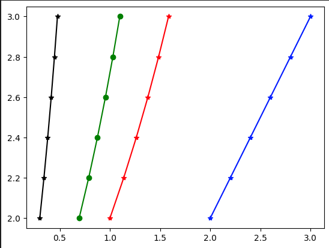

## numpy.log()在 Python 中的使用
`numpy.log()` 是一个数学函数，用于计算 x（x 属于所有输入数组元素）的自然对数。它是指数函数的反函数，也是逐元素的自然对数。自然对数 `log` 是指数函数的逆运算，因此 `log(exp(x))=x`。以 e 为底的对数是自然对数。

**语法**
```python
numpy.log(x, /, out=None, *, where=True, casting='same_kind', order='K', dtype=None, subok=True[, signature, extobj]) = <ufunc 'log'>
```
**参数**
> x: array_like

这个参数定义了 `numpy.log()` 函数的输入值。

> out: ndarray、None 或 ndarray 和 None 组成的元组（可选）

这个参数用于定义结果存储的位置。如果定义了这个参数，它的形状必须类似于输入的广播形状；否则，将返回一个新分配的数组。元组的长度等于输出的数量。

>where: array_like（可选）

这是一个条件，可以对输入进行广播。在条件为 True 的位置，输出数组将被设置为通用函数的结果；否则，它将保留其原始值。

> casting: {'no','equiv','safe','same_kind','unsafe'}（可选）

这个参数控制可能发生的数据类型转换。'no' 表示不进行数据类型转换。'equiv' 表示只允许字节顺序改变。'safe' 表示只允许能够保持值不变的转换。'same_kind' 表示只允许安全的转换或同一种类内的转换。'unsafe' 表示可以进行任何数据转换。

> order: {'K', 'C', 'F', 'A'}（可选）

这个参数指定输出数组的计算迭代顺序/内存布局。默认情况下，顺序是 K。'C' 表示输出应该是 C 连续的。'F' 表示 F 连续，而 'A' 表示如果输入是 F 连续的，则 'A' 表示 F 连续，如果输入是 C 连续的，则 'A' 表示 C 连续。'K' 表示尽量与输入的元素顺序匹配（尽量接近）。

> dtype: 数据类型（可选）

它覆盖了计算和输出数组的数据类型。

> subok: 布尔值（可选）

默认情况下，这个参数设置为 True。如果设置为 False，输出将始终是严格的数组，而不是子类型。

> signature

这个参数允许我们为底层计算中的 1-d 循环提供特定的签名。

> extobj

这个参数是一个长度为 1、2 或 3 的列表，指定了通用函数缓冲区大小、错误模式整数和错误回调函数。

**返回值**
这个函数返回一个包含 x 的自然对数值的 ndarray，其中 x 属于输入数组的所有元素。
示例 1:
```python
import numpy as np  

a = np.array([2, 4, 6, 3**8])  
a  
b = np.log(a)  
b  
c = np.log2(a)  
c  
d = np.log10(a)  
d  
```
输出:
```python
array([   2,    4,    6, 6561])
array([0.69314718, 1.38629436, 1.79175947, 8.78889831])
array([ 1.        ,  2.        ,  2.5849625 , 12.67970001])
array([0.30103   , 0.60205999, 0.77815125, 3.81697004])scssCopy codearray([   2,    4,    6, 6561])
array([0.69314718, 1.38629436, 1.79175947, 8.78889831])
array([ 1.        ,  2.        ,  2.5849625 , 12.67970001])
array([0.30103   , 0.60205999, 0.77815125, 3.81697004])
```
在上面的代码中
- 我们导入了别名为 np 的 numpy 库。
- 我们使用 np.array() 函数创建了一个名为 'a' 的数组。
- 我们声明了变量 b、c 和 d，并分别将 np.log()、np.log2() 和 np.log10() 函数的返回值赋给它们。
- 我们在所有函数中都传递了数组 'a'。
- 最后，我们尝试打印 b、c 和 d 的值。
- 在输出中，显示了一个包含源数组所有元素的对数、log2 和 log10 值的 ndarray。

示例 2:
```python
import numpy as np  
import matplotlib.pyplot as plt  

arr = [2, 2.2, 2.4, 2.6,2.8, 3]  

result1=np.log(arr)  
result2=np.log2(arr)  
result3=np.log10(arr)  

plt.plot(arr,arr, color='blue', marker="*")  
plt.plot(result1,arr, color='green', marker="o")  
plt.plot(result2,arr, color='red', marker="*")  
plt.plot(result3,arr, color='black', marker="*")  
plt.show()
```
输出:


在上面的代码中
- 我们导入了别名为 np 的 numpy 库。
- 我们还导入了别名为 plt 的 matplotlib.pyplot 库。
- 接下来，我们使用 np.array() 函数创建了一个名为 'arr' 的数组。
- 然后，我们声明了变量 result1、result2 和 result3，并分别将 np.log()、np.log2() 和 np.log10() 函数的返回值赋给它们。
- 我们在所有函数中都传递了数组 'arr'。
- 最后，我们尝试绘制 'arr'、result1、result2 和 result3 的值。
- 在输出中，显示了一个带有不同颜色直线的图表，代表了 'arr'、result1、result2 和 result3 的值。

示例 3:
```python
import numpy as np  

x = np.log([2, np.e, np.e**3, 0])  
x  
```
输出:
```python
__main__:1: RuntimeWarning: divide by zero encountered in log
array([0.69314718, 1.        , 3.        ,       -inf])
```

在上面的代码中
- 首先，我们导入了别名为 np 的 numpy 库。
- 我们声明了变量 'x'，并将 np.log() 函数的返回值赋给它。
- 我们在函数中传递了不同的值，如整数值、np.e 和 np.e**2。
- 最后，我们尝试打印 'x' 的值。
- 在输出中，显示了一个包含源数组元素的对数值的 ndarray。其中，对于值为 0 的元素，log() 函数引发了一个运行时警告，因
- 为它的对数是无穷小。