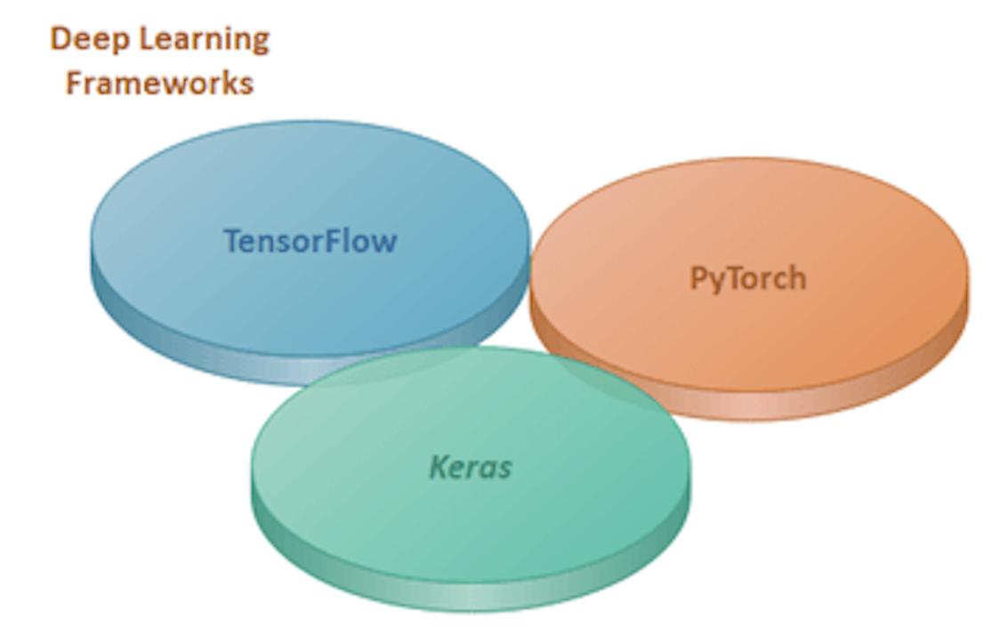

PyTorch 是基于 Torch 库的计算机软件的一小部分。它是由 Facebook 推出的深度学习框架。PyTorch是用于 Python 编程语言的 机器学习库，用于诸如 自然语言处理 等应用。

PyTorch提供的高级功能如下：

利用 图形处理单元（GPU），实现具有强大加速的张量计算。

提供基于自动微分系统的带有磁带的 深度神经网络。

PyTorch的开发目的是在实现和构建 深度学习神经网络 时提供高度的灵活性和速度。正如你已经知道的，它是用于 Python 编程语言的机器学习库，因此安装、运行和理解都非常简单。PyTorch是完全符合Python风格的（使用广泛采用的Python习惯用语，而不是编写Java和C++代码），因此可以快速成功地构建 神经网络模型。


### PyTorch的历史
PyTorch 于2016年发布。许多研究人员越来越愿意采用PyTorch。它由 Facebook 运营。Facebook还运营 Caffe2（用于快速特征嵌入的卷积架构）。将PyTorch定义的模型转换为Caffe2是一项具有挑战性的任务。为此，Facebook和Microsoft于2017年9月发明了 开放神经网络交换（ONNX）。简而言之，ONNX是为在框架之间转换模型而开发的。Caffe2在2018年3月并入了PyTorch。

PyTorch使构建非常复杂的神经网络变得容易。这一特点迅速使其成为首选库。在研究工作中，它与TensorFlow形成了激烈的竞争。PyTorch的发明者希望创建一个高度命令式的库，可以轻松运行所有的数值计算，最终他们发明了PyTorch。对于深度学习科学家、机器学习开发人员和神经网络调试器来说，实时运行和测试代码的一部分是一个巨大的挑战。PyTorch完成了这个挑战，让他们能够实时运行和测试代码，而不必等待检查是否有效。

注意：要使用PyTorch的功能和服务，可以使用Python包，例如NumPy、SciPy和Cython。

### 为什么使用PyTorch？
为什么选择PyTorch？PyTorch有什么特别之处，使其成为构建深度学习模型的特殊选择。PyTorch是一个动态库。动态库意味着它是一个灵活的库，您可以根据自己的要求和更改使用该库。目前在Kaggle竞赛中，PyTorch被不断地被优胜者使用。

有很多特性使得深度学习科学家在制作深度学习模型时使用它。

这些特性包括：
Feature For PyTorch
1. Simple Interface(简单的接口)
2. Hybird Front-End(混合前端)
3. Distributed Training(分布式训练)
4. Python-Firts(以Python为中心)
5. Tools and Libraries(工具和库)
6. Native ONNX Support(本地ONNX支持)
7. C++ Front-End(C++前端)
8. Cloud Partners(云合作伙伴)

#### 简单的接口
PyTorch具有与Python类似的非常简单的接口。它提供了一种使用API的简便方法。这个框架非常容易像Python一样运行和操作。PyTorch可以轻松地在Windows和Linux上理解或实现。

#### 混合前端
PyTorch提供了一个新的混合前端，它在急切模式中提供了灵活性和易用性，同时最初过渡到图形模式以获得在C++运行时环境中的速度、优化和功能。

例如：
```python
@torch.jit.script  
 def Rnn(h, x, Wh, Uh, Wy, bh, by):  
  y = []                                                       
  for t in range(x.size(0)):  
    h = torch.tanh(x[t] @ Wh + h @ Uh + bh)  
y += [torch.tanh(h @ Wy + by)]  
    if t % 10 == 0:  
        print("stats: ", h.mean(), h.var())  
    return torch.stack(y), h
```

#### 分布式训练
PyTorch允许开发者以分布式方式训练神经网络模型。通过对等通信和在Python和C++中异步执行集体操作的本机支持，它在研究和生产中都提供了优化的性能。

例如：
```python
import torch.distributed as dist1   
from torch.nn.parallel import DistributedDataParallel  
dist1.init_process_group(backend='gloo')  
model = DistributedDataParallel(model)  
```

#### Python为先
PyTorch完全基于Python。PyTorch与Python的最流行的库和包（如Cython和Numba）一起使用。PyTorch深深地嵌入在Python中。它的代码完全符合Python风格。Pythonic 意味着在代码中使用广泛采用的Python习惯用语，而不是编写java和C++代码。

例如：
```python
import torch  
import numpy as np  
x = np.ones(5)  
y = torch.from_numpy(x)  
np.add(x, 1, out=x)  
print(x)  
print(y)  
```

#### 工具和库
有丰富的工具和库生态系统可用于扩展PyTorch并支持计算机视觉和强化学习等领域的开发。这个生态系统是由一群积极的开发者和研究人员开发的。这些生态系统帮助他们构建灵活且快速访问深度学习神经网络的工具。

例如：
```python
import torchvision.models as models  
resnet18 = models.resnet18(pretrained=True)  
alexnet = models.alexnet(pretrained=True)  
squeezenet = models.squeezenet1_0(pretrained=True)  
vgg16 = models.vgg16(pretrained=True)  
densenet = models.densenet161(pretrained=True)  
inception = models.inception_v3(pretrained=True)  
```

#### 本地ONNX支持
ONNX是为在框架之间转换模型而开发的。要直接访问与ONNX兼容的平台、运行时、可视化工具等，需要在标准ONNX中导出模型。

例如：
```python
import torch.onnx  
import torchvision  
dum_input = torch.randn(1, 3, 224, 224)  
model = torchvision.models.alexnet(pretrained=True)  
torch.onnx.export(model, dum_input, "alexnet.onnx")  
```

#### C++前端
C++前端是PyTorch的C++接口，遵循已建立的Python前端的设计和架构。它支持在高性能、低延迟和裸机C++应用程序中进行研究。

例如：
```c++
#include <torch/torch.h>
torch::nn::Linear model(num_features, 1);
torch::optim::SGD optimizer(model->parameters());
auto data_loader = torch::data::data_loader(dataset);
for (size_t epoch = 0; epoch < 10; ++epoch)
 {
      for (auto batch : data_loader)
      {
        auto prediction = model->forward(batch.data);
        auto loss = loss_function(prediction, batch.target);
        loss.backward();
        optimizer.step();
    }
}
```

#### 云合作伙伴
PyTorch得到许多主要云平台的支持，例如AWS。通过使用预构建的镜像，在GPU上进行大规模培训，并能够在生产规模环境中运行模型等，它提供了无摩擦的开发和简便的扩展。

例如：
```python
export IMAGE_FAMILY="pytorch-latest-cpu"  
export ZONE="us-west1-b"  
export INSTANCE_NAME="my-instance"  
gcloud compute instances create $INSTANCE_NAME \  
--zone=$ZONE \  
--image-family=$IMAGE_FAMILY \ 
```
