## PyTorch基础

理解使用`PyTorch`所需的所有基本概念至关重要。PyTorch完全基于`张量（Tensors）`。`张量`具有执行操作的功能。除此之外，还有许多其他概念是执行任务所需的。

现在，逐一理解所有这些概念，以深入了解PyTorch。
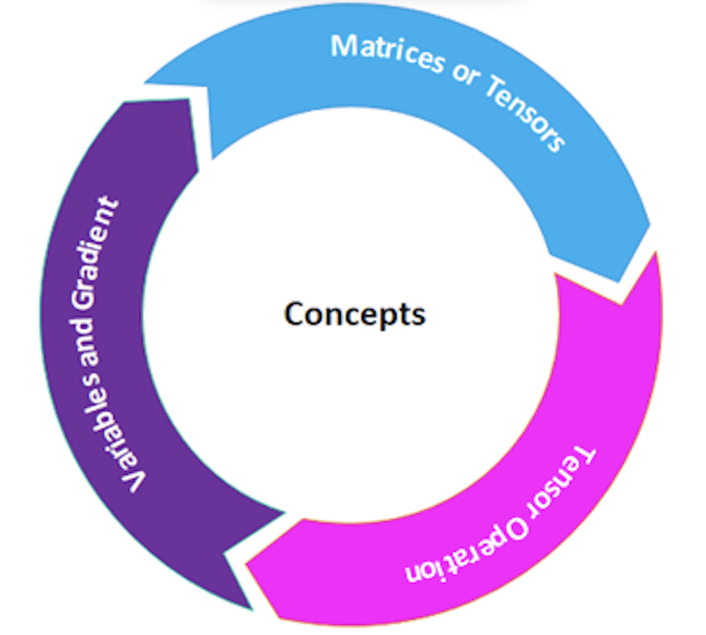

### 矩阵或张量
张量是PyTorch的关键组件。我们可以说PyTorch完全基于张量。在数学术语中，数字的矩形数组称为矩阵。在NumPy库中，这些矩阵被称为ndaaray。在PyTorch中，它被称为张量。张量是一个n维数据容器。例如，在PyTorch中，1D张量是一个向量，2D张量是一个矩阵，3D张量是一个立方体，4D张量是一个立方体向量。
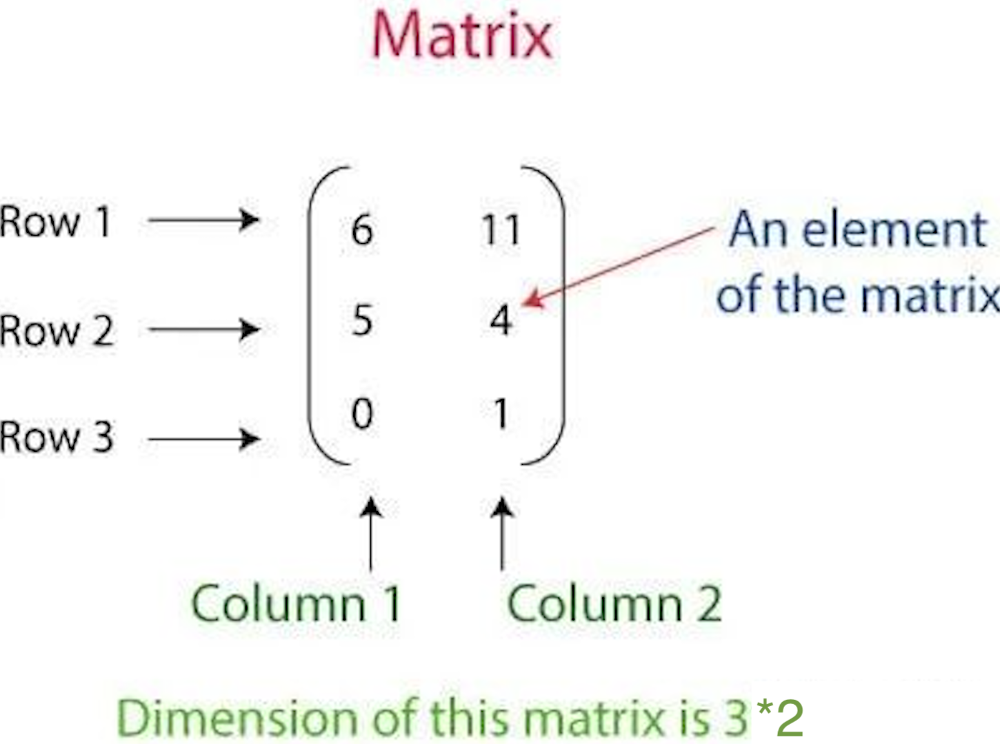

上面的矩阵表示具有三行和两列的2D张量。

有三种创建张量的方式。每一种都有不同的创建张量的方式。张量的创建方式如下：

1.使用数组创建PyTorch张量
2.创建包含全部为1和随机数的张量
3.从NumPy数组创建张量

让我们看看如何创建张量

#### 创建一个PyTorch张量作为数组
在这种情况下，您首先必须定义数组，然后将该数组作为参数传递给torch的Tensor方法。

例如
```python
import torch  
arr = [[3, 4], [8, 5]]   
pyTensor = torch.Tensor(arr)  
print(pyTensor)
```
输出:
```python
tensor ([[3., 4.],[8., 5.]])
```
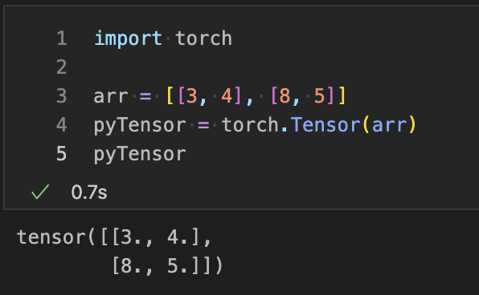

#### 创建具有随机数和全部为1的张量
要创建一个具有随机数的张量，您必须使用rand()方法，要创建一个全部为1的张量，您必须使用torch的ones()。为了生成随机数，torch的rand之外还将使用带有0参数的manual_seed方法。

例如
```python
import torch
ones_t = torch.ones((2, 2))
torch.manual_seed(0)  #  to have same values for random generation
rand_t = torch.rand((2, 2))
print(ones_t)
print(rand_t)
```
输出:
```python
Tensor ([[1., 1.],[1., 1.]])
tensor ([[0.4963, 0.7682],[0.0885, 0.1320]])
```
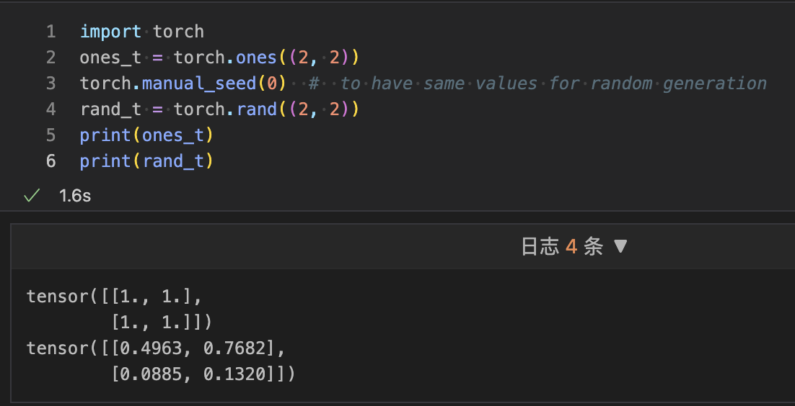

#### 从NumPy数组创建张量
要从NumPy数组创建张量，我们必须创建一个NumPy数组。一旦创建了NumPy数组，我们必须将其作为参数传递给from_numpy()。此方法将NumPy数组转换为张量。

例如
```python
import torch
import numpy as np1
numpy_arr = np1.ones((2, 2))
pyTensor = torch.from_numpy(numpy_arr)
np1_arr_from_Tensor = pyTensor.numpy()
print(np1_arr_from_Tensor)
```
输出:
```python
[[1. 1.] [1. 1.]]
```
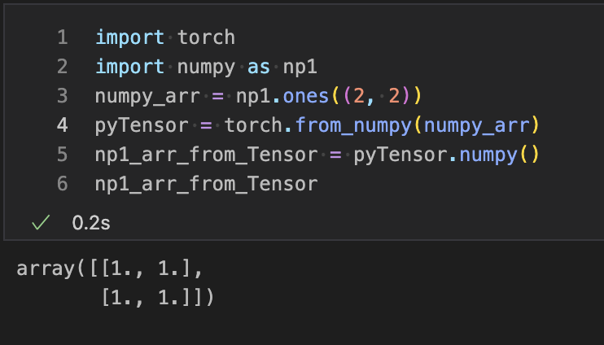

### 张量运算
张量类似于数组，因此我们对数组执行的所有操作也可以应用于张量。
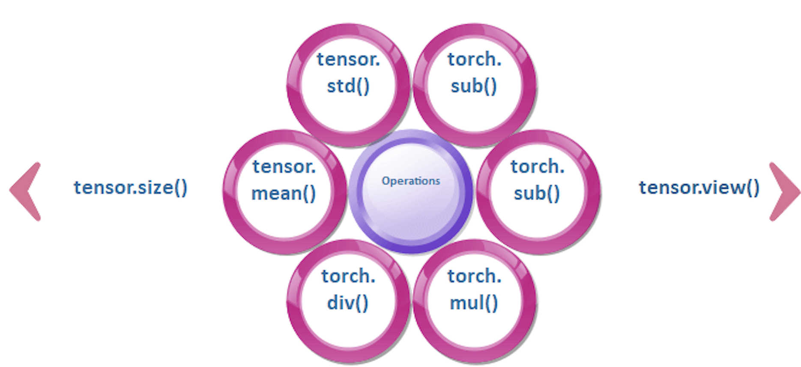
#### 改变张量的大小
我们可以使用张量的size属性来调整张量的大小。我们使用Tensor.view()来调整张量的大小。调整张量的大小意味着将2x2维张量转换为4x1或4x4维张量转换为16x1等。要打印张量的大小，我们使用Tensor.size()方法。

让我们看一个调整张量大小的示例。
```pyhton
import torch
pyt_Tensor = torch.ones((2, 2))
print(pyt_Tensor.size())        # shows the size of this Tensor
pyt_Tensor = pyt_Tensor.view(4) # resizing 2x2 Tensor to 4x1
print(pyt_Tensor)
```
输出:
```python
torch.Size ([2, 2])
tensor ([1., 1., 1., 1.])
```
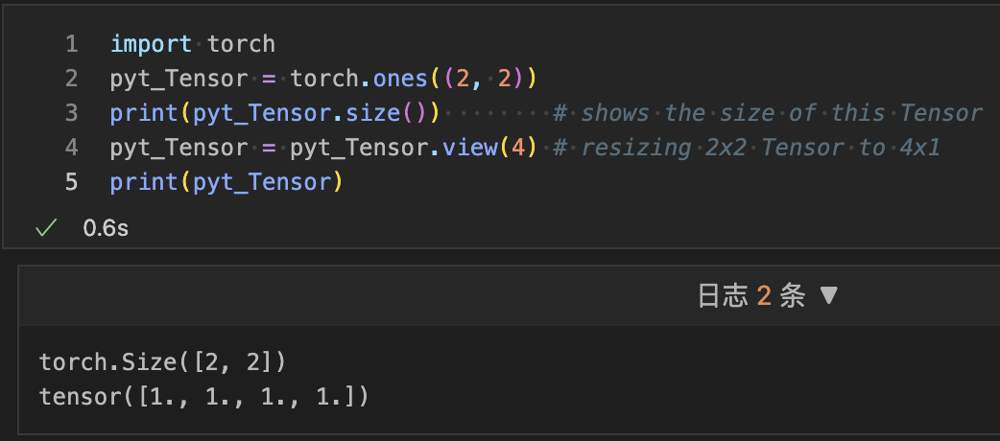

#### 数学运算
所有的数学运算，如加法、减法、除法和乘法，都可以在张量上执行。torch可以执行数学运算。我们使用torch.add()、torch.sub()、torch.mul()和torch.div()来执行张量上的操作。
让我们看一个数学运算如何执行的示例：
```python
import numpy as np
import torch
Tensor_a = torch.ones((2, 2))
Tensor_b = torch.ones((2, 2))
result=Tensor_a + Tensor_b
result1 = torch.add(Tensor_a, Tensor_b)  # another way of addidtion
Tensor_a.add_(Tensor_b)  # In-place addition
print(result)
print(result1)
print(Tensor_a)
```
输出:
```python
tensor ([[2., 2.], [2., 2.]])
tensor ([[2., 2.], [2., 2.]])
```
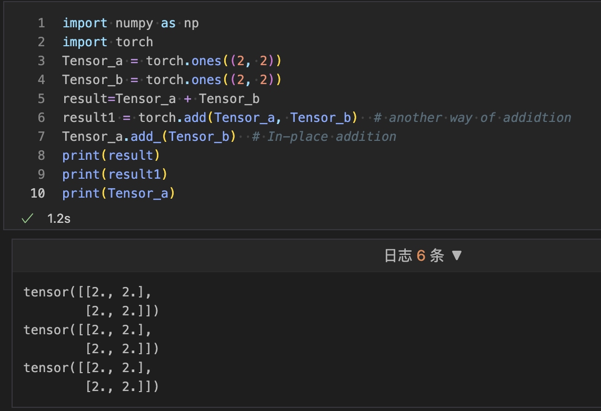

#### 均值和标准差
我们可以计算张量的标准差，无论是一维还是多维。在我们的数学计算中，我们首先要计算均值，然后在给定的数据上应用以下公式。
图片

但在张量中，我们可以使用Tensor.mean()和Tensor.std()来找到给定张量的偏差和均值。
让我们看一个计算的示例。
```python
import torch
pyTensor = torch.Tensor([1, 2, 3, 4, 5])
# mean 是平均值
mean = pyTensor.mean(dim=0)  # 如果有多行，则dim = 1
# std 是标准差
std_dev = pyTensor.std(dim=0)  # 如果有多行，则dim = 1
print(mean)
print(std_dev)
```
输出:
```python
tensor (3.)
tensor (1.5811)
```
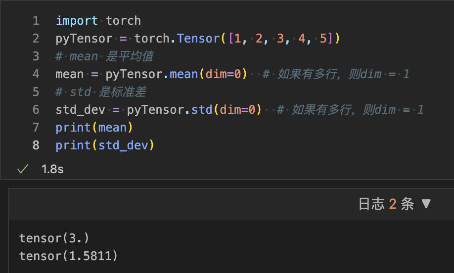

### 变量和梯度
该包的中心类是autograd.variable。其主要任务是包装一个Tensor。它支持几乎所有在其上定义的操作。您可以调用.backword()，只有在完成计算时才计算所有梯度。
通过.data属性，您可以访问原始张量，而此变量的梯度累积到.grad中。
图片

在深度学习中，梯度计算是关键点。在PyTorch中，变量用于计算梯度。简单来说，变量只是具有梯度计算功能的张量的包装器。
下面是用于管理变量的Python代码。
```python
import numpy as np
import torch
from torch.autograd import Variable

pyt_var = Variable(torch.ones((2, 2)), requires_grad = True)
print(pyt_var)
```
上述代码的行为与张量相同，因此我们可以以相同的方式应用所有操作。
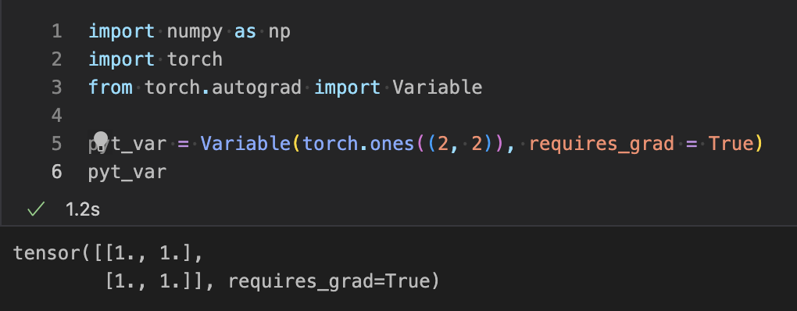
让我们看看如何在PyTorch中计算梯度。
示例
```python
import numpy as np
import torch
from torch.autograd import Variable
# let's consider the following equation
# y = 5(x + 1)^2
x = Variable (torch.ones(1), requires_grad = True)
y = 5 * (x + 1) ** 2        # implementing the equation.
y.backward()                # calculate gradient
print(x.grad)               # get the gradient of variable x
# differentiating the above mentioned equation
# => 5(x + 1)^2 = 10(x + 1) = 10(2) = 20
```
输出:
```python
tensor([20.])
```
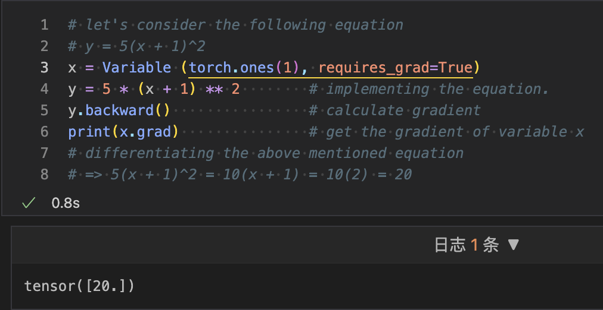
