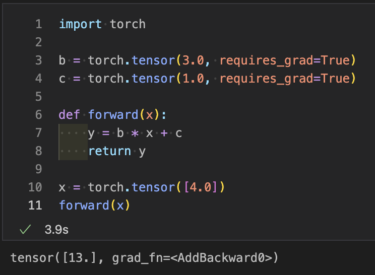
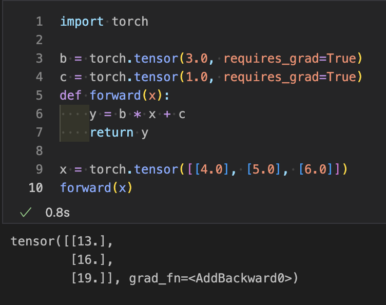
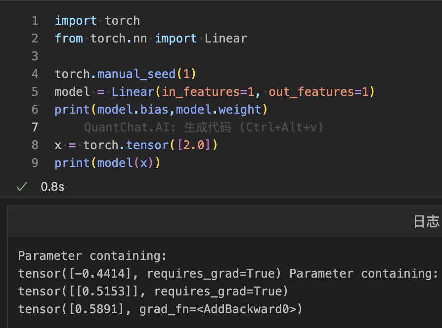
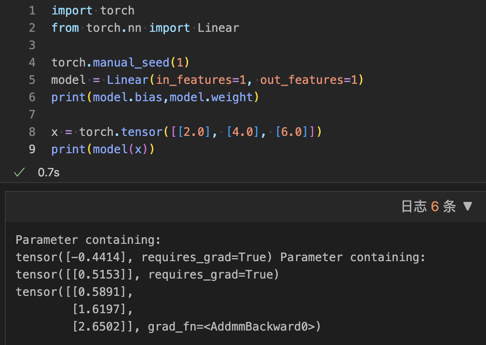

## 预测和线性类

在这里，我们简要介绍了如何实现基于机器学习的算法，以训练线性模型以适应一组数据点。

为此，不需要有深度学习的任何先验知识。我们将从监督学习的讨论开始。我们将讨论监督学习的概念以及它与之的关系。

### 机器学习
机器学习是人工智能的一个应用。机器学习（ML）赋予系统通过经验自动学习和改进的能力。ML专注于开发可以访问数据并用它自己学习的计算机程序。

学习过程从数据或观察开始，比如示例、指令或直接经验，以寻找数据中的模式并基于我们提供的示例在未来做出更好的决策。其目的是让计算机在没有人工干预的情况下自动学习并相应地调整行动。

#### 监督学习
顾名思义，存在着作为教师的监督者。在监督学习中，我们使用带标签的数据训练或教授机器。带标签的意思是一些数据已经被标记了正确的答案。之后，机器将提供一组新的数据。监督学习算法分析训练数据并从标记数据中产生正确的结果。

监督学习分为两大类算法：

- 分类: 分类问题是当输出变量或简单的输出是一个类别，如“红色”或“蓝色”或“有病或无病”时的问题。
- 回归: 回归问题是当输出变量或简单的输出是一个实数或连续值，如“工资”或“体重”时的问题。

#### 无监督学习
在无监督学习中，机器使用既未分类也未标记的信息进行训练，并允许算法在没有指导的情况下对该信息进行操作。在无监督学习中，任务是根据相似性、差异和模式对未经排序的信息进行分组，而不需要对数据进行任何事先的训练。

没有监督者，这意味着不会对机器进行任何训练。所以，机器被限制为自己发现隐藏的结构。

无监督学习分为两大类算法：

- 聚类: 聚类问题是我们必须在数据中发现固有分组的问题。比如根据课程或年龄行为将学生分组。
- 关联: 关联问题是我们必须发现描述我们大部分数据的规则的问题，比如买苹果的人也想买香蕉。

### 制作预测（创建数据模型）
制作预测是制作线性回归模型的初始步骤。在线性回归模型中，我们使用监督学习，因为回归是其第二大类别。所以学习者接受训练，并利用与标记特征相关的数据集，这些特征定义了我们训练数据的含义。

在将新输入数据提供给机器之前，学习者能够预测相应的输出。

找到预测的步骤

- 第一步是安装torch并将其导入以使用它。
- 下一步是初始化变量c和c以了解线的方程。
- 初始化线的方程，使y=w*x + b，这里w是斜率，b是偏差项，y是预测。
- 预测是在forward()方法内计算的。

让我们看一个例子，了解如何在线性回归中进行预测。

对于单一数据
```python
import torch

b = torch.tensor(3.0, requires_grad=True)
c = torch.tensor(1.0, requires_grad=True)

def forward(x):
    y = b * x + c
    return y

x = torch.tensor([4.0])
forward(x)
```
输出:
```python
tensor([13.], grad_fn=<AddBackward0>)
```


对于多个数据
```python
import torch

b = torch.tensor(3.0, requires_grad=True)
c = torch.tensor(1.0, requires_grad=True)
def forward(x):
    y = b * x + c
    return y

x = torch.tensor([[4.0], [5.0], [6.0]])
forward(x)
```
输出:
```python
tensor([[13.],
        [16.],
        [19.]], grad_fn=<AddBackward0>)
```


### 使用线性类进行预测
还有另一种绑定预测的标准方法。为此，我们必须导入torch.nn包的linear类。在此，我们使用manual_seed()方法生成随机数。当我们使用线性类创建模型时，它将为线性类赋予随机数值，这是有意义的，因为我们回想起来。

让我们看一个例子，了解如何使用模型和manual_seed()方法进行预测。

对于单一数据
```python
import torch
from torch.nn import Linear

torch.manual_seed(1)
model = Linear(in_features=1, out_features=1)
print(model.bias,model.weight)

x = torch.tensor([2.0])
print(model(x))
```
输出:
```python
<torch._C.Generator object at 0x000001FA018DB2B0>
Parameter containing:
tensor([-0.4414], requires_grad=True) Parameter containing:
tensor([[0.5153]], requires_grad=True)
tensor([0.5891], grad_fn=<AddBackward0>)
```


对于多个数据
```python
import torch
from torch.nn import Linear

torch.manual_seed(1)
model = Linear(in_features=1, out_features=1)
print(model.bias,model.weight)

x = torch.tensor([[2.0], [4.0], [6.0]])
print(model(x))
```
输出:
```python
<torch._C.Generator object at 0x00000210A74ED2B0>
Parameter containing:
tensor([-0.4414], requires_grad=True) Parameter containing:
tensor([[0.5153]], requires_grad=True)
tensor([[0.5891],
        [1.6197],
        [2.6502]], grad_fn=<AddmmBackward0>)
```

