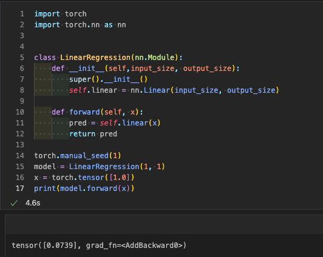
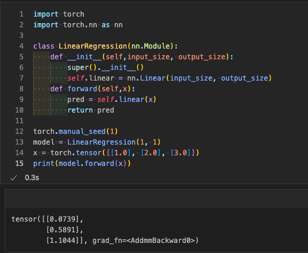

## 使用自定义模块创建数据模型

还有另一种方法可以进行预测。在前一节中，我们使用 forward() 方法和实现一个线性模型来进行预测。这种方法非常高效可靠。它易于理解和实现。

在自定义模块中，我们通过类来创建一个自定义模块，并且实现它的 init() 和 forward() 方法以及模型。init() 方法用于初始化类的新实例。在这个 init() 方法中，第一个参数是 self，表示类的实例，即尚未初始化的对象，之后我们可以添加额外的参数。

下一个参数是用于初始化线性模型的实例。在我们之前的章节中，初始化线性模型需要输入大小，以及输出大小等于1，但在自定义模块中，我们传递输入大小和输出大小变量，而不传递它们的默认值。

在此过程中，需要导入 torch 的 nn 包。在这里，我们使用继承，使得这个子类能够利用我们基类的代码，在模块中。

模块本身通常会作为所有神经网络模块的基类。之后，我们通过创建一个模型来进行预测。

让我们看一个通过创建自定义模块进行预测的示例：

对单个数据点进行预测
```python
import torch
import torch.nn as nn


class LinearRegression(nn.Module):
    def __init__(self,input_size, output_size):
        super().__init__()
        self.linear = nn.Linear(input_size, output_size)

    def forward(self, x):
        pred = self.linear(x)
        return pred

torch.manual_seed(1)
model = LinearRegression(1, 1)
x = torch.tensor([1.0])
print(model.forward(x))
```
输出结果为：
```python
<torch._C.Generator object at 0x000001B9B6C4E2B0>
tensor([0.0739], grad_fn=<AddBackward0>)
```


对多个数据点进行预测
```python
import torch
import torch.nn as nn

class LinearRegression(nn.Module):
    def __init__(self,input_size, output_size):
        super().__init__()
        self.linear = nn.Linear(input_size, output_size)
    def forward(self,x):
        pred = self.linear(x)
        return pred

torch.manual_seed(1)
model = LinearRegression(1, 1)
x = torch.tensor([[1.0], [2.0], [3.0]])
print(model.forward(x))
```
输出结果为：
```python
<torch._C.Generator object at 0x000001B9B6C4E2B0>
tensor([[0.0739],
        [0.5891],
        [1.1044]], grad_fn=<AddmmBackward0>)
```

